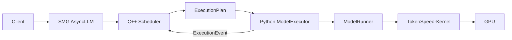
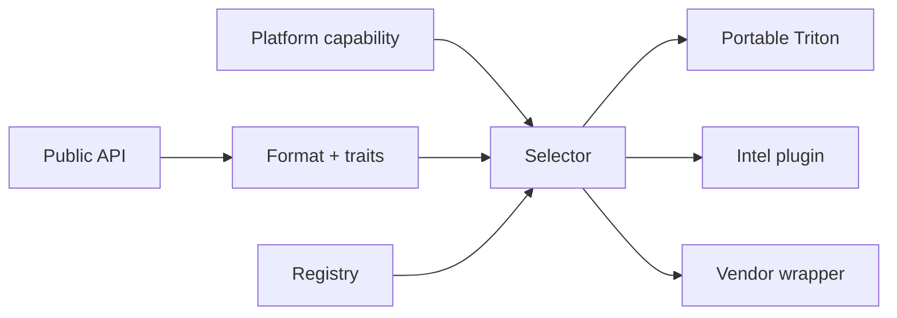

# TokenSpeed 技术评估分享大纲

> 听众：vLLM Intel GPU 研发团队  
> 时长：20–30 分钟  
> 建议页数：12 页，另留 5–10 分钟讨论

## 分享目标

分享结束时，团队应能回答三个问题：

1. TokenSpeed 相比 vLLM 的差异是否值得关注？
2. 当前公开数据是否足以判断性能优劣？
3. 在 Intel GPU 上，最小可验证路径和继续投入 gate 是什么？

## 第 1 页：为什么评估 TokenSpeed

**建议用时：1.5 分钟**

- 团队已有 vLLM Intel GPU 经验，需要判断新 engine 的可复用价值。
- TokenSpeed 定位为面向 agentic workload 的高性能 LLM inference engine。
- 本次不做“项目宣传”，只回答定位、架构、性能证据和 Intel 工作量。
- 目标模型：Qwen3 Dense BF16、Qwen3 MoE BF16。

**推荐视觉**：四个评估问题组成的横向流程：What、Difference、Evidence、Cost。

**讲解备注**：先声明评估边界。Intel SKU 尚未确定，因此不会给虚假的人日和性能数字。

## 第 2 页：TokenSpeed 不是一个 kernel 库

**建议用时：2 分钟**

- TokenSpeed：完整 serving engine。
- TokenSpeed-Scheduler：C++ 请求与 KV control plane。
- TokenSpeed-Kernel：可独立安装的 kernel registry/selector。
- TokenSpeed-MLA、AMD kernel package 等是专用性能组件。

**推荐视觉**：三层堆栈图。

```text
Serving / AsyncLLM / OpenAI API
Scheduler / Model execution / KV cache / Parallelism
TokenSpeed-Kernel public APIs and hardware implementations
```

**讲解备注**：后续所有性能讨论都要先说明是在谈 engine 还是 kernel。

## 第 3 页：端到端架构

**建议用时：2.5 分钟**



- C++ scheduler 决定请求、KV page 和下一步执行计划。
- Python executor 准备 device metadata 并执行模型。
- 模型层和 kernel selection 尽量解耦。
- AsyncLLM 负责请求输入输出和 streaming。

**讲解备注**：强调 control plane/execution plane 分离，不需要展开每个进程细节。

## 第 4 页：三个核心设计选择

**建议用时：2.5 分钟**

1. **FSM scheduler**：请求生命周期、KV 所有权和 overlap 时序显式化。
2. **local-SPMD**：通过 placement 描述并行，减少模型中的手写通信。
3. **kernel registry**：统一 portable、specialized、vendor 和 plugin 实现。

**推荐视觉**：三个并列列，每列给出 Benefit 和 Cost。

| 设计 | 潜在收益 | 工程代价 |
| --- | --- | --- |
| C++ FSM scheduler | 控制开销低，资源状态明确 | 跨语言调试、状态机复杂 |
| local-SPMD | 模型与并行策略解耦 | 编译和 placement 约束 |
| kernel registry | 多硬件实现集中管理 | traits/capability 必须准确 |

## 第 5 页：Kernel 系统为什么值得 Intel 团队关注

**建议用时：2 分钟**



- Runtime 只描述算子问题，不直接点名 Intel/NVIDIA/AMD kernel。
- Intel 可以先提供 portable baseline，再逐个替换热点。
- numerics、benchmark、shape capture 和 profiling 使用相同 registry metadata。
- 最适合先验证的是 kernel 子系统，而不是直接承诺替换整个 serving stack。

## 第 6 页：TokenSpeed 与 vLLM 的核心区别

**建议用时：3 分钟**

| 维度 | TokenSpeed | vLLM |
| --- | --- | --- |
| 优化目标 | Agentic workload 极致性能 | 通用 serving、生态和易用性 |
| Scheduler | C++ control + Python execution | EngineCore scheduler + workers |
| 并行 | local-SPMD/placement/CommManager | parallel layers/executor/platform |
| Kernel | 独立 API + registry/selector | CustomOp/backend/modular kernel |
| 硬件成熟度 | NVIDIA/AMD 主力，XPU 初步 | Intel XPU 已有较成熟路径 |
| 项目风险 | 新、变化快、覆盖较窄 | 生态成熟、兼容面广 |

**讲解备注**：不是“一个有 PagedAttention、一个没有”。两者现在都有复杂 KV、
continuous batching、平台 backend 和分布式执行，差异主要在工程组织与优化重心。

## 第 7 页：公开性能数据究竟说明什么

**建议用时：2.5 分钟**

AMD MI355X、GPT-OSS 120B 的官方公开结果：

- Gluon attention 相对 Triton：`1.4–2.3x`。
- Gluon attention 相对 AITER：`1.1–1.3x`。
- 小 batch MoE 相对 Triton：`1.7–2.1x`。
- 端到端 TokenSpeed Gluon 相对 TokenSpeed Triton：`1.6–3.6x`。

**页脚必须加粗显示**：

> 这些不是 TokenSpeed vs vLLM，也不是 Intel GPU 数据。

**推荐视觉**：左侧放公开数字，右侧放“能证明 / 不能证明”两栏。

**讲解备注**：README 的 Kimi K2.5 图比较对象是 TensorRT-LLM，同样不能回答
TokenSpeed 与 vLLM 的差距。

## 第 8 页：Intel 支持不是从零开始，但远未完成

**建议用时：2.5 分钟**

**代码已经存在**：

- XPU platform detection 和 `--device xpu`。
- XPU 上使用 native Triton-XPU。
- XCCL distributed backend 和部分 `nccl` lookup alias。
- device-module stream，以及 RMSNorm/activation portable fallback。

**仍然缺失或未验证**：

- XPU correctness/performance CI。
- Intel architecture/XMX/topology capability。
- attention、KV、sampling、MoE 的完整 XPU 测试。
- Intel 专用高性能 kernel package。
- CUDA Graph、stream/event、pinned memory 和 CUDA-only dependency 清理。

**推荐视觉**：黄绿两栏，不要使用简单的“支持/不支持”二元结论。

## 第 9 页：Qwen3 Dense 最小路径

**建议用时：2 分钟**

首轮固定：BF16、单 XPU、TP=1、eager、无量化、无 speculative、无 offload。

```text
Build/import
  -> Linear + RMSNorm + RoPE
  -> Paged MHA prefill/decode + KV write
  -> Sampling
  -> Golden logits/output
  -> OpenAI serving
```

- 每个公共 kernel API 先 standalone numerics，再进入模型。
- 对齐 Transformers/vLLM 的 logits 和输出 token。
- 成功标准是稳定 serving，不是“能够 import”。

## 第 10 页：Qwen3 MoE 为什么是第二阶段

**建议用时：2 分钟**

- 在 Dense 基础上增加 top-k routing、expert GEMM、SwiGLU 和 combine。
- 多卡再增加 TP/EP、dispatch 和 all-to-all。
- DeepEP 不是 Intel baseline，需要先建立 XCCL portable 路径。
- 单卡 MoE、TP、EP、低精度必须分阶段，避免问题同时叠加。

**推荐视觉**：阶梯图：Dense single → Dense TP → MoE single/TP → MoE EP。

## 第 11 页：如何公平比较 TokenSpeed 和 vLLM

**建议用时：2.5 分钟**

- 模型：Qwen3-8B BF16、Qwen3-30B-A3B BF16。
- 锁定 checkpoint、精度、KV dtype、GPU 数、TP/EP、请求集和软件版本。
- workload：128/2048、2048/512、8192/128、长上下文。
- concurrency sweep：1–64，prefix cache on/off。
- 指标：TTFT、TPOT/ITL、output TPS、per-user TPS、显存、错误率。
- 展示 latency-throughput Pareto，而不是单点峰值。

**讲解备注**：先 correctness，后 performance；每个点至少重复三次。

## 第 12 页：建议与决策 Gate

**建议用时：2 分钟**

**建议**：做一个受控 PoC，不直接启动全栈替换项目。

| Milestone | 交付 | Go/No-Go 问题 |
| --- | --- | --- |
| M0 | XPU build/import/CI | 依赖是否可维护？ |
| M1 | Qwen3 Dense 单卡 BF16 | portable kernel 是否正确、可优化？ |
| M2 | Dense TP + XCCL | 多卡扩展是否可接受？ |
| M3 | Qwen3 MoE 单卡/TP | MoE kernel 缺口是否可控？ |
| M4 | MoE EP | all-to-all 是否成为硬阻塞？ |
| M5 | Intel optimized backend | Pareto 是否达到投入目标？ |

**结束问题**：

1. 首个目标 SKU 和软件栈是什么？
2. 哪组 production workload 作为 gate？
3. 团队更想复用 TokenSpeed-Kernel，还是评估整个 engine？

## 备用页 A：Intel 热点清单

- Dense：paged decode attention、BF16 GEMM、RMSNorm/RoPE、sampling。
- MoE：routing、expert GEMM、combine、all-to-all。
- Runtime：graph、stream/event、host cache、prefix cache。
- 工程：XPU wheel、CI、profiling、support matrix。

## 备用页 B：证据等级

| 等级 | 示例 | 分享中的表达方式 |
| --- | --- | --- |
| 仓库事实 | 已有 `_detect_xpu_platform()` | “代码已存在，目标硬件待验证” |
| 官方实测 | MI355X Gluon vs Triton | 完整写明硬件、模型和比较对象 |
| 项目自述 | vLLM-level usability | 标注为项目目标 |
| 架构推断 | C++ scheduler 可能降低 CPU 开销 | 使用“可能”，要求 benchmark |
| 待实测 | TokenSpeed vs vLLM XPU | 不给结论，给实验方案 |

## 参考资料

- [完整技术评估](./tokenspeed-vllm-intel.md)
- [TokenSpeed README](https://github.com/lightseekorg/tokenspeed/blob/main/README.md)
- [TokenSpeed-Kernel README](https://github.com/lightseekorg/tokenspeed/blob/main/tokenspeed-kernel/README.md)
- [PyTorch TokenSpeed-Kernel Blog](https://pytorch.org/blog/lightseek-tokenspeed-kernel/)
- [vLLM Architecture Overview](https://docs.vllm.ai/en/latest/design/arch_overview/)
