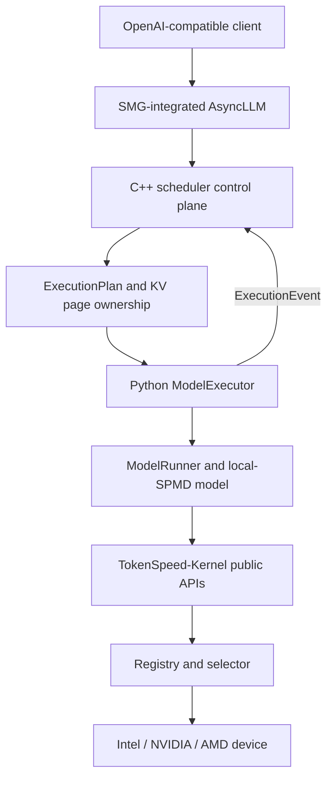
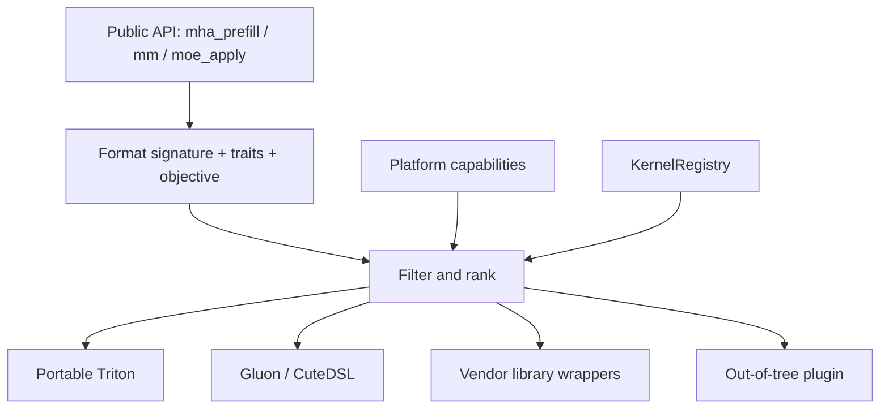
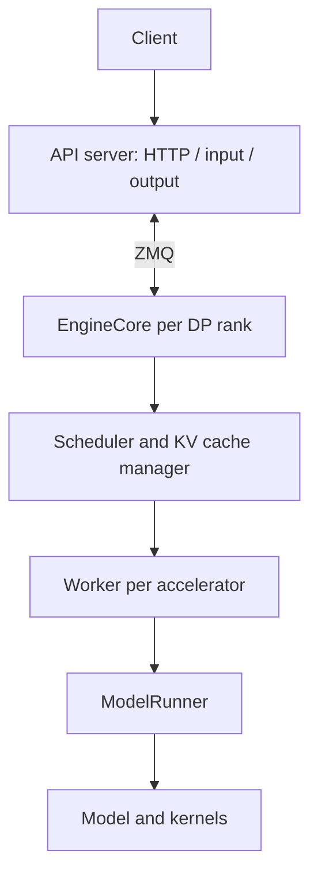

# TokenSpeed 与 vLLM：Intel GPU 技术评估

> 面向已有 vLLM Intel GPU 开发经验的研发团队。评估日期：2026-07-25。

## 执行摘要

TokenSpeed 是一个完整的 LLM inference engine，不只是 kernel 库。它面向
production agentic workloads，强调高并发长输出、低单用户延迟和新模型快速优化。
TokenSpeed-Kernel 是其中可独立安装的算子子系统，通过公共 API、kernel registry
和 selector，把 runtime 与 NVIDIA、AMD 等硬件实现解耦。

与 vLLM 相比，二者都具备 OpenAI-compatible serving、continuous batching、paged
KV cache、多 GPU 并行和可插拔 kernel，但工程重心不同：

- vLLM 的优势是成熟生态、广泛模型与硬件覆盖、稳定接口和大量生产验证。
- TokenSpeed 更强调 agentic workload 的极致性能、C++ scheduler 状态机、
  local-SPMD 并行描述，以及独立且结构化的 multi-silicon kernel 层。
- TokenSpeed 当前不能视为 Intel GPU 的产品级后端。仓库已有最小 XPU bring-up
  基础，但缺少完整 XPU correctness/performance CI 和 Intel 专用高性能 kernel。

**建议结论**：值得做一个有边界的技术验证，但不建议直接承诺替代 vLLM。
先完成 Qwen3 Dense BF16 单卡 portable baseline，再根据 correctness 和 profiling
结果决定是否投入 Qwen3 MoE、XCCL 多卡及 Intel 专用 kernel。

## 1. TokenSpeed 是什么

### 1.1 TokenSpeed 与 TokenSpeed-Kernel

| 名称 | 定位 | 主要职责 |
| --- | --- | --- |
| TokenSpeed | 完整推理与 serving engine | API、请求处理、调度、KV cache、模型执行、并行、采样、可观测性 |
| TokenSpeed-Kernel | 可独立安装的 kernel 子系统 | 算子公共 API、实现注册与选择、numerics、benchmark、profiling、plugin |
| tokenspeed-scheduler | C++ control plane | 请求状态、execution plan、KV page 所有权、prefix cache 和资源回收 |

TokenSpeed 的项目目标是“TensorRT-LLM-level performance and vLLM-level usability”。
这是项目定位，不应当作已经在所有模型和硬件上成立的性能结论。

### 1.2 目标 workload

Agentic workload 通常具有以下特征：

- 输出较长，decode 占比高，单步 launch、通信和 CPU 调度开销更敏感。
- 多轮交互和共享前缀增加 prefix cache 的价值。
- tool calling、reasoning parser、structured output 和 speculative decoding
  会进入主执行路径。
- 性能目标不是单一峰值 throughput，而是 latency-throughput Pareto frontier。

因此 TokenSpeed 的设计不仅关注 attention kernel，也关注 scheduler、KV 生命周期、
通信 overlap、sampling 和 CPU-side request handling。

## 2. 架构设计

### 2.1 从请求到 token



关键边界如下：

1. AsyncLLM 负责请求接入、tokenization、流式输出和较低 CPU 开销。
2. C++ scheduler 维护 waiting、prefill、decoding、retracted 等请求状态，生成
   `ExecutionPlan`，并通过 `ExecutionEvent` 推进状态。
3. Python execution plane 把 plan 转换成 device tensor、attention metadata、
   page table 和模型 forward。
4. 模型层描述模型结构和 placement，不应包含平台 kernel 选择逻辑。
5. TokenSpeed-Kernel 根据平台、数据格式、shape trait 和目标选择实现。

### 2.2 Scheduler 与 KV cache

TokenSpeed 的 scheduler 使用 C++ control plane 和 Python execution plane：

- request lifecycle、KV page 所有权和 overlap 时序由状态机表达。
- scheduler 输出 execution plan，而不是直接执行 PyTorch 模型。
- runtime 回传执行事件，scheduler 再提交、释放或回收 KV 资源。
- 支持 paged cache、prefix cache、host writeback/loadback 和不同 cache group。

这种设计的潜在收益是减少 Python 控制路径成本，并使 KV 资源状态更明确；代价是
跨 C++/Python 边界的调试和功能演进更复杂，需要更强的状态机测试。

### 2.3 Modeling 与并行

TokenSpeed README 将 modeling layer 描述为 local-SPMD：模型代码描述当前 rank 的
局部计算，通过 module-boundary placement annotation 生成 collective communication。
设计目标是把 TP、EP 等通信从具体模型 forward 中抽离。

当前代码并没有完全消除显式通信。Qwen3 Dense 仍通过 parallel linear layer 和
`all_reduce` 完成 TP；Qwen3 MoE 通过 `CommManager` 管理 attention、dense MLP 和
MoE 之间的通信。评估时应同时检查设计目标与目标模型的实际调用链。

### 2.4 Kernel registry 与选择



注册信息包括：

- operator family 与 mode，例如 attention decode、MoE fused。
- tensor/scale format signature。
- head dimension、page size、sliding window 等 traits。
- vendor、architecture 和 required features。
- priority，以及 latency、throughput、portability 等 selection objective。

这个边界对 Intel 有价值：先让 portable Triton 实现满足公共 API，再增加 Intel
插件，不需要在每个模型里加入 `if intel`。但“公共 API 可调用”只代表结构上可扩展，
不代表现有 Triton kernel 已在 XPU 上正确或高效。

## 3. 与 vLLM 的区别

### 3.1 vLLM V1 参考拓扑



### 3.2 同层级比较

| 维度 | TokenSpeed | vLLM V1 | 对 Intel 团队的含义 |
| --- | --- | --- | --- |
| 首要目标 | Agentic workload 的高性能 | 通用、易用、高吞吐 serving | TokenSpeed 的收益需用真实 agentic 流量验证 |
| API/生态 | OpenAI compatible，项目较新 | 接口、集成、模型与用户生态成熟 | vLLM 仍是风险更低的产品基线 |
| 控制面 | C++ scheduler + Python executor | Python EngineCore scheduler + worker | TokenSpeed 可能降低控制开销，但增加跨语言调试 |
| 进程模型 | SMG AsyncLLM、scheduler/executor ranks | API server、per-DP EngineCore、per-device worker | 需实测 CPU、IPC 和 DP 扩展成本 |
| KV cache | scheduler 管理 page ownership 与状态机 | KV cache manager + block pool | 两者都不是简单静态 cache；比较回收和 prefix 策略 |
| 模型并行 | local-SPMD、placement、CommManager | parallel layers、executor、distributed groups | Intel 都需要 XCCL 和算子/通信协同优化 |
| Kernel 抽象 | 独立公共 API + registry/selector/plugin | CustomOp、attention backend、modular kernels、platform plugin | TokenSpeed 的 kernel 边界更集中；vLLM 生态更成熟 |
| 硬件覆盖 | NVIDIA/AMD first-party，XPU 初步 bring-up | 多平台，已有 Intel XPU 路径 | TokenSpeed Intel 的验证和维护成本更高 |
| 性能策略 | portable baseline 与专用实现并存 | 多 backend、torch.compile、平台专用实现 | 两者最终都依赖 Intel 高性能 kernel，不存在免费迁移 |
| 适用判断 | 新模型/硬件快速深度优化 | 广泛生产功能和稳定兼容 | 可考虑复用 TokenSpeed-Kernel，而非立即替换全栈 |

### 3.3 不应得出的结论

- TokenSpeed 使用 C++ scheduler，不自动意味着端到端一定快于 vLLM。
- registry 解耦平台，不自动意味着 Triton kernel 可以无修改运行于 XPU。
- 某个 attention 或 MoE kernel 更快，不自动意味着 serving TTFT/TPOT 更好。
- NVIDIA/AMD 上的结果不能外推到 Intel GPU。

## 4. 已公开的性能证据

### 4.1 可引用结果

PyTorch TokenSpeed-Kernel 文章在单张 AMD MI355X、GPT-OSS 120B 上报告：

| 范围 | 比较 | 公开结果 |
| --- | --- | --- |
| Attention prefill | Gluon vs portable Triton | 15 个 shape 中 14 个最快，提升 1.4–2.3x |
| Attention prefill | Gluon vs AITER | 提升 1.1–1.3x |
| MoE small decode batch | Gluon vs Triton | 提升 1.7–2.1x |
| MoE small decode batch | Gluon vs AITER | 提升 1.1–1.6x |
| MoE medium decode batch | Gluon vs Triton | 提升 1.3–1.4x；约为最快实现的 0.9x |
| End-to-end serving | TokenSpeed Gluon vs TokenSpeed Triton | 20 个测试点全部提升，范围 1.6–3.6x |

实验条件包括 GPT-OSS 120B、MXFP4 expert weights、FP8 activation、TP=1、
ROCm 7.2.1、TokenSpeed commit `1492030`。文章没有给出同机同配置的 vLLM
全栈对比。

项目 README 的 Kimi K2.5 Pareto 图比较 TokenSpeed 和 TensorRT-LLM，也不是
TokenSpeed 和 vLLM。

### 4.2 当前能回答什么

公开结果支持以下判断：

- TokenSpeed-Kernel 的分层没有阻止 AMD 专用 kernel 获得明显收益。
- attention 与 MoE 的局部优化可以转化为端到端提升。
- 同一个 runtime API 后可以并存 portable 和 specialized 实现。

当前不能回答“TokenSpeed 比 vLLM 快多少”。这个问题必须在目标 Intel GPU 上执行
同 checkpoint、同精度、同并行、同请求集的 benchmark。

## 5. Intel XPU 支持现状

### 5.1 已存在的基础

| 能力 | 当前代码状态 | 评估 |
| --- | --- | --- |
| 平台检测 | `PlatformInfo.is_intel`、`_detect_xpu_platform()` | 已存在，architecture 仍为 `0.0` |
| Device CLI | server args 接受 `--device xpu` | 已存在，需端到端验证 |
| Triton | XPU 上选择 native `triton`/`triton-xpu` | 已存在，不能保证每个 kernel 可编译 |
| Collective | distributed initializer 选择 `xccl` | 已存在，需多卡和 subgroup 验证 |
| 兼容层 | 部分 `nccl` group lookup 映射到 `xccl` | 临时兼容，长期应清理命名与能力判断 |
| Device runtime | 多处使用 `torch.get_device_module()` | 正在抽象，仍有大量 `torch.cuda` 使用 |
| 基础算子 | activation、RMSNorm 允许 portable Triton | 已存在，缺 XPU numerics/perf CI |
| Stream | cache executor 避免 XPU priority stream 问题 | 已存在，说明 stream/event 语义已有差异 |

### 5.2 主要缺口

1. **Build 与 packaging**：主包依赖中仍包含带 CUDA 二进制的包，需要在 XPU wheel
   构建中隔离、optionalize 或确认 import guard。
2. **平台能力**：Intel architecture、XMX、local memory、带宽和多卡拓扑没有可靠
   capability 描述，selector 无法做有效的架构分派。
3. **Kernel correctness**：portable Triton 的 attention、KV cache、linear、sampling、
   MoE kernel 没有 XPU 测试矩阵。
4. **Runtime device abstraction**：CUDA Graph、stream/event、pinned memory、host
   callback、OOM 类型、profiling 和若干模型路径仍直接调用 `torch.cuda`。
5. **通信**：基础 XCCL group 已接入，但 custom all-reduce、DeepEP、DP sampling、
   weight transfer 和 all-to-all 仍有 NCCL/CUDA 假设。
6. **CI**：仓库中没有 XPU unit、integration、model correctness 或 performance job。
7. **性能实现**：当前没有仓库内可见的 `tokenspeed-kernel-intel` 实现包。

### 5.3 风险分级

| 工作域 | 当前基础 | 剩余风险 | 优先级 |
| --- | --- | --- | --- |
| Build/import | 部分 XPU detection | CUDA dependency 和 import side effect | P0 |
| Dense 单卡 correctness | portable op 路径 | attention/KV/sampling Triton 兼容性 | P0 |
| Dense TP | XCCL 初始化 | collective ordering、subgroup、性能 | P1 |
| MoE 单卡 | 通用 `moe_plan` | routing/expert kernel 可用性 | P1 |
| MoE EP | CommManager 架构 | all-to-all、dispatch/combine，无 DeepEP | P2 |
| Graph/async | device module 抽象开始 | CUDA Graph 和 stream/event 语义 | P2 |
| 产品化 | 通用测试基础 | XPU CI、发布、支持矩阵、profiling | P1 |

## 6. Qwen3 支持路线

### M0：环境与 import gate

目标：在选定 XPU 软件栈上稳定安装并启动最小 server 进程。

- 固定 Intel GPU SKU、driver、oneAPI、PyTorch XPU、Triton-XPU 和 XCCL 版本。
- 生成 XPU 专用 lockfile/wheel，隔离 CUDA-only dependency。
- 验证 platform detection、`--device xpu`、单进程和 distributed initialization。
- 建立最小 XPU CI runner；import 成功只作为 M0，不代表模型支持。

### M1：Qwen3 Dense BF16 单卡

首轮约束：TP=1、eager、BF16、无量化、无 speculative decoding、无 PD/EPD、
无 host offload，prefix cache 默认关闭。

必须依次验证：

1. checkpoint 加载与 BF16 linear GEMM。
2. embedding、Q/K RMSNorm、RoPE、SwiGLU 和 LM head。
3. paged MHA prefill、decode、KV write 和 page table。
4. logits processing、top-k/top-p/greedy sampling。
5. 固定 token 输入下与 Transformers/vLLM 的 logits 和生成结果对齐。
6. OpenAI-compatible server 的并发、取消、超时和 streaming。

每个 TokenSpeed-Kernel 公共 API 先跑 standalone numerics，再进入模型测试。

### M2：Qwen3 Dense 多卡 TP

- 启用 XCCL TP group，验证 all-reduce/all-gather/reduce-scatter。
- 覆盖不均匀 batch、空 rank/idle forward、长上下文和请求取消。
- 用 profiler 分离 GEMM、attention、XCCL 和 CPU scheduler 时间。
- 在正确性稳定后再评估 graph capture、async stream 和通信融合。

### M3：Qwen3 MoE BF16

先保持单 XPU或 TP=1，验证：

- top-k routing 和 routing weight normalization。
- BF16 expert gate/up/down GEMM、SwiGLU 和 combine。
- 不同 token 数和极端 expert imbalance。
- checkpoint expert shard/stacked weight 加载。

随后启用 MoE TP。不要在这一阶段同时引入 EP 和低精度，否则难以定位错误来源。

### M4：Qwen3 MoE EP

- 为 Intel 建立 portable dispatch/all-to-all/combine baseline。
- 验证 XCCL all-to-all 的 subgroup、空 token、不同 split size 和错误恢复。
- DeepEP 是其他 GPU 平台的专用实现，不能作为 Intel baseline。
- profiling 后再决定使用 XCCL、oneCCL primitives 或 Intel 专用通信融合。

### M5：Intel 性能后端

建议通过 `tokenspeed-kernel-intel` plugin/package 接入，而不是在模型代码分散
Intel 分支。优化顺序：

1. decode paged attention 和 KV write。
2. BF16 GEMM、fused Q/K RMSNorm + RoPE、RMSNorm + residual。
3. sampling 和 decode 小算子 launch overhead。
4. MoE routing、expert GEMM 和 combine。
5. EP all-to-all 与计算通信 overlap。

候选实现包括 Triton-XPU、oneDNN、XETLA 或 SYCL wrapper。选择依据应是目标 shape
的 correctness、latency 和维护成本，而不是预先绑定某个库。

## 7. 公平性能评估方案

### 7.1 固定条件

两套 engine 必须锁定：

- 相同 Intel GPU、频率/功耗配置和 host NUMA placement。
- 相同 checkpoint、revision、tokenizer 和 chat template。
- 相同 BF16 weights、KV dtype、max model length 和 GPU 数。
- 相同 TP/EP 策略、prefix cache 设置和 scheduler token budget。
- 相同请求数据、随机种子、warmup、重复次数和超时策略。
- 记录 TokenSpeed、vLLM、PyTorch、Triton-XPU、driver 与 XCCL commit/version。

### 7.2 测试矩阵

| 模型 | 阶段 | 并行 | 目的 |
| --- | --- | --- | --- |
| Qwen3-8B BF16 | M1/M2 | 单卡、TP | Dense correctness 和基础 Pareto |
| Qwen3-30B-A3B BF16 | M3 | 单卡可容纳时、TP | MoE kernel 与通信前基线 |
| Qwen3-30B-A3B BF16 | M4 | EP | all-to-all 和 expert scaling |

建议 workload：

| 类型 | ISL | OSL | 说明 |
| --- | ---: | ---: | --- |
| Decode-heavy | 128 | 2048 | agentic 长输出 |
| Balanced | 2048 | 512 | 常规对话/生成 |
| Prefill-heavy | 8192 | 128 | 长上下文短回答 |
| Long context | 32768 或硬件可承受长度 | 512 | KV capacity 与 attention |

并发至少覆盖 `1, 2, 4, 8, 16, 32, 64`，再根据容量增加。prefix cache 应分别
测试 on/off，并报告真实 cache hit ratio。

### 7.3 指标

- request throughput。
- input、output 和 total token throughput。
- TTFT p50/p95/p99。
- TPOT/ITL p50/p95/p99。
- per-user tokens/s。
- device memory peak、KV capacity 和 host memory。
- 错误率、超时率、输出 token 数正确性和长时间稳定性。

每个点至少重复三次，报告均值和置信区间。最终展示 Pareto curve，不用单一峰值
throughput 代替交互延迟。

### 7.4 结果记录模板

```text
engine,engine_commit,model,model_revision,device,device_count,dtype,kv_dtype,
tp,ep,isl,osl,concurrency,prefix_cache,cache_hit,request_tps,output_tps,
ttft_p50_ms,ttft_p95_ms,tpot_p50_ms,tpot_p95_ms,memory_peak_gib,error_rate
```

性能验收门槛应在 SKU 确定后填写。建议先把当前 vLLM XPU 结果归一化为 `1.0`，
再为 TokenSpeed 设置 correctness、稳定性和 Pareto 三类 gate。

## 8. 建议与决策点

### 建议投入的部分

- 先评估 TokenSpeed-Kernel 的公共 API/registry 是否适合作为 Intel kernel 试验场。
- 用 Qwen3 Dense BF16 单卡验证 runtime 与 portable Triton 的实际可移植性。
- 保留 vLLM XPU 作为 correctness 和性能基线。
- 每个里程碑独立决策，不把 MoE EP、低精度和 graph 与首次 bring-up 绑定。

### 暂不承诺的部分

- TokenSpeed 在 Intel 上优于 vLLM。
- 现有 portable Triton kernel 无修改即可达到可接受性能。
- NVIDIA/AMD 专用功能在 XPU 上具有等价实现。
- 在硬件和软件版本未确定前给出准确人日。

### 进入下一阶段所需信息

1. 目标 Intel GPU SKU、单机卡数和互连拓扑。
2. PyTorch XPU、Triton-XPU、oneAPI 和 XCCL 版本。
3. Qwen3-8B 与 Qwen3-30B-A3B 的生产 ISL/OSL/并发分布。
4. 首轮可接受的功能裁剪和性能 gate。
5. XPU CI 资源和 kernel/runtime/communication 各域负责人。

## 9. 证据与限制

| 来源 | 证据等级 | 用途 | 限制 |
| --- | --- | --- | --- |
| TokenSpeed 当前仓库 | 一手实现 | 架构与 XPU 代码现状 | 存在中的代码不等于目标硬件已验证 |
| [TokenSpeed-Kernel PyTorch Blog](https://pytorch.org/blog/lightseek-tokenspeed-kernel/) | 官方公开实测 | Kernel 设计与 AMD 性能数据 | 非 Intel、非 vLLM 全栈对比 |
| [vLLM Architecture Overview](https://docs.vllm.ai/en/latest/design/arch_overview/) | 官方设计文档 | vLLM V1 进程与组件比较 | 需与团队实际使用版本核对 |
| [知乎材料](https://zhuanlan.zhihu.com/p/2035794020299957201) | 二手材料，待核验 | 补充背景 | 自动访问返回 403，不采用其独有数字或结论 |

仓库内关键入口：

- [项目定位](https://github.com/lightseekorg/tokenspeed/blob/main/README.md)
- [TokenSpeed-Kernel 设计](https://github.com/lightseekorg/tokenspeed/blob/main/tokenspeed-kernel/README.md)
- [平台检测](https://github.com/lightseekorg/tokenspeed/blob/main/tokenspeed-kernel/python/tokenspeed_kernel/platform.py)
- [Triton XPU 选择](https://github.com/lightseekorg/tokenspeed/blob/main/tokenspeed-kernel/python/tokenspeed_kernel/_triton.py)
- [MHA runtime backend](https://github.com/lightseekorg/tokenspeed/blob/main/python/tokenspeed/runtime/layers/attention/backends/mha.py)
- [Qwen3 Dense](https://github.com/lightseekorg/tokenspeed/blob/main/python/tokenspeed/runtime/models/qwen3.py)
- [Qwen3 MoE](https://github.com/lightseekorg/tokenspeed/blob/main/python/tokenspeed/runtime/models/qwen3_moe.py)
- [MoE kernel plan](https://github.com/lightseekorg/tokenspeed/blob/main/python/tokenspeed/runtime/layers/moe/expert.py)
- [XCCL process groups](https://github.com/lightseekorg/tokenspeed/blob/main/python/tokenspeed/runtime/distributed/process_group_manager.py)
