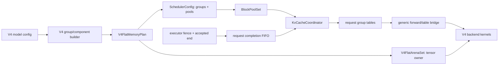

# DeepSeek V4 L1 KV cache 向 flat block pool 的最终迁移方案

## 文档状态

- 方案状态：Final；本文描述本分支收敛后的终态契约，不再描述已删除的中间实现。
- 基线：`origin/main@4928e808e859fbf598c6bc15c0580702216396f2`。
- 实现分支：`feat/deepseek-v4-flat-kv-cache-migration`。
- 范围：DeepSeek V4 device/L1 KV cache 的规划、申请、prefix、执行元数据、回收和生命周期。
- 交付方式：一次性交付，不按 phase 拆分，也不保留依赖 radix fallback 的半迁移状态。
- 已有外部证据：本分支在收敛前已完成 GSM8K 精度和性能基准；完成本次重构后仍须复跑最终 commit。

## 1. 最终结论

DeepSeek V4 的 cache groups 具有不同的 raw-token page span、retention、table layout 和每页 payload。Flat KV 因此统一的是 ownership、admission、prefix、lifecycle 和 observability 接口，而不是把所有 payload 强塞进一个同构物理 free-list。

最终设计由四个有明确边界的模块组成：

1. `V4FlatArenaSet` 是 target/draft device tensors 的唯一 owner。
2. `BlockPoolSet` 管理多个同构 pool 的 page identity、free/cached/LRU/refcount metadata，不拥有 device tensors。
3. `KvCacheCoordinator` 负责 heterogeneous groups 的原子 admission、prefix、publication、reclaim 和 free。
4. request-owned completion FIFO 在 executor fence 之后发布 accepted-only prefix，并保护 overlap、terminal cleanup 和 MTP rewind。

模型无关的 EventLoop、ModelExecutor、CUDA Graph wrapper 和 scheduler 只消费通用 cache capabilities、group/table plans 和 lifecycle 接口，不识别 DeepSeek V4。V4 识别、spec 构造、component layout 和 memory plan 构造只存在于 registry/model/pool 初始化边界。



## 2. 范围与非目标

### 2.1 必须对齐的 device-side 功能

- SWA KV、c4/c128 compressed KV、compressor state、c4 indexer KV 和 indexer compressor state。
- FP8 和 MXFP4 indexer layouts。
- prefill、decode、chunked prefill、mixed prefill/decode。
- prefix history chain 和 exact-terminal continuation state。
- target-only 与 MTP target/draft，包括 accepted-only publication 和 overlap scheduling。
- eager、decode/idle CUDA Graph，以及当前可达的 breakable prefill graph。
- finish、abort、forward failure、retract/readmit、device OOM 和 sleep/wake。
- per-pool capacity、pressure、metrics 和 debug observability。

### 2.2 明确不做

- host/L2 cache、D2H/H2D offload、kvstore/L3 和 CPU backup/reload。
- V4 group-aware PD 跨实例 cache transfer。
- variable-size byte allocator、buddy allocator、page relocation 或 compaction。
- 不删除 radix V4。Radix 保留为兼容路径和 differential oracle，但 Flat V4 不从 radix 补表或回退。

V4 与 active KV PD role 的组合继续 fail fast。`get_contiguous_buf_infos` 只是 component buffer enumeration，不代表不同 group page domains 已具备安全的 transfer protocol。

## 3. Parity 契约

| 功能 | Flat V4 必须保持的语义 |
|---|---|
| SWA | bounded table + logical base；只保留 trailing window；null page 永不被真实写入。 |
| c4/c128 history | raw token 到 compressed row/page 的映射不变，离散 local page IDs 正确。 |
| Indexer | c4 indexer KV 与 c4 compressed KV 共用 logical page ID/table，但 component tensors 独立。 |
| Chunked prefill | 任意 chunk boundary 与非 chunk 结果一致；mid-prefill 完整 page 可在 fence 后发布。 |
| Mixed batch | 每个 request、owner 和 group 的 table/base 独立，prefill/decode metadata 不串位。 |
| Prefix | deepest history boundary 决定命中；continuation state 只在该 boundary 完整且 exact-terminal 时恢复。 |
| MTP | target/draft 共用物理 plan 和 logical page domain；只发布 accepted tokens，rejected tail 被 rewind。 |
| Overlap | 最多一个 successor；short accept 取消 successor 的逻辑应用，但仍等待其物理 fence retirement。 |
| CUDA Graph | 每次 replay 刷新全部 owner-local tables/bases；缺 group、超 shape 或 stale generation 立即失败。 |
| Lifecycle | finish/abort/retract/failure 不 double-free、不 UAF；有未退休 dispatch 时延迟最终释放。 |
| Sleep/wake | shared arena 只释放/恢复一次；恢复后清零 null page 并使旧 generation 全部失效。 |

## 4. 唯一的 group geometry 权威

### 4.1 `PagedCacheGroupSpec` 是唯一权威

`PagedCacheGroupSpec.rows_per_page` 和 `entry_stride_tokens` 是唯一的 per-group
page geometry；canonical `block_size` 只是由两者确定的 raw-token page span：

```text
block_size = rows_per_page * entry_stride_tokens
```

构造时 `block_size=None` 只表示“由 geometry 立即规范化”，对象完成构造后始终持有正整数。显式值必须与乘积完全一致。V4 component planes、runtime arena、table plan 和 CUDA Graph shapes 都消费同一个 owner-local spec 的 `rows_per_page`，不得再从 model layout helper 或 global page size 推导另一套 rows/page。Python bridge 将 canonical geometry 原样传给 C++，C++ group 构造边界再次校验同一乘积。

禁止重新引入：

- `block_size_tokens` 等镜像字段；
- V4 专属 override；
- explicit Flat V4 对 global scheduler block size 的 fallback；
- hot path 中重复推导或猜测 group geometry。

当 group specs 非空时，scheduler `block_size` 仅由所有 canonical group
`block_size` 的 GCD 得到，作为 content-hash base grain；传入
`resolve_scheduler_block_size` 的 global `page_size` 不参与该 GCD。Python runtime
只有在没有 group specs 的 legacy/radix 路径才使用 global `page_size`。C++ ABI
仍接受升级前直接构造的 legacy/radix group config（`block_size == 0`）并保留原有
fallback；explicit Flat 构造边界会拒绝该值，绝不以 global size 覆盖或补全任一
group geometry。

### 4.2 V4 group topology

实际存在的 groups 由 target/draft model config 构造；不存在的 compression ratio 不创建 group 或 pool。典型 `1/4/128` topology 如下：

| Group | Family / retention | Rows/page | Stride | `block_size` | Table | Prefix role |
|---|---|---:|---:|---:|---|---|
| `v4.swa_kv` | state / sliding | 64 | 1 | 64 | bounded | continuation |
| `v4.c4a.compressor_state` | state / sliding | 4 | 1 | 4 | bounded | continuation |
| `v4.c4a.compressed_kv` | history / full | 64 | 4 | 256 | absolute | anchor |
| `v4.c128a.compressor_state` | state / sliding | 8 | 1 | 8 | bounded | continuation |
| `v4.c128a.compressed_kv` | history / full | 2 | 128 | 256 | absolute | anchor |
| `v4.c4a.indexer_compressor_state` | state / sliding | 4 | 1 | 4 | bounded | continuation |

base hash grain 是 present group block sizes 的 GCD；history alignment 是 present history anchors 的 LCM。两者从 plan 计算，不能硬编码 4 或 256。

## 5. Heterogeneous pool 和 device layout

### 5.1 Pool identity

每个 storage class 绑定一个 frozen `pool_id`。`BlockPoolSet` 将其规范化为稳定的 `PoolIndex`，并为每个 pool 维护独立 local `page_id` 空间。forward tables 仍只发送连续 `int32 page_id`；静态 `group_id -> pool_id` binding 已足以解释它，不需要把 `(pool_id, page_id)` 打包进每个 table cell。

跨 pool 的完整身份是 `(pool_id, local_page_id)`。不同 pool 的相同 local page ID 无关联，不能比较或互换。

page 0 是每个 pool 的 null page：

- allocator 永不把它作为真实 page 返回；
- arena 初始化和 wake 后必须清零对应 payload；
- kernel write location 只接受真实、有效范围内的 page；
- hole、padding 和 graph dummy 可以引用 0，但必须被 mask。

### 5.2 连续性契约

Flat KV 不保证一个 request 获得连续 physical page IDs。正确性只依赖：

- 单个 component page row 在 tensor 内连续；
- block table 中 logical slot 顺序稳定；
- `BlockRef` 存活期间 local page ID 不迁移；
- tensor leading dimension 与对应 pool `total_blocks` 完全一致。

因此不引入 page compaction，也不为追求连续 ID 牺牲 prefix reuse 或 allocation latency。

### 5.3 Layout efficiency

每个 pool 只承担绑定 group 的 component planes。一个 block 的 payload 为：

```text
bytes_per_block(pool) = sum(bytes_per_block(component in pool))
payload_bytes(pool)   = total_blocks(pool) * bytes_per_block(pool)
```

target/draft 同名 group 使用同一 logical page domain：

- pool capacity 取各 owner 对该 group 的最大需求，不因 draft 再创建一套 page IDs；
- block payload 包含所有实际存在的 owner-namespaced components；
- 同一 component identity 重复声明时，dtype/shape/stride/alignment 必须完全一致；
- `storage_schema_hash` 覆盖最终 component union。

c4 compressed KV 和 c4 indexer KV 是一个 logical group 的两个 planes，不是两个 allocator groups。只有 eviction、retention、prefix 或 lifecycle 真正独立时才允许拆 group。

## 6. Memory plan 边界

### 6.1 通用 plan

`flat_memory_plan.py` 只包含模型无关的数据结构和纯函数：

- component/tensor geometry；
- `FlatBlockPoolPlan`；
- `FlatGroupTablePlan`；
- `FlatRuntimeMetadataPlan`；
- graph table/base device bytes；
- forward input table/base device bytes；
- 通用 shape/allocation validation。

该模块不得 import V4 config，也不得包含 V4 group names、owner policy 或 cache topology。

### 6.2 V4 plan builder

V4 builder 分为两层：`kv_cache/deepseek_v4.py` 的公开入口从模型 layout
派生 owner-local specs、components 和通用 runtime metadata；
`configs/deepseek_v4_flat_memory_plan.py` 的纯配置层负责：

- target/draft owner-local spec union；
- group-to-pool 和 component-to-pool binding；
- per-pool capacity、payload 和 storage schema；
- 组合通用 `FlatRuntimeMetadataPlan`，不重复定义 table geometry；
- plan fingerprint 与 TP agreement。

最终 device budget 只包含真实占用 GPU memory 的项目：

```text
device_cache_total_bytes = payload_bytes
                         + graph_metadata_bytes
                         + forward_input_bytes
```

不再维护 CPU object/header/staging 的估算值，因为它们不是 device admission correctness gate。TP 正常路径只 all-gather `{rank, plan_fingerprint}`；不传输完整 canonical plan。只有所有 rank 同时发现 fingerprint 不一致时，才执行第二次 canonical-plan gather，并报告首个不同字段的完整路径和值。

## 7. Allocation、prefix 与生命周期

### 7.1 `PoolDemand`

所有 capacity 决策都使用按 canonical pool index 排列的 `PoolDemand`：

- fresh allocation；
- cached-hit claim；
- slide/reclaim credit；
- decode reservation；
- retract victim release；
- admission pressure。

比较是 component-wise，不允许把所有 pages 求和后用一个 pool 的余量补另一个 pool。常见小 pool count 使用 inline storage；实现不得把当前 V4 的 pool 数固化成通用契约，也不得在 scheduler hot path 每轮构造 map/string lookup。

逐轮 load/legacy-page 兼容统计只跨 Python/C++ 边界返回 active/capacity bytes 与
bottleneck pressure 的固定 scalar aggregate，不构造 per-pool rows。完整 per-pool
snapshot 只用于 metrics/debug 低频路径；Prometheus 开启时最多每秒采样一次。关闭
metrics 时 decode loop 只读取固定 scalar aggregate 并派生两个整数 page counters，
不创建 per-pool snapshot vector/tuple/set 或 labeled summary/metric dict。

### 7.2 原子 admission

一次 admission 的顺序固定为：

1. 完成所有可能失败的 non-pool gates，例如 request slot 和调度限制。
2. `PreparePrefix` 只读匹配并计算 claim demand。
3. coordinator 对 claim + fresh demand 做跨 pool capacity preflight。
4. 预分配所有 host vectors/map slots。
5. 在 scheduler mutation thread 上连续 claim hits 并 acquire fresh blocks。
6. 把 tables 作为一个 committed owner 移交给 request。

任一 pool 不足时所有 pools 都不变。`PreparedPrefix` 是 scheduler-iteration-local、move-only 的只读匹配结果；在 scheduler-thread confinement 下只保留 match 和 claim demand，不保存重复 owner、epoch、hash 或 identity 快照。不得让它跨 scheduler iteration 存活。

### 7.3 Prefix semantics

history anchors 形成 content-hash chain；continuation states 不独立决定命中深度。coordinator 先确定 deepest history boundary，再在同一 boundary exact-probe 所有 required continuation groups：

- bundle 完整：claim history + state；
- 任一 required state 缺失：按 V4 既有语义回退 root/cold compute；
- prefix disabled：所有 continuation groups 仍参与 allocation/lifecycle，但不参与 matching。

`PreparedReadyBlocks` 保留两阶段提交，因为 completion publication 同时修改多个 block-pool indices、prefix bindings 和可能的 host mailbox。它负责最后一个 fallible prepare 和 `noexcept` commit；不能用 scheduler-thread confinement 删除这层强异常安全。

### 7.4 Terminal lifecycle

request tables 是 device page refs 的唯一 scheduler owner。finish、abort、forward failure 和 retract 都必须 idempotent：

- 没有 outstanding execution：立即 free；
- 有 outstanding/canceled dispatch：记录 pending terminal，等所有 fences retirement 后 free；
- short accept：先取消 successor 的逻辑应用，但保留其物理 execution debt；只有在 successor fence 也退休、request 进入 quiescent 后才 rewind rejected tail；
- stale generation/sequence：拒绝，不改变当前 request；
- sleep/wake：shared `device_cache_arena` 只释放/恢复一次，arena generation 改变后旧 metadata 失效。

## 8. Executor-fenced completion

Explicit Flat pools 自动启用 fenced publication，不再有 V4 专属或默认关闭的 feature flag。

### 8.1 ABI

executor 提交给 scheduler 的 completion payload 只包含：

```text
table_generation
dispatch_seq
accepted_raw_end
```

request identity 和本次 tokens 由外层 forward result 提供。request-owned dispatch record 只保存 sequence、`dispatch_raw_start/end` 和 completion policy；`protected_raw_end` 仅随 executor input 保留到 fence。immutable group strides 由 scheduler completion schema 持有，其余 group geometry 由 coordinator 持有。Python 不发送 per-group ready ends，也不暴露 producer-domain watermark。

这里的 `table_generation` 是 request reincarnation fence；`FlatForwardOperation.cache_generation` 则是 shared arena reset/sleep-wake fence。二者生命周期不同，不得复用或互相推导。

### 8.2 Request-owned fixed FIFO

当前运行时只支持 overlap depth 0 或 1，所以每个 request 最多保留两个 inline dispatch records：

- fixed-size FIFO 是 `Request` 的 inline state；post-FSM dispatch publication 不再创建 map node，dispatch spec 和 internal record 都不携带或复制 request ID；
- completion 必须按 `dispatch_seq` retirement；
- 不支持 arbitrary reorder、duplicate/retransmission 或 32-domain transaction engine；
- completion schema/scratch 不为每次 submit 分配 reorder buffer；
- canceled physical work仍占 FIFO，直到对应 executor fence 到达。

execution plan 先完成所有可能失败的 storage/materialization 和 vector reserve，再进入 `noexcept` 的 fail-stop publication tail；该 tail 对每个返回的 row 直接调用 `RecordDispatch`，随后发布 plan。FIFO 本身没有 batch transaction、rollback handle 或 dispatch rollback log。completion 到达后的 prefix publication 仍可使用作用域内的 fallible prepare 和 `noexcept` commit 来保证多 pool 强异常安全；这不是可乱序、可回滚的通用 completion transaction engine。

fence 到达后 completion schema 先按静态 `entry_stride_tokens` 将 accepted end 对齐到各组已完成的写入边界；coordinator 再按 `block_size`、table layout 和 prefix role 只发布完整 page 或 exact-terminal state snapshot。publication 顺序为：

1. 校验 generation、sequence 和 accepted range。
2. 准备所有新 ready prefix bindings。
3. `noexcept` commit bindings 和 per-group progress。
4. 退休当前 dispatch；short accept 时把依赖它的 successor 标记为 canceled，但不提前释放或改写其仍可能被 GPU 写入的 pages。
5. full accept 可在当前 fence 后 reclaim expired sliding pages；short accept 必须等所有 canceled successor fences 退休。
6. request quiescent 后才 rewind rejected tail、完成最终 reclaim，并执行 pending terminal free。

这保证 cache 只有在 GPU 不再写对应 dispatch 后才对 prefix matcher 可见。

## 9. Forward table ABI 与 hot path

### 9.1 单一 table-source 决策

通用 `resolve_cache_table_binding` 在 ModelExecutor 初始化边界构造 immutable
`CacheTableBinding`，并选择：

- Flat：group tables + logical bases；
- Radix：legacy paged table；
- `radix` / `flat` 之外不存在运行时 fallback。

ModelExecutor 根据 binding 一次绑定 Flat 或 Radix extractor，把同一 binding 交给 graph wrapper，并把 source kind 固定到 backend graph state；forward/replay 不再各自推断 kind，Flat extractor 也不构造 paged/radix mappings。`resolve_cache_table_source` 仅在外层兼容调用边界把 legacy kwargs 规范化为同一 source object。Flat source 必须覆盖 owner 所需全部 groups；缺失或混入另一 source 立即报错。V4 metadata 是否含 legacy block table 由实际 rank-2、非零宽 table geometry 派生，不再保存另一份 per-metadata source-kind 状态。

target 和 draft Flat pools 必须共享同一个 validated plan object，而不只是 fingerprint 相同。这样 table geometry、capture widths 和 pool identity 只在构造边界验证一次，后续 consumers 共享已验证对象。

### 9.2 Dense metadata

forward bridge 每个 group 输出：

- row-major contiguous `int32` page table；
- contiguous `int32` logical base vector；
- bounded shape/header。

初始化边界验证 owner groups、scheduler union、target/draft plan identity、backend capability、ring schema 和 allocation。planned Flat staging 每次只校验动态 rows/cols/page-id header 与 arena generation，并拷入稳定 ring slot；owner-local projection 按 slot identity 复用。只有 legacy/unplanned conversion 在自己的转换边界验证 tensor schema。ModelExecutor、CUDA Graph wrapper 和 backend 共享 binding 与稳定 table/base view，不再逐层重复构造 key sets、复制 mappings 或重新校验静态 plan consistency。

## 10. CUDA Graph 与 MTP

CUDA Graph capture widths 来自 `FlatGroupTablePlan`：

- full-history：覆盖 max context 和 protected reservation；
- bounded-window state：覆盖 trailing window、alignment guard 和 protected reservation；
- target/draft：按 owner-local groups 规划，但共享同一 executor graph batch rows；两端共有的 group 使用同一 capture width。

graph wrapper 只消费通用 plan fields：owner、group table plans、capture columns、batch rows 和 exact allocation bytes。它不 import V4，也不推断 V4 topology。capture 阶段按 plan/group ids 建立 persistent buffers，不要求尚不存在的 live request tables；严格的 group 完整性只在 eager/replay 消费真实 source 时执行。每次 replay 必须刷新 table values 和 bases；shape 超 plan、group 缺失或 arena generation 过期直接失败。

MTP target/draft 使用同一个 physical plan 和 pool domain，但各自只消费 owner-local tables。target/verify 的特殊 metadata sequencing 由 backend 的通用 speculative hook 封装，wrapper 不识别模型。accepted tail 以 target scheduler state 为权威；draft rejected rows 不得进入 prefix，也不得被后续 replay 读取。

draft model 另以 fail-closed 的 `draft_first_step_covers_all_kv_layers` 声明一次成功的 first step 是否足以清偿全部 draft-owner producer debt。V4 NextN 仅在 `num_mtp_layers == 1` 时返回 true；多层 round-robin 写入仍保持 false，直到存在逐层 dense catch-up。

## 11. Model-agnostic runtime 边界

核心 runtime 允许的通用 capabilities 为：

- `supports_pd_transfer`；
- `supports_hierarchical_kv_cache`；
- `device_cache_arena`；
- `scheduler_group_specs` / `scheduler_group_page_counts`；
- Flat table/capture plan；
- `draft_first_step_covers_all_kv_layers`：draft model 声明、默认 false 的 Flat completion producer-debt gate；
- arena generation、clear/reset 和 metrics hooks。

禁止在 EventLoop、ModelExecutor、CUDA Graph wrapper、scheduler core 中出现：

- DeepSeek V4 type check 或 import；
- V4 group IDs；
- V4 专属开关；
- 根据 model name 选择 allocator/completion 行为。

V4 registry/pool 可以实现上述 capability，核心路径只按 capability 执行。PD 和 hierarchical-cache guards 同样基于 pool capabilities，而不是 model name。

## 12. 需要保留与需要删除的工作

### 12.1 保留

- `BlockPoolSet` 和 local page identity。
- `PoolDemand` component-wise capacity math。
- `KvCacheCoordinator` 的 group policy 和 atomic acquire。
- `PreparedReadyBlocks` 的 publication strong exception safety。
- `V4FlatArenaSet` sole ownership、target/draft shared plan 和 sleep/wake generation。
- family-scoped prefix、bounded bases、accepted-only fenced publication。
- radix V4 兼容路径和外部 differential oracle。

### 12.2 删除或禁止回归

- model-aware EventLoop/core branches。
- `block_size_tokens` 和 explicit Flat global fallback。
- producer-domain completion mask、per-group Python progress 和 arbitrary reorder engine。
- CPU metadata byte estimates和完整 canonical plan all-gather。
- V4 backend 内到处散落的 radix/flat fallback。
- 重复 table/base validator、重复 hash/helper 和未使用 wrappers/members。
- 仅为已删除通用 completion engine 服务的大型测试矩阵。
- 大段 fake torch/runtime harness；测试优先调用 production spec/plan builder。

## 13. 不变量

1. 每个 group 的 `block_size == rows_per_page * entry_stride_tokens > 0`。
2. explicit Flat 的 group 必须绑定 frozen pool；pool 必须有正的 usable capacity 和 bytes-per-block。
3. page 0 永远是清零 null page，真实 allocation 不返回 0。
4. local page ID 只在其 pool 内解释；跨 pool 身份包含 pool ID。
5. target/draft 同名 group 的 scheduling schema 完全一致，并共享同一个 plan object。
6. group table rows、logical bases、capture widths 和 plan shape完全一致。
7. admission 对所有 pools 原子；失败前后 snapshots 相同。
8. prefix prepare/claim 只能在同一 scheduler iteration 的 mutation-domain commit 内完成。
9. continuation state 只能附着于 exact deepest history boundary。
10. prefix publication 只能发生在 executor fence 后，且不得超过 accepted end。
11. completion generation/sequence 单调；stale completion 不改变新 request incarnation。
12. 任一 outstanding dispatch 存在时，request pages 和 arena 不得提前释放。
13. graph replay 必须刷新全部 owner-required tables/bases。
14. Flat V4 不依赖 radix table、single-pool occupied pages 或 PD transfer fallback。

## 14. 验收矩阵

### 14.1 Python/config

- V4 group topology 对不同 ratio、FP8/MXFP4、target/draft 组合 table-driven。
- `block_size` derivation、显式 mismatch 和 C++ bridge parity。
- pool/component/table plan、device byte accounting 和 fingerprint agreement。
- target/draft plan identity、table-source exclusivity 和 capability guards。
- CUDA Graph owner shapes、allocation validation 和 arena generation。

### 14.2 C++ scheduler

- heterogeneous `BlockPoolSet` allocation/free、null page 和 per-pool snapshots。
- `PoolDemand` admission、reservation、reclaim/retract 和单 pool bottleneck。
- prefix history + exact continuation bundle，缺 state 回 root。
- `PreparedPrefix` atomic claim/acquire，以及真实 heterogeneous multi-pool `PreparedReadyBlocks` fallible prepare/destructor rollback/`noexcept` commit；completion FIFO 本身不含 rollback journal。
- FIFO depth 1/2、mid-prefill、short accept、stale generation/seq、MTP rewind。
- finish/abort/retract 共用 terminal fence；outstanding/canceled dispatch 退休前 starvation 不得 retract/free，退休后才能回收。group-aware PD transfer 不在本次验收范围。
- Flat ON 与 Radix OFF 两个 compile variants。

### 14.3 跨层和 hardware

- 一个最小 V4 Flat synthetic smoke，覆盖 plan -> scheduler -> forward tables -> backend metadata。
- arena ownership、target/draft views、sleep/wake 和 stale-generation 独立 tests。
- 真实 DeepSeek V4：eager/graph、chunked/mixed、target-only/MTP。
- Radix/Flat token parity、prefix hit/accepted-tail parity、无 OOB/UAF/double-free。
- GSM8K 精度复跑。
- 相同模型参数和负载下比较 TTFT、ITL、throughput、GPU memory、scheduler CPU；不得出现明显 hot-path regression。
- profiler 必须核对 grouped table/base 的 H2D/D2D copy 数量；若相对 Radix/旧 Flat 出现显著回归，收敛为 ring-slot packed slab、一次 active-range H2D 和 backend fused unpack，不在 hot path 增加逐 group Python 分配。

仓库内 tests 只保留 V4 Flat 独有且正交的 contracts；相近输入使用 table-driven tests。Radix 已有语义不复制一套新 tests，真实 checkpoint 精度和性能由外部验收提供。

### 14.4 B200 最终验收入口

`TOKENSPEED_FLAT_KVCACHE` 是 scheduler extension 的编译期开关，不是 serve
时读取的环境变量。Flat 与 Radix 必须分别强制重编译，并在启动前核对实际 import：

```bash
python3 -m pip install --no-cache-dir --force-reinstall --no-deps \
  --config-settings=cmake.define.TOKENSPEED_FLAT_KVCACHE=ON \
  ./tokenspeed-scheduler
python3 -c 'import tokenspeed_scheduler as s; print(s.__file__); assert s.FLAT_KVCACHE is True'
python3 -m pytest -q test/runtime/test_deepseek_v4_flat_synthetic.py
```

随后使用同一 commit、模型、serve 参数、prompt 集、并发和生成参数运行 Flat；启动日志必须同时出现：

```text
KV cache scheduler backend=flat (TOKENSPEED_FLAT_KVCACHE=ON)
Scheduler config: kv_backend=flat admission_path=fenced-flat
```

保留 GSM8K score、逐请求 token 输出、TTFT、ITL、throughput、GPU memory 和
scheduler CPU 原始结果。再仅把上面的 CMake 值改为 `OFF`，断言
`s.FLAT_KVCACHE is False`，以完全相同的运行参数重跑 Radix。性能比较先完成相同
warmup，再至少重复三次取中位数；精度比较使用同一 evalscope 版本和 work dir
配置。任何 token/prefix/accepted-tail 差异、CUDA OOB/UAF、Flat 日志未进入
`fenced-flat`，或相对重构前基线的显著性能回退，都视为验收失败。

## 15. 完成定义

- 核心 model-agnostic 模块没有 V4 import、名称判断或专属配置。
- `block_size`、plan identity、table geometry 和 lifecycle state 各只有一个权威来源。
- V4 Flat 的 allocation、prefix、execution、retract、terminal、MTP、graph 和 sleep/wake contracts 全部通过。
- Flat scheduler 和 Radix scheduler 都能干净构建并通过适用 tests。
- migration 文档与最终代码一致，不再引用已删除 API。
- 最终 commit 在 B200 上通过真实模型精度和性能复验。
- 本次不扩展 L2、kvstore、CPU offload 或 group-aware PD transfer。

## 16. 主要代码边界

- V4 group geometry：`python/tokenspeed/runtime/configs/deepseek_v4_cache_spec.py`
- 通用 Flat plan：`python/tokenspeed/runtime/configs/flat_memory_plan.py`
- V4 plan 入口：`python/tokenspeed/runtime/layers/attention/kv_cache/deepseek_v4.py`
- V4 plan 配置组合：`python/tokenspeed/runtime/configs/deepseek_v4_flat_memory_plan.py`
- 通用 table source/binding：`python/tokenspeed/runtime/flat_cache_tables.py`
- 通用 capability guards：`python/tokenspeed/runtime/cache_capabilities.py`
- V4 arena/pool：`python/tokenspeed/runtime/layers/attention/kv_cache/deepseek_v4.py`
- V4 backend：`python/tokenspeed/runtime/layers/attention/backends/deepseek_v4.py`
- 通用 Flat group adapter：`python/tokenspeed/runtime/layers/attention/backends/flat_groups.py`
- Python completion bridge：`python/tokenspeed/runtime/execution/types.py`
- C++ pools/coordinator：`tokenspeed-scheduler/csrc/cache/`
- C++ request-owned FIFO：`tokenspeed-scheduler/csrc/scheduler/request.h`
- C++ completion schema/scratch：`tokenspeed-scheduler/csrc/scheduler/flat_kv_completion_ledger.{h,cpp}`
- Scheduler lifecycle：`tokenspeed-scheduler/csrc/scheduler/operations/forward.cpp`
