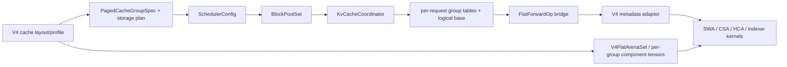

# DeepSeek V4 device KV cache 向 flat block pool 的一次性迁移方案

## 文档状态

- 方案状态：Final；feature branch 已落地实现与 CI gate，B200 hardware acceptance pending
- 决策日期：2026-07-13
- L1 ownership 收敛复核：2026-07-16
- 基线：`origin/main@08b1153979122a0bf72bf79879d362f1965697e0`
- 实现分支：`feat/deepseek-v4-flat-kv-cache-migration`
- 范围：DeepSeek V4 的 device/L1 KV cache 管理和执行元数据
- 非目标：host/L2 cache、kvstore/L3、CPU offload/reload、V4 group-aware PD 跨实例 cache transfer 的协议与实现
- 安全收口：`origin/main` 基线的 V4 active KV PD role unsupported 且缺少 capability guard；本分支已补 model-aware pre-init guard 与 PD factory defense，但不把 PD transfer 误算为迁移 parity
- 交付方式：一次性完成，不提供功能残缺的中间态，也不按 phase 拆分上线
- 目标：flat 构建下完整承接当前 radix 路径的 V4 功能与正确性，同时兑现异构 page、稳定寻址和 layout efficiency

本文第 3、4 节的“当前行为”“gap”和源码行号均描述上述 `origin/main` 快照，用作迁移的 parity oracle；第 5 节以后描述最终设计和本分支实现。`implemented/wired` 只表示代码与 gate 已接线，不等于 B200 上的 token parity、kernel confinement 或 topology acceptance 已经通过。

## 1. 结论

DeepSeek V4 不能直接接入当前“一个全局 `BlockPool` + 一个全局 page-id 空间”的 flat 实现。当前 V4 buffer 已按 cache group 分配不同的 page 数和不同的 page payload；全局 page ID 不仅会让每个 block 支付所有 group 的显存，还可能直接越过某个 V4 tensor 的 leading dimension。

目标设计采用一个深的统一模块，而不是一个强制统一的物理 free-list：

1. C++ 引入 `BlockPoolSet`，每个 storage class 拥有一个同构 `BlockPool` 和一个独立、稳定的本地 page-id/ref/LRU metadata 空间；它不拥有 device tensors。
2. Python 引入唯一的 `V4FlatArenaSet` 作为所有 target/draft component tensors 的 sole owner。target/draft pool object 只是 non-owning views；event loop 共同持有 arena-set 与 pool-set 的完整生命周期。
3. target 与 MTP draft 的 group specs 取并集；典型 target 的六个逻辑 cache group 各绑定一个 storage class。`c4 compressed KV` 和 `c4 indexer KV` 仍是同一逻辑 group、同一 table、同一 arena 中的两个 component plane，draft component 也按其 group 共址并复用同一 page ID。
4. block table 继续只传 `int32 page_id`；`group_id -> pool_id` 是静态配置，因此热路径不需要复合地址。跨模块需要唯一身份时使用 `(pool_id, page_id)`。
5. admission、prefix claim、slide/reclaim credit、decode reservation、retraction 和 metrics 全部从 scalar page count 改成逐 pool 的 `PoolDemand`。
6. logical page identity 始终是绝对编号，但表示按 retention 分开：full-history table 保持 base 0；V4 sliding/state table 使用 `base_logical_page + bounded page vector`，回收前缀只推进 base，不搬迁物理 page。这样避免 raw span 4 的 state table 随总 context 线性膨胀。page 0 在每个 arena 都初始化为全零，所有真实/graph-dummy 写入都必须被 mask 掉。
7. prefix role 不是一个 `prefix_eligible` 布尔值：history anchor 决定 deepest boundary，continuation state 必须在该 boundary 做 exact-terminal 整束恢复。在同一 coordinator 临界区内用 transaction-local `PreparedPrefix` 先全量验证、再一次性 claim/commit，不引入长期 continuation directory。
8. V4 backend 直接消费全部 flat group tables；eager、chunked prefill、mixed、CUDA Graph、MTP、overlap scheduling 和 prefix replay 必须在同一个变更集内通过 radix/flat differential gate。
9. physical page ID 连续不是正确性契约。硬约束是单个 page row 连续、logical slot 稳定、page ID 在引用存续期间不搬迁。
10. `get_contiguous_buf_infos` 只是 buffer 枚举 ABI，不是 PD capability。所有 V4 + active KV PD role 在 radix/flat 两种构建下都必须于模型、pool、scheduler 和传输资源创建前 fail fast；未来 group-aware PD 另立设计。

“Unified”在这里统一的是 ownership、admission、prefix、reclaim 和 observability 的接口。不同 payload ABI 的 page 不是可互换资源，强行放入同一个物理池会破坏 V4 的显存效率和边界安全。

## 2. 范围和兼容性边界

### 2.1 本次必须完成

- V4 所有 device cache：SWA KV、c4/c128 compressed KV、compressor state、c4 indexer KV、indexer compressor state。
- 现有 V4 执行模式：prefill、decode、chunked prefill、mixed prefill/decode。
- FP8 与 MXFP4 indexer cache layout。
- prefix caching，包括 history chain、continuation state、eviction、reuse 和 speculative accepted-only publication。
- target-only 与 MTP target/draft，包含 overlap scheduling。
- eager 与 CUDA Graph capture/replay，包括当前可达的 breakable prefill graph、decode 和 idle capture。
- finish、abort、forward failure、retract/readmit、device OOM 和 sleep/wake 的现有支持边界。
- per-pool capacity、metrics、DP load signal 和 debug observability。
- radix/flat 的 token、cache-hit、speculative acceptance differential，以及 flat 路径的 slot/table/cache-content/lifecycle confinement 验收。

### 2.2 明确不做

- host `BlockPool`、D2H/H2D L2 streaming sink、host prefix hit。
- kvstore/L3、remote object storage。
- `get_cpu_copy` / `load_cpu_copy` 对 V4 的实现。
- V4 group-aware PD 跨实例 cache transfer 的协议与实现。`origin/main` 基线只有 component-buffer enumeration，active KV PD role 没有 V4 capability guard，会落入对所有 component 复用单一 `occupied_pages` 的 generic path。该组合按 grouped-cache contract 未支持，可能错页或越过较小 buffer 的注册范围，不能算 radix/V4 parity。本分支只补齐 model-aware pre-init fail-fast 与 PD factory defense；group-aware PD 另立设计。
- variable-size byte allocator、buddy allocator、page relocation 或 compaction。
- 在本迁移中删除 radix V4 路径。radix adapter 和其语义测试作为 deterministic differential oracle 保留；全局 radix removal 单独清理。

所有 DeepSeek V4 + active KV PD role（当前是 `disaggregation_mode in {prefill, decode}`；`encode` 继续由既有 text-model 校验拒绝）无论 radix/flat 构建都必须 fail fast。主 guard 在加载 target/draft model config 后、`_init_distributed`、model runner、attention profile/pool 和 scheduler 创建前执行；PD factory 在 `get_kv_args` 前再用 pool capability 做防绕过校验。默认 bootstrap port 或其他未激活 PD 的字段不能单独触发 guard。

当 V4 与 heterogeneous pool-set 同时启用时，可配置的 `enable_kvstore` 或 flat host tier 必须在 runtime 创建前 fail fast；没有独立启动开关的 `get_cpu_copy` / `load_cpu_copy` 保持未实现并在调用时 fail fast。不能让旧的单 pool `TransferPair` 在缺少 page-domain identity 的情况下被误用。

### 2.3 一次性交付的含义

代码可以按依赖顺序实现；feature branch 只有在全部 code-level invariants、fail-fast 和自动化 wiring 落地后，才允许将 `DeepseekV4AttentionBackend.uses_flat_cache_groups` 打开，以便执行 hardware acceptance。该 flag 不是合并/发布证据：第 8 节 B200 gates 未通过前仍不得解除 release guard。迁移过程中保留的 guard 只能报错，不能回退到 table-blind、单表或部分 group 的执行路径。

## 3. `origin/main` 基线的 V4 cache 契约

### 3.1 热路径和 ownership



目标 ownership 只有四层：

- `V4FlatArenaSet`（Python）唯一拥有所有 device component tensors、allocation byte accounting 和 sleep/wake buffer generation；target/draft pool 只持 view。
- `BlockPoolSet`（C++）只拥有 local page identity、`CacheBlock`/refcount、free/cached LRU 和 content index metadata，不拥有 tensor storage。
- `KvCacheCoordinator` 拥有 group policy、prefix 对齐和跨 pool 事务。
- 每个 request 的 `BlockTable` 通过 `BlockRef` 持有页面引用；backend 只消费只读表，不拥有页面。

event loop 同时持有 `V4FlatArenaSet` 与 `BlockPoolSet` 的 owner，确保任何 `BlockRef`、backend view 或 async execution 存续时二者都不会被销毁。不能再增加“V4 allocator adapter -> flat allocator adapter -> scheduler adapter”之类的浅层转发；payload ownership、allocator metadata 和跨 pool policy 分别收敛在 arena-set、pool-set 和 coordinator 三个深模块内。

### 3.2 逻辑 group 和物理 payload

典型的 c4+c128 模型发布六个逻辑 group。某种 ratio 不存在时，对应 group 和 arena 都不创建。

| Logical group | Family / retention | Rows/page | Raw-token stride | Raw tokens/page | 物理 component | 关键语义 |
|---|---|---:|---:|---:|---|---|
| `v4.swa_kv` | state / sliding | 64 | 1 | 64 | 所有层 SWA KV | 每 step 写入；只保留 trailing window |
| `v4.c4a.compressor_state` | state / sliding | 4 | 1 | 4 | ratio-4 compressor state | 8-token continuation window |
| `v4.c4a.compressed_kv` | history / full | 64 | 4 | 256 | c4 compressed KV + c4 indexer KV | 两种 component 共用 page ID 和 table |
| `v4.c128a.compressor_state` | state / sliding | 8 | 1 | 8 | ratio-128 compressor state | 128-token continuation window |
| `v4.c128a.compressed_kv` | history / full | 2 | 128 | 256 | c128 compressed KV | full-history chain |
| `v4.c4a.indexer_compressor_state` | state / sliding | 4 | 1 | 4 | c4 indexer compressor state | 与 c4 indexer 写入原子推进 |

来源是 `python/tokenspeed/runtime/configs/deepseek_v4_cache_spec.py:192-248`。当前 bridge 只传 `rows_per_page` 和 `entry_stride_tokens`，却没有给已经存在的 C++ `PagedCacheGroupConfig.block_size` 赋值（`python/tokenspeed/runtime/engine/scheduler_utils.py:129-159`）。因此 flat 路径会退回 global block size；对 V4 正确的 C++ block size 必须是：

```text
block_size_tokens = rows_per_page * entry_stride_tokens
```

六组的典型值分别是 `64, 4, 256, 8, 256, 4`，其 GCD 为 4，history/prefix 的共同对齐边界为 256。这两个数必须从实际存在的 groups 计算，不能硬编码：ratio 0 会被规范化为 1；ratio 0/1-only 配置只有 64-token SWA group、没有 `HistoryAnchor`，因此不能声称 LCM=256。本方案对该配置在 prefix disabled 时保持 cold/root compute，在 `enable_prefix_caching` 时启动失败；不把未设计的 state-only prefix skip 混入本次迁移。

### 3.3 每个 V4 page 的显存公式

令：

- `Nall`、`N4`、`N128` 分别为总层数、c4 层数和 c128 层数；
- `R_swa` 为 SWA 单 row bytes；
- `A(x, a)` 为按 kernel alignment `a` 向上对齐；
- `R_idx` 为 FP8 或 MXFP4 indexer 单 row bytes；
- FP32 state 每个元素 4 bytes。

则每个逻辑 group 的 page bytes 是其所有 layer component plane 之和：

```text
B_swa       = sum(all layers) A(64 * R_swa, swa_token_stride)
B_c4_hist   = sum(c4 layers) [A(64 * R_swa, swa_token_stride) + 64 * R_idx]
B_c128_hist = sum(c128 layers) A(2 * R_swa, swa_token_stride)
B_c4_state  = sum(c4 layers) 4 * state_width(layer) * 2 * 4
B_c128_state= sum(c128 layers) 8 * state_width(layer) * 2 * 4
B_idx_state = sum(c4 layers) 4 * (2 * index_head_dim) * 2 * 4
```

MTP 不能继续用一个与 group 无关的 `draft_cache_cell_size * max_total_tokens` 近似。scheduler 只管理一套 request logical tables；target 与 draft 对同一个 group、同一个 logical page 必须使用相同 local page ID。因此 storage plan 以 target/draft specs 的并集建 pools，容量不因同一 request 多一套 draft tensor 而翻倍，但每个 block 的 payload 要同时计入两者：

```text
B_pool = sum(target component bytes/page) + sum(draft component bytes/page)
C_pool = capacity required by the shared logical request table
M_pool = C_pool * B_pool
```

target pool object 和 draft pool object 可以保留为不同的 Python non-owning view，但全部 tensor 只由共享 `V4FlatArenaSet` 分配和释放。draft tensor 的 leading dimension 必须来自共享 scheduler pool plan，不能再按 draft 自己的 page-count 公式创建第二套不相干 ID 空间。若 draft 发布 target 不存在的 group，则 scheduler group set 使用并集。同名 group 的逻辑调度 schema 必须一致：rows、stride/raw span、retention、family、sliding/continuation window、prefix role 和 table layout。component schema 按 `(owner, layer, component)` namespace 取确定性并集；只有同一 component identity 重复定义时才要求 dtype/shape/stride/alignment 完全一致，pool `storage_schema_hash` 对最终并集计算。

现有实现已经按 group page count 分别创建 tensor（`python/tokenspeed/runtime/layers/attention/kv_cache/deepseek_v4.py:876-970`）。以 `head_dim=512`、`rope_dim=64`、`index_head_dim=128` 为例，每层 page payload 约为：

| Payload | 每层 bytes/page |
|---|---:|
| SWA | 37,440 |
| c4 history + FP8 indexer | 45,888 |
| c4 history + MXFP4 indexer | 41,792 |
| c128 history | 1,728 |
| c4 compressor state | 32,768 |
| c128 compressor state | 32,768 |
| indexer state | 8,192 |

即使 c4/c128 state 在某个配置下字节数恰好相同，其 row shape 分别是 4 和 8，不能只按 byte size 判断可 alias。storage compatibility 必须包含完整的 tensor planes、dtype、shape、stride、alignment 和 kernel view ABI。

### 3.4 必须对齐的现有功能与安全边界

下表前十一行是 flat 必须实现的 radix/V4 parity；最后一行是 scope guard，不是待迁移的已有功能。完成定义分别要求 parity 实现和 guard fail-fast，不能混为一项。

| 功能或边界 | `origin/main` radix/V4 行为 | flat 迁移契约 |
|---|---|---|
| SWA | 64-row page；slot mapping 每 step 清洗；compact table + base offset | bounded flat table + explicit logical base；真实 token 永不写 page 0 |
| CSA/HCA | c4 overlap CSA、c128 HCA；按 ratio boundary 写 compressed rows | raw token 到 compressed row/page 的映射不变，跨任意离散 page ID 正确 |
| Indexer | c4 indexer KV 与 compressed KV 共 table；支持 FP8/MXFP4 | 共用 logical slot/page ID，但 component tensor 互不覆盖 |
| Chunked prefill | chunk 边界可跨 SWA 和 compressed boundary | 任意 chunk 切分与非 chunk 结果一致 |
| Mixed | 同一 op 内分割 prefill/decode metadata | 每个 request、每个 group 的 row/table 对齐不串位 |
| Prefix | history group 形成 chain；state 作为 continuation snapshot | 命中 deepest history 时仅恢复同一节点的 exact-terminal 完整 state bundle；否则按当前 V4 语义回退 root |
| MTP | target/draft metadata、packed verify、accepted-tail 更新 | accepted-only publish；rejected slots 不进入 prefix，也不被后续 replay 读取 |
| Overlap | reservation horizon 和 late result 保护 | vector reservation；late result、retract 和 accepted tail 无 UAF/double-free |
| CUDA Graph | 当前可达 breakable prefill、decode/idle capture；每 replay 刷新持久 table/offset | 三类 graph 的全部 owner-local V4 group 都刷新；缺一组立即失败；history/state 分别使用 max-context/bounded width |
| 生命周期 | finish/abort/failure/retract/readmit/OOM | 每个 pool 独立回到基线；任一 pool 短缺时不发生部分分配 |
| Sleep/wake | V4 buffer 可丢弃式释放；CPU backup 未实现 | 保持现有支持边界；恢复后重建/清零各 pool，失效引用不得存活 |
| Scope guard: PD | V4 未实现 group-aware PD；基线无 capability guard，会误入复用单 `occupied_pages` 的 generic path | 不伪造 parity；本分支已实现 model-aware pre-init guard 与 factory defense，所有 V4 + active KV PD role 在任何 model/pool/scheduler/transport 资源创建前 fail fast；transfer 协议独立设计 |

## 4. `origin/main` 基线 flat 路径的 gap

### 4.1 Gap 总表

| ID | Gap | 直接后果 | 必做修复 |
|---|---|---|---|
| G1 | Python 没有设置 per-group C++ `block_size` | V4 的 4/8/64/256 raw span 全部按 global 值解释 | bridge 由 `rows * stride` 生成并校验 block size |
| G2 | scheduler 只构造一个 `BlockPool` | V4 group-local tensor count 与 global ID 不一致，可能 OOB | `BlockPoolSet` + group-to-pool binding |
| G3 | 当前 flat memory plan 每个 block 收取所有 component row | 跨 group deadweight，最大 payload 支配容量 | V4 present groups 各用 exact storage class，target/draft component tensor 按 arena leading dim 分配 |
| G4 | coordinator 把所有需求求和后与单 free count 比较 | 一个 group 的余量可错误掩盖另一个 group 的耗尽 | `PoolDemand` component-wise admission 和 atomic acquire |
| G5 | reservation、slide credit、wedge、retract 都是 scalar | decode 承诺超卖、错误死锁或错误 victim | 所有 ledger 和 pressure 逐 pool 化 |
| G6 | V4 backend 明确拒绝 flat，且只 pop radix paged tables | flat build 无 V4 数据通路 | V4 专用 canonical table adapter；完整接入 eager/graph/MTP |
| G7 | flat hole=0，而 V4 slot helper 把 `>=0` 当有效 | hole 可变成 null-page 的真实读写 | 写入只接受 `page_id > 0`；读路径按有效 logical range mask |
| G8 | 当前 flat sliding table 用 absolute holes | raw span 4 时 C++ `BlockRef`、forward bridge 和 graph table 随 context 膨胀 | V4 state group 使用 bounded table + logical base；全部 group stale guard |
| G9 | generic flat mixin 会 shed `family=state` | V4 compressor/indexer state 完全丢失 | V4 不复用 state-shedding policy，所有 state table 都是必需输入 |
| G10 | generic flat prefix manager 不表达完整 continuation bundle，match/claim 间还暴露无 ref 的裸 block pointer | history hit 存在但 state 缺失时可能错误续算；pre-claim 存在 ABA 窗口 | 三态 prefix role + exact-boundary `PreparedPrefix` composite transaction |
| G11 | `AvailableKvPages`、`ActiveKvPages` 和 Python utilization 是 scalar | local ID 跨 pool 冲突、负载与显存占用失真 | per-pool metrics + byte aggregate + bottleneck pressure |
| G12 | 基线的 V4 + active KV PD role 无 capability guard；PD 复用一组 `occupied_pages` 索引所有 component buffer | radix/flat 的独立 group page domain 下都可能搬错页或 OOB | 本分支已实现全局 fail-fast；group-aware descriptor/wire 独立设计 |
| G13 | flat CI 过滤了多项 radix V4 overlap/mixed/accepted-tail 用例 | “flat suite green”不能证明 V4 parity | 把 radix 语义 corpus 移植成 flat-V4 硬 gate |
| G14 | draft pool 独立按自身 page count 分配；flat graph 只筛 target full-history groups | draft tensor 与 scheduler local ID 越界，SWA/state metadata 缺失 | target/draft specs 联合 plan、co-indexed planes、按 draft specs 选择全部 groups |
| G15 | `TailPageAvailableTokens`、occupied-page API 和 req-to-page mirror 仍隐含 group 0 / single full-history sample | V4 首组是 SWA，取错几何、page list 或 draft 写入位置 | 所有 V4 consumer 改为 group-id/per-pool keyed；单组 sample 仅保留在显式 legacy ABI |
| G16 | flat prefix match/precheck 在 scheduler 阶段，req-pool slot、claim/acquire 在后续 FSM event | `PreparedPrefix` 逃出 transaction，或 req-pool 在 pool commit 后失败 | 所有 fallible non-pool gates 先完成；coordinator 产出 RAII `FlatCommittedAdmission`，event 只做不失败 ownership move |

### 4.2 `origin/main` 基线源码证据

- 单 pool：`tokenspeed-scheduler/csrc/scheduler/scheduler.cpp:57-77`。
- 单 pool scalar admission：`tokenspeed-scheduler/csrc/cache/kv_cache_coordinator.cpp:200-227`。
- scalar reservation：`tokenspeed-scheduler/csrc/scheduler/scheduler.h:256-270`。
- scalar slide/admission：`tokenspeed-scheduler/csrc/scheduler/operations/forward.cpp:108-203`。
- absolute table、hole=0、不压缩：`tokenspeed-scheduler/csrc/cache/cache_types.h:54-86`。
- flat backend guard：`python/tokenspeed/runtime/configs/paged_cache_spec.py:138-203`。
- V4 只声明 `uses_paged_cache_groups`：`python/tokenspeed/runtime/layers/attention/backends/deepseek_v4.py:238-243`。
- generic flat mixin 会 shed state，且 graph capture/replay 显式跳过 state：`python/tokenspeed/runtime/layers/attention/backends/flat_groups.py:97-121,220-301`。
- 当前 flat planner 的全 component 成本：`python/tokenspeed/runtime/configs/flat_memory_plan.py:180-207`。
- V4 component 当前是以同一 `compressed_pages` 分配的独立连续 tensors，而不是 row-offset interleave：`python/tokenspeed/runtime/layers/attention/kv_cache/deepseek_v4.py:897-950`。
- generic `SwaManager` 会在末端 state 缺失时向左搜索更浅 resumable boundary：`tokenspeed-scheduler/csrc/cache/swa_manager.h:119-139`；当前 radix V4 要求 deepest history 的 exact-terminal continuation bundle，缺任一 state 直接回 root：`tokenspeed-scheduler/csrc/resource/hybrid_prefix_cache/hybrid_prefix_cache.cpp:923-966`。
- flat `PrefixMatch` 保存裸 `CacheBlock*`，`GetCachedBlock` 不增 ref，直到 `ClaimHitBlocks` 才 `Share`：`tokenspeed-scheduler/csrc/cache/cache_types.h:89-94`、`tokenspeed-scheduler/csrc/cache/block_pool.h:113-135`、`tokenspeed-scheduler/csrc/cache/kv_cache_manager.h:57-63`。因此 refcount 本身不能关闭 match/claim 间的 identity 窗口。
- 现有 V4 graph 已按 sliding window + protected reservation 为 state 组计算 bounded capture width：`python/tokenspeed/runtime/configs/paged_cache_spec.py:531-552`；absolute-hole table 超过该 width 时 replay 会拒绝：`python/tokenspeed/runtime/layers/attention/backends/deepseek_v4.py:1674-1726`。
- scalar monitoring：`python/tokenspeed/runtime/engine/event_loop.py:1408-1423,1482-1501`。
- flat `ExtendResultEvent` 当前跳过 radix accepted-only publish body：`tokenspeed-scheduler/csrc/fsm/forward_events.h:429-447`。
- first-group sample contract：`tokenspeed-scheduler/csrc/fsm/forward_states.h:120-124,177-189`；single full-history req-to-page mirror：`python/tokenspeed/runtime/execution/model_executor.py:262-272,645-662`。
- V4 把 SWA、compressed KV、compressor state、indexer KV/state flatten 成无 group identity 的连续 buffer 列表：`python/tokenspeed/runtime/layers/attention/kv_cache/deepseek_v4.py:1223-1267`。
- PD `KVArgs` 没有 group/page-domain 字段，`BufferKind` 也只有 generic K/V、draft K/V 和 Mamba state：`python/tokenspeed/runtime/pd/mooncake/entities.py:35-56`、`python/tokenspeed/runtime/pd/transfer_plan.py:33-39`。
- receiver 把每层 offset 0 标成 K、其余全部标成 V；prefill/decode executors 只读取 `occupied_pages`：`python/tokenspeed/runtime/pd/mooncake/receiver.py:137-143`、`python/tokenspeed/runtime/pd/prefill_executor.py:162-194,249-276`、`python/tokenspeed/runtime/pd/decode_executor.py:102-133`。
- PD 对所有 buffer 复用相同 page indices，且当前 event loop 对任意 active role 都无条件创建 generic transfer：`python/tokenspeed/runtime/pd/mooncake/prefill.py:402-436`、`python/tokenspeed/runtime/engine/event_loop.py:505-537`。
- V4 各 group 使用独立 allocator/page domain：`tokenspeed-scheduler/csrc/resource/allocator/paged_cache_group.h:69-103`。因此 generic `occupied_pages` 即使数值偶然落在范围内，也不代表同一逻辑页。
- draft pool 的独立创建：`python/tokenspeed/runtime/layers/attention/registry.py:744-772`；flat draft table 的 history-only 筛选：`python/tokenspeed/runtime/execution/cuda_graph_wrapper.py:538-560`。
- 当前 first-chunk flat match/admission 在 `Scheduler::schedulePrefillFirstChunk`，但 req-pool slot、claim/acquire 在后续 FSM event：`tokenspeed-scheduler/csrc/scheduler/operations/forward.cpp:310-388`、`tokenspeed-scheduler/csrc/fsm/forward_events.cpp:208-230`。

## 5. 目标架构

### 5.1 配置模型

Python 侧输出纯数据的 `V4FlatMemoryPlan`：

```text
V4FlatMemoryPlan
  max_total_tokens
  payload_bytes
  graph_metadata_bytes       # device tables + explicit per-group base buffers
  forward_input_bytes        # device flat-table/base inputs at declared in-flight depth
  cpu_forward_export_bytes   # exact dense payload capacity + conservative C++ owner/header bound
  cpu_forward_staging_bytes  # pinned CPU tables/bases at the same depth
  cpu_pool_metadata_bytes_estimate
  cpu_request_metadata_bytes_estimate
  forward_buffer_depth
  target_graph_batch_rows
  draft_graph_batch_rows   # 当前 shared wrapper 与 target 相同，仍显式入 fingerprint
  max_scheduled_batch_rows
  device_cache_total_bytes   # payload + graph metadata + GPU forward inputs
  plan_fingerprint
  group_table_plans[]:       # capture/export/host descriptor 的唯一列上界来源
    group_id
    target_capture_cols      # owner 不拥有该 group 时为 0
    draft_capture_cols       # owner 不拥有该 group 时为 0
    max_export_cols          # scheduler union 的 eager/chunk 上界
    max_live_descriptor_cols # BlockTable vector capacity high-water 上界
  pools[]:
    pool_id
    total_blocks          # 包含 null page 0
    bytes_per_block
    storage_schema_hash
    tensors[]             # owner=target|draft、component plane、shape、dtype、stride、alignment
  scheduler_group_specs[]: # canonical target ∪ draft；scheduler/prefix/export authority
    group_id
    pool_id
    block_size_tokens     # rows_per_page * entry_stride_tokens
    rows_per_page
    entry_stride_tokens
    retention
    family
    prefix_role
    table_layout           # absolute | bounded_window
    required_producer_domain_mask # 少量 owner/producer domains，不是逐 layer plane bits
  target_owner_group_specs[] # scheduler specs 的 deterministic target subset/view
  draft_owner_group_specs[]  # scheduler specs 的 deterministic draft subset/view
```

C++ 配置只接收调度所需部分：

```cpp
struct FlatBlockPoolConfig {
    std::string pool_id;
    std::int32_t total_blocks;
    std::int64_t bytes_per_block;
};

struct PagedCacheGroupConfig {
    // existing fields ...
    std::string pool_id;
    std::int32_t block_size;  // raw tokens per block; never zero for flat
    PrefixRole prefix_role;
    TableLayout table_layout;
    std::uint32_t required_producer_domain_mask;
};
```

producer domain 在 executor 边界聚合，例如 `target_main`、`target_indexer`、`draft_main`、`draft_indexer`。一个 domain 只有在该 owner/group 下所有 layer planes 和 auxiliary-stream writes 对 scheduler 可见后才完成；因此 `uint32_t` 只编码有界 producer domains，不会被 layer 数撑爆。

`PrefixRole` 是三态而不是 `prefix_eligible` 布尔值：

```text
HistoryAnchor       # 参与 common-history match，决定候选 boundary
ContinuationState  # 不改变 boundary，只在 exact boundary 验证和恢复
None                # 完全不参与 prefix reuse
```

约束：

- flat 模式下每个 group 的 `block_size > 0`，禁止回退 global block size。
- full-history group 使用 `absolute`；V4 sliding/state group 使用 `bounded_window`。legacy flat 未显式设置时保留当前 absolute-hole 行为。
- 每个 group 必须绑定存在的 pool。
- `total_blocks >= 2`，其中 local ID 0 永不分配。
- V4 planner 的每个 component tensor `shape[0] == pool.total_blocks`。
- `scheduler_group_specs` 是 target/draft group 的确定性并集；scheduler、prefix required set 和 forward export 只使用它。model group validation、target backend/graph 和 draft backend/graph 分别只使用对应 owner-local specs，禁止把 draft-only group 注入 target consumer。
- pool index 按 canonical `pool_id` 排序，不依赖 Python dict/spec 输入顺序。`plan_fingerprint` 对完整 canonical plan 序列化：pool identity/capacity/bytes/storage schema、scheduler union 中每个 group 的 pool binding/rows/stride/raw span/retention/family/window/prefix role/table layout/producer mask，以及 target/draft owner-local membership。attention TP group 在任何 scheduler/arena 创建前校验所有 rank 完全一致，错误必须指出首个 divergent field。
- flat 模式下 `FlatBlockPoolConfig.total_blocks` 是唯一物理 capacity authority。现有 `PagedCacheGroupConfig.total_pages` 只服务 radix allocator；双构建共用配置时，它保留 radix 的 group count，flat 只能把它当 plan/debug 校验值，不能据此再创建 allocator。V4 一组一池时两者必须相等。
- 同时给出 legacy `num_device_pages` 和显式 pools 时必须验证一致或拒绝，不能静默选择。
- 非 V4 的现有单 pool 模型没有显式 `pool_id` 时，binding 自动生成一个 `default` pool，保持当前行为。

### 5.2 V4 storage class 映射

| Pool ID | 绑定 group | Arena 中的 tensor planes | Raw tokens/page |
|---|---|---|---:|
| `v4.swa` | `v4.swa_kv` | target 与 draft 的每层 SWA byte buffer | 64 |
| `v4.c4.state` | `v4.c4a.compressor_state` | target/draft c4 层的 FP32 compressor state | 4 |
| `v4.c4.history` | `v4.c4a.compressed_kv` | target/draft c4 compressed KV；同层 indexer KV | 256 |
| `v4.c128.state` | `v4.c128a.compressor_state` | target/draft c128 层的 FP32 compressor state | 8 |
| `v4.c128.history` | `v4.c128a.compressed_kv` | target/draft c128 compressed KV | 256 |
| `v4.index.state` | `v4.c4a.indexer_compressor_state` | target/draft c4 indexer state | 4 |

本次不合并 V4 storage class。只有 `storage_schema` 完全兼容的 group 才能共享物理 class；仅 block bytes 相同不够。这样可以原样保留当前 tensor 形状、contiguous `.view()` 和 kernel stride，不引入 raw union/as-strided backing。

上述六个是典型 target group set；实际创建的是 `scheduler_group_specs = target_owner_group_specs ∪ draft_owner_group_specs`。draft 不拥有第二套 `BlockPool` 或 arena，它只向 `V4FlatArenaSet` 的相同 storage class 添加 co-indexed component planes。若某个 group 只有 draft 使用，scheduler 仍管理该 group，target owner-local specs/component 列表为空，target model validation、metadata 和 graph capture 不得消费它。

`c4 compressed KV + c4 indexer KV` 的 co-indexed planes 不是 group alias：scheduler 只看见一个具有统一 geometry、retention、prefix role 和 lifecycle 的逻辑 block，多个 tensor plane 类似同一逻辑 page 的 K/V payload 分解。启动时必须断言二者都是 64 rows、stride 4、raw span 256，并把 target/draft 的 compressed 与 indexer producer domains 全部纳入该 group 的 `required_producer_domain_mask`。只有未来出现独立 eviction、retention、prefix role 或 recompute 生命周期时，才允许拆成两个 group。

这些 component 在物理上保持 plane-major 的独立连续 2-D tensor，只共享 leading-dimension page ID。不把 `plan_tensors.row_offset` 当作现成的 V4 byte-packing 方案：当前 V4 kernel、`.view()`/`.reshape()` 和 contiguous-buffer helper 都依赖独立 plane ABI，而 V4 生产路径并未接入该 interleaved planner。如果为减少 allocation 而使用一块 arena backing，也只允许用 plane-base subrange 切分，不改变现有 tensor stride/view 契约。

group-local page ID 是设计的一部分。不同 pool 可以同时合法地分配 local ID 1；唯一物理身份是：

```text
BlockAddress = (pool_id, local_page_id)
```

forward table 不需要重复携带 `pool_id`，因为 table dict 的 `group_id` 已静态决定 pool。metrics、debug dump、ownership assertion 和事件协议必须使用复合身份，不能再对裸 `int32` 去重。

### 5.3 `BlockPoolSet` 与 `V4FlatArenaSet` 深接口

```cpp
class BlockPoolSet {
public:
    BlockPool& Pool(PoolIndex);
    const BlockPool& Pool(PoolIndex) const;
    PoolDemand FreeBlocks() const;
    PoolDemand TotalUsableBlocks() const;
    bool CanSatisfy(const PoolDemand&) const;
    PoolSnapshot Snapshot() const;
};
```

`PoolDemand` 是按 canonical `pool_id` 排序后得到的 stable pool index 紧凑 vector，支持：

- component-wise checked `+`、`-` 和 `FitsWithin`；
- checked non-negative arithmetic；
- `AnyPositive()`；admission caller 由 `need - (free + credit - reservations)` 得到逐 pool shortfall 并选择 bottleneck；
- 按 pool 的 page bytes 转换为 byte demand；
- debug 输出 pool ID 和每个分量。

`CacheGroup` 保存绑定的 `PoolIndex`。现有 `BlockRef` 已保存 owner pool，释放、share 和 `EvictToNull` 应继续从 ref 的 owner 取正确的 null block；不允许 coordinator 再传一个隐式全局 pool。

pool registry 在 scheduler 构造完成后立即 freeze。`BlockPool` 是不可移动对象，使用 `unique_ptr` 或其他稳定地址容器持有；pool-set 的生命周期覆盖全部 `BlockRef` 和 prefix lookup handle，运行期禁止增删 pool。否则现有 `CacheBlock::owner_` 与 `BlockRef` 保存的 `BlockPool*` 会因容器 reallocation 悬空。

`V4FlatArenaSet` 按同一 frozen plan 创建 component tensors，并向 target/draft pool 暴露 non-owning typed views。`get_kv_size_bytes()`、memory saver、page-0 clear 和 sleep/wake reset 只能从 arena-set 入口执行；arena reset 与 pool metadata reset 使用同一个递增 `arena_generation`，先等待 Python execution fence，再清空 C++ refs/index/reservations，随后重建 tensors/null pages，禁止只重建一侧。

### 5.4 capacity 和 layout planning

对 target/draft specs 并集中的每个 logical group，继续使用当前经验证的 page-count 公式。target 与 draft 处理同一 request token timeline，不能把两者的 page counts 相加；它们共享 `C_g`，只累加每页 component bytes：

```text
C_g = compute_paged_cache_group_page_counts(
    max_live_requests,
    max_scheduled_tokens,
    max_total_tokens,
    max_context_len,
    decode_input_tokens,
    overlap_schedule_depth,
)
```

该值必须包含：null page、live-request tail、sliding resident window、scheduled write budget、spec/overlap protected tail 和 safety margin。

`scheduled write budget` 仍按单个 scheduler round 的全局 `max_scheduled_tokens` 计；它是 payload capacity 上界，不承诺最大 chunk 在任何显存压力下都能零气泡 overlap。structured completion 在 predecessor fence 前不能把其页面作为 slide credit，因此容量不足时允许有界 backpressure。这个取舍不能放松 table shape：每个 request 的 export 仍必须覆盖当前 dispatch 与最多 `overlap_schedule_depth` 个 predecessor；full-accept fence 到达后，C++ 立即回收 successor retention window 之前、其 kernel 永远不会寻址的 sliding front pages，使 row 不会跨轮累计。short accept、canceled successor、protected/rejected tail 和 tail rewind 继续等待 generation 全部 execution fence quiescent。

本次 V4 每个 class 只有一个 group：

```text
C_pool = C_group
```

通用 pool-set 若有多个 schema-compatible group 共享 class，则只有一个 null page：

```text
C_pool = 1 + sum(C_group - 1)
```

payload device bytes：

```text
M_payload = sum_pool(C_pool * B_pool)
```

table metadata 也必须进入 plan，不能用 payload tensor bytes 冒充全部 layout 成本：

```text
M_graph_tables = 4 * sum(target/draft backends, groups)
                       max_graph_bs * capture_cols(group)
M_graph_bases  = 4 * sum(target/draft backends, groups)
                       max_graph_bs

D_forward = declared maximum simultaneously in-flight forward metadata buffers

M_forward_inputs = 4 * D_forward * max_scheduled_batch_rows
                       * (sum(max_export_cols(group)) + num_groups)
H_forward_staging = 4 * D_forward * max_scheduled_batch_rows
                        * (sum(max_export_cols(group)) + num_groups)
H_forward_export_bound = 4 * D_forward * max_scheduled_batch_rows
                             * (sum(max_export_cols(group)) + num_groups)
                           + conservative per-group owner/container overhead bound

H_request_tables ~= sizeof(BlockRef) * sum(request, group)
                                         max_live_descriptor_cols(group)
H_pool_core      ~= sum_pool(C_pool * sizeof(CacheBlock)
                            + free_list_node_high_water(pool))
H_prefix_index   ~= content-key entries + per-pool hash bucket/entry overhead
H_pool_metadata  = H_pool_core + H_prefix_index

M_device_cache_total = M_payload + M_graph_tables + M_graph_bases
                       + M_forward_inputs
H_cache_metadata_total = H_pool_metadata + H_request_tables
                         + H_forward_export + H_forward_staging
```

`D_forward` 必须从 executor/overlap pipeline 的真实最大并发 lifetime 获取，不能默认为 1；C++ export owner、CPU pinned staging 和 GPU input tensor 必须共用同一 ownership/depth 契约。`BlockTable` 使用 vector erase 时 capacity 不会自动缩小，因此 host request-table 账本按 planner 的 `max_live_descriptor_cols`/`vector.capacity()` 上界计，不按当前 `LiveSize()` 计。`BlockPoolSet` 为每个 page 预建 `CacheBlock` 和稳定 list node；pool/cache/ref 状态使用 mutation-time O(1) 逻辑计数。forward export 的 dense int32 table/base payload、pinned staging 和 graph/input tensor 按 row-column shape/`numel * element_size` 精确对账；C++ export owner/container/header 只承诺保守 capacity bound。`cpu_*_bytes_estimate` 明确只是 64-bit host 的启动期保守估算：STL node、bucket rounding、allocator usable size 与 RSS 都不是跨平台稳定 ABI，不把它们伪装成 correctness gate。GPU memory 求解先为 persistent graph tables/bases 和 forward inputs 留出上界，再求 `C_pool`。全部 host pool/request/index/export/staging metadata 不占 GPU budget，但必须有配置上限和启动日志；V4 state group 的 bounded view 使其与 sliding window/chunk 成正比，禁止重新退化为 `max_context_len / 4` 个 `BlockRef` 和 per-step table entries。

bounded table 是 correctness/layout 前提，不是可延后的微优化。典型 c4+c128 的四个 state group 在 absolute-hole 表示下每请求需要约 `0.640625 * context_len` 个 slot；128K context 是 83,968 slots，约 1.28 MiB C++ `BlockRef` 和 0.32 MiB `int32` table。graph batch 160 仅 state table 就约 51.2 MiB，且每个 decode step 的 export/staging/H2D 成本退化为 `O(batch * context)`。现有 V4 graph 已按 sliding window 分配 bounded width，flat C++ 必须补齐 `base_logical_page` seam，不能反过来把 graph 扩成 max-context state table。

V4 profiler 以同一个 `max_total_tokens` 候选计算 target/draft 并集的全部 `C_g` 和 component tensors，再对 memory budget 做单调求解；返回完整 plan，而不是只返回 `max_total_tokens / global_block_size`，也不再用 scalar `draft_cache_cell_size` 近似 draft。实际分配完成后必须断言：

```text
sum(tensor.nbytes) == plan.payload_bytes
plan.graph_metadata_bytes == graph tables + explicit base buffers
plan.forward_input_bytes == GPU table/base inputs * D_forward
plan.cpu_forward_export_bytes == exact C++ dense table/base payload capacity * D_forward
                                 + conservative owner/container overhead bound
plan.cpu_forward_staging_bytes == pinned CPU table/base staging * D_forward
runtime BlockTable/export/staging shape <= canonical plan bounds
plan.device_cache_total_bytes == payload + graph metadata + forward inputs
tensor.shape[0] == owning_pool.total_blocks
all component rows of local page 0 are zero
```

CUDA Graph backend 不再根据 `context_len/window/overlap` 独立重算列宽：target/draft 分别直接消费 owner-local `flat_capture_cols_by_group` 和 plan 中的 graph batch rows，persistent table 必须为 `[owner_graph_rows, capture_cols(group)]`，显式 base 必须为 `[owner_graph_rows]`。分配后按 tensor 的实际 `numel * element_size` 汇总 target+draft tables/bases，并与 `plan.graph_metadata_bytes` 精确对账；group、shape、dtype bytes 或 owner plan fingerprint 任一不一致都在 capture 前 fail closed。`enforce_eager` 的 graph rows 为 0，因此 flat graph metadata 必须保持零字节，而不是发生未计入 plan 的隐式分配。

拒绝的方案：

- per-group-sized tensor + global IDs：allocator 的合法 global ID 会越过较小 tensor 的 leading dimension，直接 OOB。
- global naïve slab：把全部 tensor 扩为 global capacity 后，每个 block 支付 `sum(B_g)`，以 cross-group deadweight 换取不越界。
- global max-row union：每个 block 至少支付 `max(B_g)`，且会破坏当前 view/stride ABI。
- single pool 内的 typed ranges、per-class free lists 和 slot translation：一旦补齐独立 capacity 与逐 class admission，语义上已经是 `BlockPoolSet`，不应把它藏在一个 untyped free-list 名称下。
- variable-size allocator：引入 byte offset、外部碎片、relocation 和复合 table entry，破坏稳定 row ID 与 CUDA Graph。
- 仅按 page bytes bucketing：忽略 tensor schema，可能产生非法 alias。

layout efficiency 不使用脱离配置的固定比例作为承诺。planner 测试必须对仓库内代表性 V4 配置同时输出 exact pool-set、global max-row union 和 naïve global slab 三种可复现账本，并断言 exact plan 等于实际 tensor bytes、且不收取任何未绑定 group 的 payload；线上 capacity 只以逐 pool plan 为准。

### 5.5 page 连续性和稳定性

“连续”分成三种，不能混为一个 allocator 要求：

| 连续性 | 契约 | 实现 |
|---|---|---|
| Intra-page memory | 必须连续并满足 alignment | 每个 component plane 是连续 tensor；`page_id -> row` O(1) |
| Logical-page identity | 必须稳定、绝对编号 | full-history 的 `base=0`；sliding 的 vector slot `i` 代表 `base_logical_page + i` |
| Physical page IDs | 不保证相邻 | prefix reuse、LRU eviction 后允许任意离散 IDs；kernel 逐 table gather |

另外：

- page ID 在 refcount 非零、cached/pinned 或 async kernel in-flight 期间不可搬迁。
- sliding table pop-front 只删除已释放的 descriptor 并推进 logical base，不移动 arena payload，也不改变仍存活 page 的 ID。除此之外不做 compaction。
- 不因“连续申请失败”拒绝一个总 free pages 足够的请求。
- 未来的 bulk-copy 优化可对相邻 local IDs 合并 run，但离散 fallback 始终是正确路径。
- 验收测试要故意制造离散 IDs，防止 kernel 或 copy path 暗中依赖物理相邻。

### 5.6 原子 admission、reservation 和 reclaim

对 pool `p` 的需求：

```text
D_p = sum(group g bound to p) BlocksNeededFor(table_g, tokens)
```

一次 admission 的完整 gate 为逐 pool 判断：

```text
claim_ref0 + new_need
    <= free - reservations_of_other_requests + reclaim_credit
```

V4 device-only 路径遇到 host extension 必须断言不可达或在启动阶段拒绝；本次不为 heterogeneous host pool 预留半实现接口。

顺序必须是：

1. 进入 `SchedulerThreadMutationDomain`：它在 scheduler 构造线程记录 owner thread，所有 device/host `BlockPool` 共用同一实例，不加 mutex。`SubmitRequests/NextExecutionPlan/Advance/Reset`、`Allocate/Touch/Free/Cache/Evict`、mutable index/snapshot 读取以及可能析构最后一个 `BlockRef` 的路径都先校验 owner thread；普通入口 wrong-thread 时 fail fast，`noexcept` 的最后引用释放路径直接 hard-fail。RAII event/admission 的放弃也必须回到该 domain 清理。transaction 记录进入时的 pool-set `mutation_epoch`。未来若要并发 mutation，必须另立同步设计，不能在这里隐式加一组 per-pool lock。
2. 纯查询计算所有 group 的 history 候选 boundary、new-page need、slide credit 和 reservation。对 prefix 候选做第一遍 exact key/range/extent/component 验证，将结果放入 transaction-local `PreparedPrefix`，记录相同 `mutation_epoch`，但此时不 `TouchBlock`、不改 LRU/refcount/free list。
3. 如果 continuation 验证失败，丢弃 `PreparedPrefix`、回退 root，并从 cold chunk start 重新计算 need/credit/reservation，不复用 history candidate 的任何账本。如果成功，统计其 refcount-0 pages 为 `claim_ref0`，与 new-page demand 一起聚合成 `PoolDemand`。
4. 对全部 pools 做 component-wise precheck。任一分量不足就直接离开临界区；request tables、LRU、refcount、free list 和 reservation 全部不变。
5. precheck 通过后，先在不修改 pool 的状态下为所有 staging tables/maps/content keys 和每个 pool 的 fresh-block result storage 完成构造和 `reserve`；任何 host allocation exception 都发生在这里，pool/LRU/refcount/free list/epoch 仍完全不变。commit 不能调用仍会内部创建/扩容临时 vector 的 batch allocator；新增 `AllocateBlocksInto(preallocated_span)` 或等价 no-allocation API。然后断言 `mutation_epoch` 未变并第二遍校验 prepared handles 仍是同一 content identity，进入严格的 noexcept commit 顺序：`Share all prepared cached hits -> AllocateBlocksInto/Adopt all fresh blocks -> fill pre-reserved tables -> swap/adopt request tables and reservation`。必须先 claim 全部 ref-0 hits，fresh allocation 才能驱逐其他候选；否则 prepared hit 可能被本 transaction 自己 evict。prepared hit 只调用一次 `BlockRef::Share`（内部完成唯一一次 `TouchBlock`），fresh ref-1 block 只用 `BlockRef::Adopt`，禁止裸 `TouchBlock + Share` 或对 fresh block 再 `Share`。每个 pool mutator 从第一次实际 mutation 起就推进/标脏 epoch，即使 invariant failure 也不能留下未记账 mutation；prechecked share/acquire 或 reserved fill 失败是 fatal invariant violation，不是回滚分支。

该 transaction 不能被 scheduler/FSM event 边界拆开。Flat build 先用唯一判定
`enable_structured_flat_kv_completion && !flat_block_pools.empty()` 分流；completion flag 单独打开仍属于 legacy single-pool completion ABI，不能误判为 structured admission。radix build 中该判定恒为 false。Structured 分支由 `Scheduler::scheduleStructuredFlatPrefillFirstChunk` 以 RAII 获取 req-pool slot，完成所有可能失败的 non-pool gates，并调用上述 coordinator transaction，产出 scheduler-owned `FlatCommittedAdmission`：

`TOKENSPEED_FLAT_KVCACHE=ON/OFF` 仍是 Flat 与 radix backend 的唯一选择边界；上述判定不是运行时 backend switch，只在已编译的 Flat binary 内隔离 structured explicit plan 与 legacy-flat compatibility lane。OFF build 不包含 structured Flat admission/event/retract 实现；ON build 中 predicate=false 只进入同一 binary 的 legacy-flat contract（可保留 radix compatibility observer），不会切换到 OFF build 的 radix FSM/backend。

```text
FlatCommittedAdmission
  req_pool_slot
  group BlockTables + bases
  GroupWriteProgress initial state
  PoolDemand reservation
  hit/window metadata
```

它是 RAII staging owner；如 event 未被消费，必须在 `SchedulerThreadMutationDomain` 内释放已 commit refs/slot/reservation，不能由任意异步线程直接析构最后一份 `BlockRef`。独立的 `ScheduleFlatPrefillFirstChunkEvent` 只接收 token window、role 和该 committed object，并将 ownership move 进 FSM state；其类型无法携带 `MatchResult`、`TreeNode`、radix allocator、host extension 或 `HybridPrefixCache` observer。legacy/radix 的 `SchedulePrefillFirstChunkEvent` 继续作为隔离的兼容事件。Structured event 不再执行 req-pool `Allocate`、`ClaimCommonPrefix`、host extension 或 `Acquire`，也不存在新的可失败分支。V4 device-only 路径的 host extension 在进入该 seam 前已 fail fast；legacy flat 如仍保留 host extension，只能使用 legacy 事件契约，不得将 match handle 塞入 V4 committed admission。

同一 owner split 贯穿后续热路径：structured prefill/decode 不调用 `HybridPrefixCache::AdmitChunk`；Flat terminal 使用只携带 coordinator 的 `FlatFinishEvent`，不构造 full-paged tokens、rolling hashes 或 radix/L3 finish payload；Flat 饥饿恢复固定走 `FlatRetractEvent -> Submitted` 冷重入。因此 radix 的 `ScheduleRetractEvent`、`ScheduleDecodeFromRetractedEvent` 及 scheduler recovery 分支从 Flat binary 编译裁除。共享的 legacy loadback transport、radix build、legacy single-pool Flat L2 和全局 FSM state ABI继续保留。

Scheduler 中的 radix owner 保留为 compatibility-only `optional<KVPrefixCache>`，但 structured explicit Flat 构造时保持 disengaged，因此不会创建 `RadixTree` root `TreeNode`，也不会安装 KV event sink 或实例化 `HybridPrefixCache`。所有 radix/legacy/L2/PD 入口统一经 checked accessor 取用该 owner；structured 模式误入 `apply_match`、radix cache event 或 transfer 路径会 fail fast，不能用空树伪装成功。无 match 的纯 rolling hash 仍可用，但其 page quantum 来自 coordinator base geometry。启动前置校验同时要求 explicit pools 配置的 legacy device allocator 为零，避免先分配第二套 page metadata 再报告 authority 冲突。

需要统一改为 `PoolDemand` 的接口包括：

- `BlocksNeededFor`；
- `PreparedPrefix` 的逐 pool cached-to-active consumption；
- `BlocksReclaimableAt` / `FlatSlideCredit`；
- `flat_reserved_pages_`；
- first-chunk、subsequent prefill、decode admission；
- prefix claim、cache、free 和 accepted-tail rewind；
- wedge detection 和 OOM 判断。

retract victim 不再只按 `TokenSize` 选择。算法计算当前 bottleneck shortfall，并按候选 request 在 bottleneck pools 中可释放的非 pinned blocks 排序；平分时使用总可释放 bytes、token size 和 request ID 保证确定性。

device-only retract 的语义是安全冷恢复：释放该 request 的全部 flat refs，保留 token history，重新执行 device prefix match。对 V4 transport-only state 必须复现当前 radix 规则：deepest history 节点存在 exact-terminal 完整 continuation bundle 才恢复，否则回退 root 后重新 prefill；不得自行选择一个更浅 snapshot、使用 partial state 或依赖 L2。

### 5.7 prefix cache 与 continuation state

V4 prefix policy 必须显式区分：

- `history_anchor` / `HistoryAnchor`：target/draft specs 并集中所有需要复用的 c4/c128 compressed history groups；
- `continuation_state` / `ContinuationState`：target/draft 需要的 SWA、c4/c128 compressor state、indexer state；
- `none` / `None`：不参与 V4 prefix 的扩展 group。

当前 V4 的 `prefix_cache_required_group_ids` 只返回 history groups（`python/tokenspeed/runtime/layers/attention/kv_cache/deepseek_v4.py:981-987`），因此全部 state groups 都是 transport-only continuation state，而不是可独立匹配的 required state chain。

存在的 history group raw span 都是 256。base size 必须对 present groups 求 GCD，history alignment 对 present `HistoryAnchor` groups 求 LCM；典型 c4+c128 配置分别是 4 和 256。二者只由 `KvCacheCoordinator::BaseBlockSize()` 和 `HistoryAlignmentTokens()` 对外提供；`SchedulerConfig` 不再重复计算 geometry，legacy global `block_size` 不能参与 structured Flat hash、request page size 或 folding。prefix key 仍由 base-granular rolling hash fold 到各 group block size。没有 history group 时 V4 grouped prefix skip 禁用或 fail fast，不能把 SWA state 当作可独立 history chain。

启动时对每个 `ContinuationState` 强制校验 `history_alignment % raw_tokens_per_page == 0` 且 `sliding_window_tokens % raw_tokens_per_page == 0`。典型 4/8/64 都整除 256，现有窗口也整页对齐。不满足时 prefix-on 配置 fail fast；本次不定义 partial state-page snapshot。

匹配和发布规则：

1. 先在所有 `HistoryAnchor` group 上求 deepest common history boundary。
2. continuation state 不是独立 history chain，也不参与 boundary converge。对每个 `ContinuationState` group，只计算 deepest boundary 所需的 retained logical range，并用现有 per-pool content index 做 exact-H lookup；禁止 `SwaManager::findResumableBoundary` 自动向左找更浅的 H'。
3. coordinator 用一个不跨临界区存活的 `PreparedPrefix` 完成 composite prepare。它为每个 group 携带 `{base_logical_page, logical_end, raw_end, content_keys, verified_blocks}`，只在排他 coordinator transaction 内有效；第一遍全量验证期间不 pin、不触碰 LRU。
4. 只有 deepest history 节点自身是 exact terminal，且所有 continuation groups、logical ranges、endpoint 对应的 required producer domains 已全部 publish 时，`PreparedPrefix` 才成功。任一页被逐出、任一 state/domain 缺失或 endpoint 不一致时，V4 整体回退 root，不搜索更浅 terminal。
5. prepare 成功后，admission 以 `claim_ref0 + new_need` 做逐 pool precheck。只有 precheck 通过后才按 5.6 节完成 no-allocation staging、第二遍 identity 校验和 `Share-all-hits -> Allocate/Adopt-fresh -> noexcept swap`；各 group 的 base/range/refs 原子初始化后再整体 adopt 到 request。
6. speculative 路径只发布 accepted tokens 对应的 history 和 state；rejected tail 永不进入 hash map。

不新增长期 continuation directory 或 per-block `CacheBlock::generation`。当前 flat `PrefixMatch` 在 match/claim 间保存的是不增 ref 的裸 `CacheBlock*`，现有 refcount 只在 `BlockRef::Share` 之后保护生命周期，不能独立证明 pre-claim ABA safety。`SchedulerThreadMutationDomain + mutation_epoch + 两遍 identity 验证` 共同关闭这个窗口，且 shortfall 路径完全不触碰 LRU；所有 pool mutator 和最后一份 RAII ref 的析构都必须受同一 domain 约束。若实现无法证明该封闭性，就必须改用 generation/pin 方案，不能只保留裸 pointer。如果未来测量证明逐 state-page probe 成为瓶颈，可再增加只记录 endpoint 完成 mask、不保存 pointer/ref 的弱索引；它不能成为 correctness authority。

这会复用 `SwaManager` 的 retained-window 计算和 `BlockPool` content index，但不复用其“向左收缩 boundary”的通用 match policy，因而与现有 radix V4 的“history chain + exact-terminal continuation snapshot”语义对齐。

### 5.8 flat table ABI 与 V4 metadata

V4 backend 新增一个 canonical table-source adapter：

```text
exactly one of:
  radix: paged_cache_block_tables + compact base offsets
  flat:  flat_block_tables + flat_block_table_base_offsets
```

同时出现两套且内容不一致、flat 缺 group/base、group table row 数不足、page ID 越界或 pool binding 不一致都必须 fail closed。迁移完成后 flat build 不再经过 radix `PopulateOp`。base offset 是 flat table view 自身的逻辑坐标，不意味着重新依赖 radix tree。

`FlatForwardOperation` 的 C++ export owner 改为每 group 连续 row-major table values + 连续 base vector + 有界 shape/header，不继续以 `map<gid, vector<vector<int32>>>` 将 nested-vector overhead 扩散到每个 request row。Python 到 pinned tensor 的一次有界 copy 仍计入 `cpu_forward_export_bytes + cpu_forward_staging_bytes`；若未来实现真正 zero-copy，只能在实际删除其中一个 owner 后从 plan 扣除，不能先假设无中间 copy。

flat table 契约：

- dict key 是完整 V4 group ID；所有必需 group 每个 op 都存在。
- row 是 request；`flat_block_table_base_offsets` 对每个 group 都必须显式存在且 row count 与 table 原子一致，full-history group 的值恒为 0，column 是绝对 logical page。
- sliding/state group 只导出当前 op 所需的有界连续 logical range；每行携带 `base_logical_page`，column `i` 对应 `base+i`。
- generic legacy flat group 可以继续使用 absolute holes；V4 bounded view 内不为过期前缀保留 `BlockRef` 或 0 hole。
- ragged column tail 为 -1，永不在有效 length 内读取。
- graph dummy row 的 column 0 是 page 0，但 padded-token valid mask 必须使所有 cache write 成为 no-op。
- V4 的 state groups 不能像 generic MHA mixin 一样被 shed。

C++ `BlockTable` 必须把绝对 logical 坐标和 compact vector 下标封装成唯一接口，不再允许 manager 直接以 absolute slot 索引 `blocks_`：

```cpp
BaseLogicalPage() -> int32
LiveSize() -> int32
LogicalEnd() -> BaseLogicalPage() + LiveSize()
ContainsLogical(abs_page) -> bool
ToLocal(abs_page) -> checked local index
AtLogical(abs_page) -> BlockRef&
InitRange(base, ordered_refs)  // 仅对 empty table；cold base=0，prefix restore 可为非 0
DropBefore(abs_page)           // 释放/erase live prefix 后推进 base
Reset()                        // 释放全部 refs，base 回 0
```

`NumBlocks()` 不得继续同时表示 live size 和 absolute logical end；迁移后调用方必须显式选择 `LiveSize()` 或 `LogicalEnd()`。`ClaimHitBlocks`、`CacheFullBlocks`、`SwaManager` reclaim/credit、rewind 和 free 全部经过上述 logical API。每次 forward 的坐标顺序固定为：先按当前 logical range cache 已完成的 full pages，再 `DropBefore` 已过期 state descriptors/推进 base，最后为下一 chunk acquire。

V4 不直接 mix in `FlatCacheGroupsMixin`。可复用的是它的 graph buffer discipline：per-group persistent allocation、fresh fill、tail clear 和 stale-group guard；不可复用的是 `_shed_state_groups`、uniform `self.page_size` slot math 和不携带 sliding base 的 metadata policy。V4 保留专用 named-metadata adapter 和现有 per-group slot helpers。

通用 raw-position 映射：

```text
logical_row  = floor(raw_position / entry_stride_tokens)
logical_page = floor(logical_row / rows_per_page)
row_offset   = logical_row % rows_per_page
table_col    = logical_page - base_logical_page[request]
page_id      = table[request, table_col]
slot         = page_id * rows_per_page + row_offset
```

`table_col` 必须先做上下界检查。写路径只有 `page_id > 0` 才有效；`page_id == 0` 和 `-1` 都必须 mask。debug/test 模式还要验证写 page 属于当前 group table 且 `< owning_tensor.shape[0]`。c4 indexer KV 与 c4 compressed KV 使用同一个 `page_id` 和 logical row，但分别写自己的 component tensor。

### 5.9 eager、mixed、chunked 和 MTP

- eager prefill/decode 直接从当前 op 的 flat tables 创建 V4 metadata。
- breakable prefill graph 是现有 V4 可达路径，必须与 decode/idle graph 一起迁移；capture/replay 显式接收 owner-local group tables、base offsets 和写 mask，dummy row 只能引用 null page 且所有写入必须被 mask，禁止任何 page-0 write。
- chunked prefill 以 raw position 计算每组独立 boundary；chunk 可以跨 4、8、64 或 256，不能用 global page size 推导所有写入。
- mixed op 保持 request row 顺序，并分别生成 prefill/decode slice；每个 group 的 table row 必须与同一 request 对齐。
- scheduler 只拥有 `scheduler_group_specs = target_owner_group_specs ∪ draft_owner_group_specs` 的一套 live flat tables；prefix required set 和 forward export 使用 union，target/draft model validation、backend 和 graph capture 则严格按各自 owner-local specs 从同表选择 groups，并索引各自 co-indexed component tensors。不能像当前 `_draft_flat_group_ids` 一样只筛 target full-history groups，draft 所需 SWA/state groups 也必须传递，也不能让 draft-only group 进入 target consumer。
- V4 target/draft 直接消费 group-keyed tables 和 write locations，不通过 `_flat_full_group_id -> req_to_page` 单表 mirror 作为 canonical mapping。c4/c128 history 的 raw span 都是 256，local ID 又属于不同 pool，不能被旧路径按 stride-1/global-page-size 重新解释。mirror 只可保留给显式 legacy consumer，且只有存在 `stride=1` + global rows/page + full-history 的唯一 group 时才可用，否则 fail fast。
- verify width、draft advance、accepted length 和 overlap protected horizon 必须进入 vector reservation。
- draft completion capability 是 drafter 构造时冻结的 host `bool`，不能在 forward hot path 动态探测。当前 V4 NextN 的 `spec_step_idx % num_nextn_predict_layers` 会轮转实际 attention layer；只有 `num_nextn_predict_layers == 1` 时，一次完整 Eagle 调用的所有 speculative iterations 才连续扩展同一 draft KV plane，因此生产 drafter 只在该配置声明 `first_step_covers_all_draft_kv_layers=True`。多层 round-robin 对每层形成稀疏位置，dense catch-up 未实现前必须保持 `False` 并 fail closed，不能因为 spec steps=`3` 就误报为三层都连续完成。
- auxiliary CUDA stream 上的 compressor/indexer 写入必须在页面释放或复用前完成。Python executor 继续使用现有 `StreamFork`/execution-result fence 把 auxiliary writes join 到 execution-result readiness；只有 fence ready 后才能生成 scheduler completion。C++ scheduler 不持有、等待或解释 CUDA event/ticket。

每个 live request/group 在 coordinator 内维护动态 producer progress，而不是把逐 layer plane bit 暴露给 scheduler：

```text
GroupWriteProgress
  table_generation
  next_dispatch_seq
  next_apply_seq
  reserved_raw_end
  accepted_raw_end
  valid_raw_end[producer_domain]
  published_raw_end
  in_flight[dispatch_seq]  # bounded by overlap depth + 1; ranges and POD domain ends
```

executor 只在 execution-result fence 已证明相关 producer domain 的所有 layer planes 和 auxiliary-stream writes 可见后，才发送纯 POD completion：`(table_generation, dispatch_seq, accepted_end, protected_end, [{group_id, completed_domain_mask, domain_valid_ends}])`。可发布上界是已按序 apply 的 required domains 之 `min(valid_raw_end)`，并 clamp 到 `accepted_raw_end`；只有从已发布前缀连续覆盖到该上界的完整 raw page 才设 content hash。prefix lookup 因此只能看到全部 required domains 已完成的连续 accepted 前缀。

decode/spec completion 初始 `accepted_raw_end` 来自同步后的 device `output_lengths`；若 host 侧 EOS、stop、max-length 或 grammar 终止只保留其中更短的 `new_ids`，Python 必须在跨越 no-throw commit boundary 前按实际保留 token 数同步回退 `accepted_raw_end`，而 producer group 的真实写入 watermark 保持不变并由 C++ clamp。数值异常的 structured flat terminal 则必须先发送 `Abort` 取消 current 与 overlap successor，再发送 completion 仅退休 execution fence；legacy/radix 没有可 defer 的 completion debt，继续保持 result-before-Abort。这样 suspect KV 不会先被 hash/publish，同时所有 exported table 仍要等最后一个 canceled fence 退休后才能释放。

新请求/cold allocation 初始化新 `table_generation` 和空 watermarks；prefix restore 将已 publish 的 history/state endpoint 作为起点；retract/readmit/abort/free 使旧 generation 失效。allocation/reuse 不继承上一 owner 的 progress。`dispatch_seq` 则在同一 table generation 内为每次 forward 单调分配：只有 dispatch record 成功进入 deque 后才推进 sequence，分配/复制失败不能烧号或留下 generation-zero state。不同 generation 的 late result 立即拒绝；同 generation 的 completion 必须按 seq 应用，乱序到达则在有界 ledger 中等待前序，不得当作 stale 丢弃。completion 在写入 pending slot 前完成一次 validation/materialization，drain 不重复构造 heap-backed ready object。ordered drain 使用固定 callback triple `{context, prepare, commit noexcept}`：`prepare` 是最后一个可失败步骤，预留 token/hash/content-index/host-mailbox storage，但不推进 ledger watermark；失败时原 payload 留在 front，可由 exact retransmission 或任意后续合法 `Submit` 重试，而且重试发生在 duplicate/overflow 判断之前。只有 `prepare` 成功后才更新 ledger progress 并调用 no-throw `commit`；违反 commit 契约直接 fail-stop，不能对可能已部分提交的状态做重复 apply。terminal cancellation 会同步跳过并退役所有已经到达且 contiguous 的 canceled fences；若这一步清空 outstanding ledger，同一个 Abort/Finish event 必须立即消费 pending terminal，不能等待一个可能永远不会到达的后续 completion。

accepted result 通过唯一的按序入口处理，当前落点是 `FlatKVCompletionLedger::Submit -> Scheduler::PrepareFlatCompletion/CommitFlatCompletion`：prepare 校验 ready-only POD，预留 append capacity，以 stable request span + appended completion span 逐页 hash（不构造 `fresh_page_tokens/token_pages` 的 O(tokens) staging copy），并按 pool 批量预建 exact hash-bucket slots/host-mailbox slots；同 pool bindings 预先按本次 publication 上界 reserve，rollback 用保留的 hash 平均 O(1) 定位并删除新空 bucket。commit 才按序更新各 domain watermark、逐 group clamp accepted/valid end、publish accepted-only 完整 pages，并在 full-accept fence 上安全 reclaim sliding front；它不分配、不等待 CUDA。若前序 dispatch 产生 rejection，任何依赖该 rejected token 的 successor speculative progress 都必须 cancel/invalidate，重算连续 domain watermarks，不得让后续 seq 跨过 gap 发布。只有 wholly-rejected 且不再落入任一 live protected/in-flight range 的 physical pages 才能释放；共用 tail 保留 ref 但缩短有效 extent。该入口必须在下一次 publish/claim/readmission 前完成，rejected rows 不得 hash/read，不得只处理 history group。

full-accept predecessor (`accepted_raw_end == dispatch_raw_end`) 的 execution fence 是一个更细粒度的安全回收点：在 prefix publish/progress 更新后，可以对 sliding group 执行 `ReclaimExpired(..., accepted_raw_end)`，因为 successor 的最早 query 只会读取该边界的 trailing window；被删除的整页不在已导出 successor 的可寻址范围。这里禁止提前 `RewindTail`。short accept 会取消依赖 successor，front/tail 都继续保守持有到 canceled fence 排空；quiescent finalize 再统一处理 rejected/protected tail。该区分同时保证 async GPU 安全与 bounded table 不随连续 overlap dispatch 无界增长。

### 5.10 CUDA Graph

当前 V4 的 breakable prefill graph 与 decode/idle graph 都是可达路径，因此三类 graph 必须使用同一份 owner-local group plan、table/base ABI 和 page-0 write mask。每个 group 的持久 width 按具体 graph shape 分别计算：

```text
max_tokens_per_req = maximum per-request input/verify width for this graph
protected = (overlap_depth + 1) * max_tokens_per_req
prefill_carry = overlap_depth * max_prefill_tokens_per_req

history_cols_g = ceil_div(max_context_len + protected, block_size_tokens_g)
state_cols_g   = ceil_div(sliding_window_tokens_g + prefill_carry + protected,
                          block_size_tokens_g) + 1  # logical-start alignment guard
```

上式只是约束说明；迁移后唯一的 `compute_flat_capture_cols(spec, graph_shape)` helper 是 exact source of truth，返回的 plan field 被 profiler、backend allocation 和验收直接消费，不得在三处分别保留 `+1/+2` 近似。如果 executor 的 max length 已经包含 protected tail，helper 负责消除重复预算。

eager/chunked prefill 的动态 state view 必须同时容纳“上一 chunk 留下的 trailing window + 本 chunk 新页 + protected horizon”，不是二者取 max：

```text
in_flight_prefill = (overlap_depth + 1) * max_new_tokens_per_request
state_export_cols_g = ceil_div(
    retention_bound_g + in_flight_prefill + protected,
    block_size_tokens_g,
) + 1
```

`prefill_carry` 来自 prefill-to-decode overlap：final prefill dispatch 已把 FSM 置为 `PrefillDone`，其 completion 尚未提交时下一轮可以先调度 first decode，因此 decode capture 仍会看到一个 predecessor chunk。非 overlap loop 中该值为 0。export 的峰值则同时包含当前 dispatch 与全部 overlap predecessor。上述 exact width 由共用 planner helper 产生，同时驱动 CPU staging、GPU forward input 和缓冲深度账本。例如 overlap=1、SWA window=4096、chunk=8192 时，忽略 protected 也需约 320 列，而只按单 chunk 计算的 192 列仍不足。

graph 规则：

- capture 为每个 V4 group 分配固定地址的 table buffer。
- replay 必须刷新所有 capture 过的 group；缺一组立即报 stale-table error。
- persistent pointer 不变，实际 cols/base 可以变化；每次同时刷新 table 和 base，剩余 column tail 统一填 -1，要求 full-width dereference 的 kernel 才能显式改成 0。
- dummy rows 的 table/base 填 0；V4 bounded real rows 不依赖 front holes。
- target/draft、verify width 和 padded batch 各自保留正确的 write-loc view。
- rejected MTP tail、前一 replay 的更宽 table 和已释放 page 都不得残留。

### 5.11 PD 边界

本次不实现 V4 group-aware PD 跨实例 cache transfer。`get_contiguous_buf_infos` 只证明 V4 能枚举 component buffers，不是 capability declaration。当前 generic PD 不携带 group/page-domain identity，只传单一 `occupied_pages`，也不表达 continuation bundle 和 target/draft component planes；所以 V4 + active KV PD role 在 radix 和 flat 上都属于 unsupported，而不是“已有功能暂未迁移”。

guard predicate 是 active KV-disaggregation role，即当前 `disaggregation_mode in {prefill, decode}`，不能按 bootstrap port 等被动配置字段判断。主 guard 在 `EventLoop` 加载 target/draft model config 后立即执行，早于 `_init_distributed`、`create_model_runner`、attention profile/pool 和 scheduler；`DeepseekV4TokenToKVPool` 同时声明 `supports_pd_transfer=False`，`get_kv_args` 在读取 buffer pointers 前做二次校验，防止 alternate entry point 绕过主 guard。错误必须使用稳定、可测试的 capability message，不创建 socket、thread、RDMA registration 或任何 partial runtime state。

未来 group-aware PD 至少必须协商 storage-plan/schema hash，以稳定的 group/page-domain identity 携带 per-domain source/destination page pairs，并显式绑定 component planes。进程本地 `pool_id` 由两端各自的 plan 派生，不冻结为跨实例 wire identity；同组 co-indexed planes 复用同一 page pairs。具体协议、实现和验收不是本文档的交付项。

### 5.12 metrics 和负载信号

原始 per-pool snapshot 暴露：

```text
total_blocks, usable_blocks, free_blocks, active_blocks,
cached_evictable_blocks, pinned_cached_blocks, reserved_blocks,
bytes_per_block
```

Python 从这些原始字段派生 `active_bytes`、`capacity_bytes`、`byte_utilization` 和 `pressure`。全局展示使用 byte-weighted aggregate：

```text
active_bytes = sum(active_blocks_p * bytes_per_block_p)
capacity_bytes = sum(usable_blocks_p * bytes_per_block_p)
byte_utilization = active_bytes / capacity_bytes
```

但 admission/DP load 不能只看 byte aggregate，因为一个较小的 state pool 可能先耗尽。调度压力使用：

```text
pressure = max_pool(
    1 - (free_blocks - reserved_blocks) / usable_blocks
)
```

并 clamp 到 `[0, 1]`。cold debug/internal-state 输出包含 group-to-pool binding、pool capacity/state、plan fingerprint 与 generation/quiescence；逐请求 logical base、live-view width 和 vector-capacity bound 由 fail-closed assertions 与自动化测试验证。prefix transaction 的错误要区分 missing group、stale identity 与 capacity shortfall。`ActiveKvPages` 不再对裸 local ID 做全局去重。

## 6. 一次性交付工作清单

以下是同一个受支持变更的完整工作面，不是 rollout phases。

### 6.1 Python spec、profile 和 tensor plan

- 在 `PagedCacheGroupSpec` 提供唯一的 `block_size_tokens = rows_per_page * entry_stride_tokens` 计算入口和正数校验。
- 扩展 `flat_memory_plan.py`，输出 `PoolPlan`、`GroupBinding`、`TensorPlan`，保留 legacy default-pool planner。
- 显式产出 `scheduler_group_specs`、`target_owner_group_specs`、`draft_owner_group_specs`；前者是后两者的 canonical union，不能继续用一个 `pool.paged_cache_group_specs` 同时承担 scheduler 与 owner-local consumer 两种语义。
- 让 V4 profiler 对 target/draft specs 并集返回完整 `V4FlatMemoryPlan`；payload、graph table/base、CPU pool/request metadata、CPU staging、GPU forward inputs、并发 depth、实际 tensor allocation 和 scheduler pool counts 使用同一 plan。
- 新增唯一 `V4FlatArenaSet`，按实际 specs 创建独立 arenas（典型 target 为六个）；target/draft component planes 共用 arena page IDs，target/draft pool 仅持 non-owning views，每个 tensor leading dim 与 pool count 一致。
- 每个 arena 显式清零 page 0；其余 state pages 可以 `empty`，但分配给 request 前必须按现有写入覆盖契约处理。
- 按 `(owner, layer, component)` 对 target/draft component schema 取并集，对 FP8/MXFP4 indexer 分别生成 storage schema hash，禁止不兼容 alias。
- 生成有界 producer-domain mask，并校验同名 group 的 rows、stride/raw span、retention、family、sliding/continuation window、prefix role 和 table layout 全部一致。

### 6.2 Python -> C++ config bridge 和启动 guard

- nanobind 增加 `FlatBlockPoolConfig` 和 `PagedCacheGroupConfig.pool_id`。
- `pool_to_paged_cache_groups` 总是设置 C++ `block_size`，flat 下禁止 0/fallback。
- scheduler config 同时传 canonical-ordered pools 和 scheduler union groups，并验证 group count、ID 唯一、pool 存在、flat capacity 只来自 `pool.total_blocks`、radix `group.total_pages` 不形成第二个 allocator，以及 tensor plan 一致。
- scheduler/arena 创建前，在 attention TP group 校验完整 `plan_fingerprint`；输入 specs 顺序不同必须得到同一 fingerprint，任一 rank 的 capacity/storage schema/group geometry/window/role/binding/owner-local partition 漂移必须列出首个差异并 fail fast。
- 在 `EventLoop` 加载 target/draft model config 后、初始化 distributed/model runner/attention pool/scheduler 前拒绝所有 V4 + active KV PD role；radix/flat 构建使用同一 model-aware guard。
- V4 pool 声明 `supports_pd_transfer=False`，PD factory 在 `get_kv_args` 读取 pointers 前做二次 capability check；buffer enumeration API 的存在不得被当成 support signal。
- V4 + flat host/kvstore/CPU offload 在 attention profile/pool 和 scheduler 创建前 fail fast。

### 6.3 C++ allocator/coordinator

- 新增 `BlockPoolSet`、`PoolDemand`、pool ID/index registry 和 per-pool snapshot。
- pool registry 按 canonical `pool_id` 排序，使用稳定地址所有权并在构造后 freeze。
- `BlockTable` 增加 `BaseLogicalPage/LiveSize/LogicalEnd/ContainsLogical/ToLocal/AtLogical/InitRange/DropBefore/Reset` 和 layout policy；V4 sliding manager 回收前缀时释放 ref、erase compact descriptor 并推进 base，full-history/legacy absolute 行为不变。禁止 manager 直接用 absolute slot 索引 vector。
- `CacheGroup` 绑定 pool index；所有 manager 方法使用 owner pool。
- coordinator 的 need、claim、acquire、cache、free、slide 和 rewind 改为 pool-aware。
- `MakeSpecsFromConfig -> KvCacheManager -> keysForGroup/MakeFoldedGroupKeys` 全链使用 `raw_tokens_per_page = rows_per_page * entry_stride_tokens`；fold factor 只能是 `raw_tokens_per_page / base_raw_tokens`。
- prefix match 保留基于 present groups 的 GCD/LCM folding；新增三态 `PrefixRole`、exact-boundary continuation probe 和 transaction-local `PreparedPrefix`。在任何 pool mutation 前预构造/reserve 全部 host staging 与 allocator result storage；新增 no-allocation batch acquire seam。随后在同一 `SchedulerThreadMutationDomain` 中用 mutation epoch + 两遍 identity 验证，并按 `Share all cached hits -> Allocate/Adopt fresh -> noexcept fill/swap` 原子 claim 整个 history+state bundle，禁止 double-touch 或先 allocate 导致 self-eviction。
- 所有 allocator/content-index mutator 和最后一份 `BlockRef` 的析构都收敛到 `SchedulerThreadMutationDomain`；被放弃的 RAII event/admission 也必须回到该 domain 清理。
- 保留 legacy 单 default pool 行为和测试语义。

### 6.4 Scheduler 生命周期

- reservation ledger 从 `request -> int` 改为 `request -> PoolDemand`。
- 用 `UsesStructuredFlatAdmission()` 在任何 radix/hybrid match 前完成 owner 分流；completion-only legacy config 不改变 admission owner。
- 重排 first-chunk seam：RAII req-pool slot 和所有 fallible non-pool gates在 coordinator commit 前完成；request-id/reservation storage 也在 commit 前物化；`FlatCommittedAdmission` 跨过独立 structured event，event 只 move ownership，`PreparedPrefix`/裸 match handles 不跨 event。
- first prefill、subsequent chunk、decode、MTP/overlap admission 逐 pool gate。
- wedge detection 标识具体 bottleneck pools；retract victim 按可释放 bottleneck blocks/bytes 选择。
- finish、abort、forward failure、late result、retract/readmit 和 OOM 清理所有 pool refs/reservations。
- execution-plan publication 在 request/FSM mutation 前预留 plan slot、dispatch rollback log、OOM outbox 和 terminal-id scratch；reservation ledger key 在 `SubmitRequests` admission 时按 request lifetime 一次预建，活跃 request 的 zero-demand 只原位 clear，终态才 erase。mutation 后不再构造 per-row flat maps，整个 migration-added publication tail 明确为 noexcept/fail-stop：batch export、cache-op flatten、legacy debt node 和 structured input storage 全部成功后，才以 no-allocation node merge/noexcept move 一次提交 debt 与 plan，并在最后 swap 非空 OOM outbox，任何失败都不能 unwind 返回一个已变更但未 dispatch 的 scheduler。现有通用 `applyEventAndGenerateOp` 内部若发生 host `bad_alloc` 仍属于既有 fail-stop 边界，不伪称已具备跨 FSM 的强回滚保证。
- 每个 request/group 维护 `GroupWriteProgress`；用 `table_generation` 拒绝跨 table 生命周期的 stale completion，用有界 `dispatch_seq` ledger 对同 generation overlap result 按序 apply，通过 required producer domains 的连续最小 valid watermark 限定 accepted-only publication。prepare 失败的 front 保留原 payload 并可由任意合法 submit 优先重试；terminal cancel 同步退休已经到达的 contiguous canceled fences，并在 ledger 清空时于同一事件内落下 pending Abort/Finish。
- 新增唯一的按序 completion transaction，在下一次 publish/claim/readmission 前消费 Python 已 fence-ready 的纯 POD progress：固定 `{context, prepare, commit noexcept}` callback 中，prepare 完成 token/hash、per-pool content-index 和 pending-store 的全部可失败预留，commit 才完成逐 group progress update、accepted-only publish 和安全 reclaim；hash 直接连接 stable/appended spans，不复制整段 tokens，content-index rollback 按 hash 定位新 bucket。commit 为 no-allocation/fail-stop 契约；C++ 不持有或等待 CUDA ticket。
- `TailPageAvailableTokens`、request occupied/local pages 和 draft write-loc 全部改为 group-id/per-pool keyed；V4 不生成 canonical req-to-page mirror。旧的 first-group/single-list sample 只保留给具备唯一 stride-1 full-history group 的显式 legacy ABI，不能供 V4 admission、metrics 或 MTP 使用。

### 6.5 Forward bridge 和 V4 backend

- `ForwardOperationBase` 的 production flat hot path 只携带 request-owned、config-index-aligned 的短生命周期 `BlockTable` row view，不再为每个 request 构造 `map<group, vector<page>> + map<group, base>`。`FlatForwardOperation` 先按 group 求 batch width，每 group 只分配一次连续 row-major table/base owner，再从 live table 一次 fill；direct/unit 构造保留 owned-map compatibility seam，但 scheduler 不使用。每个 V4 request row 仍原子发布全部 group tables/bases，full-history 显式发布 0；nanobind 到 Python pinned tensor 的一次有界 copy 保留，因此 C++ export 与 pinned staging 两份 host peak 都进 plan。
- V4 backend 新增 canonical radix/flat table adapter，两者都显式消费各自的 base offsets。
- 只复用 generic flat graph 的 persistent-buffer/fresh-fill/tail-clear/stale-guard discipline；V4 专用 adapter 必须保留全部 state groups 和 per-group geometry，不继承 `_shed_state_groups` 或 uniform-page slot policy。
- 所有 SWA、compressed、state、indexer slot helper 使用各组几何和 `page_id > 0` mask。
- flat V4 下将 `DeepseekV4CacheMetadata.compressed_block_table()` 的 ratio<=1 `block_table` fallback，以及 `_deepseek_v4_swa_slot_mapping()` 缺 group table/shape 时回退 generic `out_cache_loc` 的分支改为 fail closed；这些单表路径不能在 V4 flat 配置中被“通常不走”所掩盖。
- eager、chunked、mixed、target/draft、MTP accepted-tail 和 auxiliary stream 全面接入。
- completion 传播链固定为 `ModelExecutionResult -> generation_output_processor.py -> scheduler_utils.make_extend_result_event -> bindings/python_module.cpp/forward::ExtendResult -> outside_event_handler.cpp -> ApplyFlatCompletionAndRewind`。Python 在 execution-result fence ready 后按 group 返回纯 POD 的 producer-domain mask/valid ends、`table_generation`、`dispatch_seq`、accepted/protected ends；prefix publication 等到全部 required domains 的连续 watermark 覆盖 accepted full page。
- host terminal 过滤必须在发送 decode completion 前把 `accepted_raw_end` 收缩到实际提交的 token prefix；structured NaN terminal 采用 `Abort -> completion fence`，不得让 completion 先进入 publication commit。late overlap result 即使 Python request state 已删除，也必须继续发送 completion-only fence 以排空 canceled generation。
- 只有上述路径全部完成后才设置 `uses_flat_cache_groups=True` 和 `flat_spec_capable=True`。

### 6.6 CUDA Graph

- 为全部 V4 groups 建 per-group persistent table/base buffers；history 用 max-context width，state 用 bounded window width。
- breakable prefill、decode 和 idle capture 都从同一 owner-local plan 构造；prefill graph 不得继续生成可写的 page-0 dummy locations，也不得缺省 flat tables/bases。
- capture width 和 eager/chunk export width 都只从 memory plan 的共享 helper 结果取值；CPU/GPU staging 按实际 in-flight depth 持有，不使用另一套 `+1/+2` 公式。
- capture/replay 分别按 target/draft owner-local specs 与 verify width 构建，同时从 scheduler union table export 取各自 subset；每 replay 对 owner 所需全部 groups 做 stale guard，不能只取 target full-history groups，也不能让 draft-only group 进入 target graph。
- backend capability 与本次 active table source 分离；radix/flat 双支持时每次 capture/replay 必须 exactly-one source，严禁同时注入 radix 与 flat tables。
- 统一 dummy row、legacy hole 和 ragged-tail sentinel；V4 bounded view 加入 page0 write guard。
- radix tests 保留 radix source contract；新增 flat bounded-state/base-offset 契约测试，不允许一个测试模糊接受缺 base 的输入。

### 6.7 Sleep 和 observability

- memory saver 只通过 `V4FlatArenaSet` 释放/重建 tensors；释放前验证 Python execution fence ready 且无 in-flight ref，随后在同一 reset seam 清空 `BlockPoolSet` refs/index/reservations 并推进 generation；wake 后重建 arena views/allocator metadata 并清零所有 null pages。
- 保持当前 sleep 支持边界：若 prefix-on reset 尚未成为现有承诺，则启动/调用处明确拒绝，不允许保留指向已释放 buffer 的 prefix refs。
- C++/Python/Prometheus 增加 O(1) per-pool state metrics、byte aggregate 和 bottleneck pressure；host metadata 保留显式启动估算，runtime 只承诺可移植的逻辑计数和 table/export/staging 精确 shape 上界，不承诺 STL/RSS 的伪精确字节数。

### 6.8 Guard 和清理

- 将当前“V4-style backend 在 flat 下必然拒绝”的测试改为“真实 V4 backend + 真实 V4 pool plan 可通过”。
- 保留以下 fail-fast：缺 group、缺 table、invalid page ID、V4+L2、partial continuation snapshot、stale graph table；所有 V4 + active KV PD role 由与 flat 无关的全局 capability guard 拒绝。
- 删除所有 V4 flat 路径上的 global block-size fallback、single-table sample fallback 和裸 page-ID 全局去重。
- structured explicit Flat 接受 Python V4 正常传入的 `prefix_cache_adjunct`，但只以 `PagedCacheGroupConfig.prefix_role` 作为 coordinator prefix policy；不得因此实例化 radix `HybridPrefixCache` adjunct。
- structured explicit Flat 对 radix-owned Mamba adjunct、任意 role 的 usable host/L2 tier 和 radix-owned L3 在任何 allocator/cache/pool 构造前 fail fast；Mamba 要支持时必须建模为 coordinator-native cache group，heterogeneous L2/PD 另立协议。
- 删除 `SchedulerConfig::BaseBlockSize()`、first-event 中从未读取的 Hybrid observer、structured finish 的 radix token/hash work，并从 Flat build 裁掉不可达的 radix retract/recovery scheduler 与 event 实现。
- 保留 radix V4 adapter 和语义测试作为 differential oracle；只保证 flat build 不再经过 radix `PopulateOp`，不在本变更删除 radix V4 路径。

## 7. 不变量

实现和 code review 必须逐条证明：

1. 每个 group 绑定且只绑定一个存在的 device pool。
2. 同一 pool 的非 null page 同时最多由一个 live owner/cached identity 占用；跨 pool 相同 local ID 合法。
3. local page ID 永远小于该 group 所有 component tensor 的 leading dimension。
4. 每个 pool 的 page 0 永不从 free list 分配，所有 component 初始化/重建后全零，执行期间不得被 cache writer 修改。
5. 真实 token 和 dummy graph token 都不得写 page 0 或 -1；dummy row 只允许被 mask 后安全读取。
6. logical page identity 不变；full-history base 恒为 0。一个新 `table_generation` 可由 cold path 以 base 0，或由 `PreparedPrefix` 以 retained-range 的非 0 base 初始化；此后 V4 sliding view 只可在释放过期 refs 后单调推进 base，`Reset/Free` 结束该 generation 并把 base 恢复为 0。
7. physical page 相邻不是 kernel、metadata 或 correctness 的前提。
8. 一个 op 的跨 group acquire 是 all-or-nothing。
9. req-pool slot 和所有 fallible non-pool gates 必须在 coordinator commit 前完成；`PreparedPrefix` 不跨 FSM event，仅已 commit 且 RAII-owned 的 `FlatCommittedAdmission` 可跨 event 做不失败 ownership move；放弃它时必须回到 `SchedulerThreadMutationDomain` 析构 refs。
10. reservation、claim、slide credit 和 free 在同一 `PoolDemand` 口径下守恒。
11. prefix hit 只有在所有 history anchors 对齐、exact-terminal continuation bundle 已对所有 required producer domains 发布时可执行；`PreparedPrefix` 不得逃出 `SchedulerThreadMutationDomain`。全部 host staging 和 fresh-block result storage 必须在 pool mutation 前成功 reserve，commit 使用 no-allocation batch acquire；随后验证 mutation epoch/identity，并按“先 `Share` 全部 cached hits，再 `Allocate/Adopt` fresh blocks，最后 noexcept fill/swap”执行。cached/fresh ref 各自只 claim 一次，任一 mutation 即使异常也必须推进 epoch。
12. speculative 只缓存 accepted tokens；Python execution-result fence ready 后才产生纯 POD progress，publish upper bound 是按 `dispatch_seq` 有序 commit 后 required-domain 连续 valid watermarks 和 accepted end 的最小值。前序 rejection 使依赖它的 successor progress 失效；只释放 wholly-rejected 且不在 protected/in-flight range 的 pages，共享 tail page 保留 ref 并缩短 valid extent，其 rejected rows 不可被 hash 或后续读取。
13. graph replay 每次刷新 target/draft 所需的全部 V4 tables 和 bases，且不会读取上一轮 stale IDs。
14. c4 compressed KV 与 indexer KV 共 page/table，但 component buffer 不重叠。
15. finish/abort/failure/retract/OOM 后每个 pool 的 refs 和 reservation 均守恒；任何释放/复用都晚于 Python execution fence，C++ 不拥有 device async ticket。
16. target/draft 的同名 group 共用包含 window 在内的 logical scheduling schema、local ID 和 capacity，但 component schema 按 owner namespace 取并集并写入各自 plane；draft 不创建第二套 scheduler pool，required producer domains 全部完成前 page 不可 prefix-publish。
17. pool registry 构造后地址稳定且不可变，任何 `BlockRef` 存续期间 owner pool 不销毁；全部 pool mutator 和最后一份 ref 的析构受同一 `SchedulerThreadMutationDomain` 约束。
18. profiler payload bytes 等于实际 tensor bytes；device 账本显式包含 payload、graph tables/bases 和 GPU forward inputs，host 账本显式包含 `CacheBlock`/free-list/hash metadata、request tables、C++ export owner 和按 in-flight depth 计的 pinned staging。
19. V4 flat device path 不绑定、分配或访问任何 usable host/L2 tier；若 legacy ABI 仍要求 scheduler 持有 null-only sentinel，它不得进入 coordinator、capacity、metrics 或 transfer path。
20. `V4FlatArenaSet` 是 target/draft component tensors 的唯一 owner；`BlockPoolSet` 只拥有 allocator metadata。sleep/wake/reset 必须以同一 generation 原子失效并重建两侧，不能重复分配或只重建一侧。
21. pool index 由 canonical `pool_id` 顺序唯一确定；同一 attention TP group 的 `plan_fingerprint` 在 arena/scheduler 创建前完全一致，且覆盖完整 pool/storage、group scheduling schema 和 target/draft owner-local partition。
22. scheduler 使用 union specs；target/draft model validation、metadata 和 graph 只消费各自 owner-local specs。draft-only group 不得泄漏到 target consumer。
23. C++ completion ABI 只接收 fence-ready 的纯 POD progress，不能跨 nanobind/FSM 边界传递或等待 CUDA event/ticket。

## 8. 验收矩阵

### 8.1 C++/CPU scheduler

| 测试面 | 必须覆盖 |
|---|---|
| Config | 六组 `64/4/256/8/256/4` round-trip；present-group GCD=4、history LCM=256；group->pool 正确；state raw-span/window 对齐；ratio0/1-only prefix-on fail fast；乱序 specs 得到同一 canonical index/fingerprint，单 rank capacity/storage schema/geometry/window/role/binding/owner-partition drift 在创建前失败 |
| Local IDs | 两个 pools 同时分到 local ID 1，ownership 和 table 均正确 |
| Atomic acquire | 一个多-pool 请求的任一 demanded pool shortfall 时，全部 table/ref/free/reservation 完全不变；对该耗尽 pool 需求为 0 的请求仍可使用其他 pool |
| Lifecycle | req-pool/non-pool gate 失败时 pool 未 commit；committed event 被放弃、success、finish、abort、forward failure、retract/readmit、OOM 后逐 pool/slot/reservation 回到基线；owner-thread prepare/commit/abandon 正常，foreign-thread scheduler/pool mutation fail fast，异步回调的最后一份 ref 若离开 `SchedulerThreadMutationDomain` 则 hard-fail |
| Sliding | base 单调推进、bounded live view、working set/metadata plateau、跨 chunk window rollover；`BlocksReclaimableAt` 与实际逐-pool free delta 一致（cached/shared/pinned 都覆盖）；cache-before-drop hash 正确；partial tail 不 drop；nonzero-base prefix restore 后继续 slide；Free/abort base reset |
| Prefix | full/partial/non-terminal/terminal、evict/reuse、complete bundle claim；H 缺任一 state 而 H' 仍有旧 snapshot 时也必须回 root，不可收缩到 H' |
| Prefix transaction | exact probe 与 commit 间 mutation epoch 不变；shortfall 不改 LRU/ref/free/epoch；code review、capacity assertions 与 no-allocation API 证明所有可能增长的 host containers 在首个 pool mutation 前完成，commit 只使用预留容量；跨 pool cached-hit+fresh case 必须先 claim 全部 hits，再 allocate/adopt fresh；cached/fresh 各只 claim 一次；commit 后 allocator pressure 不得复用已 claim 页面；异步/aborted RAII 析构不能穿过 prepare-commit |
| Hash fold | c4/c128 fold factor 按 raw span 256 计算；chunk mid-grid、non-boundary final row 不发布错误 coarse key |
| Spec/overlap | verify width x accepted length x overlap depth；Python fence-ready 后的 POD producer progress；accepted-only ordered rewind/publish；stale table generation；same-generation out-of-order seq；predecessor rejection invalidates dependent successor；C++ 路径不持有 CUDA ticket |
| Mixed | 同 op 的 prefill/decode table rows 和 group coverage |
| Fragmentation | 故意打散 physical IDs，跨页执行仍正确 |
| Legacy | 单 default pool 的现有 flat tests 行为不变 |

必须移植当前 flat CI 过滤掉的 radix family-split、continuation checkpoint、reserved-tail、accepted-only、overlap matrix 和 mixed coverage corpus。不能只新增一个 happy-path V4 fixture。

### 8.2 Python config/metadata

- V4 spec 到 C++ config 的六组 `block_size` 和 `pool_id` 精确断言。
- ratio `0/1/4/128`、可选 group 缺席、boundary/non-boundary 写、bounded base、ragged -1、page0 mask 和离散 page IDs；同 batch 不同 request base/live width 的 table/base row 仍原子对齐。
- c4 compressed/indexer 共槽，state groups 使用各自 rows/stride。
- ratio-4 下 compressed/indexer geometry 同为 64 rows、stride 4、raw span 256；任一 required producer domain 未完成都不可 publish。
- 同时传 radix+flat 冲突、缺任一 V4 group、page ID 越界都 fail closed。
- memory plan 对 token budget 单调；component bytes、page counts、arena rows 和 `V4FlatArenaSet.get_kv_size_bytes()` 一致；device payload/graph tables+bases/GPU inputs 精确对账，host pool/request metadata 使用保守估算且有配置上界，export 的 dense int32 payload shape/bytes 精确对账、C++ owner/container/header 使用保守上界、pinned staging 按实际 `numel`/bytes 精确对账，并发 depth 与实际 buffer lifetime 一致。STL allocator rounding/RSS 不进入跨平台 correctness 判定。
- 长 context/max batch 下 raw-span-4 state 的 host live descriptors、eager staging 和 graph width 都由 window/chunk 上界约束，不随 total context 线性增长。
- 构造 logical start offset=`raw_span-1`、nonzero base、完整 trailing window、max per-request chunk、verify width 8、overlap 1 的最坏组合；逐 group 硬断言实际 C++ export row cols `<= plan.max_export_cols`，并证明少 1 列的 buffer 必须 fail closed。
- FP8 与 MXFP4 两种 indexer schema。
- target/draft group 并集、scheduler/owner-local 三套 spec views、同名 logical scheduling schema（含 window）校验、window mismatch fail-fast、owner-namespaced component union、draft-only group、co-indexed leading dim 和 combined bytes；draft SWA/state groups 不被 history-only filter 丢弃，draft-only group 不进入 target validation/metadata。

### 8.3 CUDA Graph

矩阵至少覆盖：

```text
verify width: 1, 2, 4, 8
overlap depth: 0, 1
actual batch: 0, 1, padded
model role: target, draft
graph kind: breakable prefill, decode, idle
```

断言：所有 target/draft owner-local V4 group persistent pointer 稳定、history/state width 只从共享 helper/plan 取值、table/base 同步刷新、即使 table shape/IDs 不变但 base 变化也必须 copy、breakable prefill/decode/idle 都只消费 exactly-one active table source、dummy row=0 且 write 被 mask、column tail=-1、缺 group/base 报 stale、draft SWA/state groups 不缺失、draft-only group 不进入 target capture、target-only group 不进入 draft capture、replay 缩宽后无旧 ID、accepted tail 后不读 rejected row、page0 sentinel 始终不变。

同时用上述最坏 alignment/verify/overlap 组合断言实际 decode row cols `<= plan.capture_cols`，并对每个 group 验证少 1 列的 capture buffer 在 capture/replay 前明确失败。不只比较 planner 和 backend 返回的同源数值，必须与实际 export 宽度交叉校验。

### 8.4 1-GPU synthetic integration

串起真实链路：

```text
C++ flat Scheduler
  -> Python FlatForwardOp bridge
  -> V4 backend metadata
  -> V4 cache writers/readers
```

覆盖所有五类物理 data、两请求 mixed、离散 IDs、SWA base rollover、跨 compressed boundary。对每个 arena 的 page 0 和相邻 page 放 sentinel，证明没有跨 group、跨 page 或跨 component 覆盖。

MTP 精确 acceptance 矩阵放在该 deterministic synthetic 层：通过 injected logits/verifier result 强制 `accepted length = 0/partial/full`，覆盖 predecessor rejection、dependent-successor invalidation、共享 tail、protected horizon 和 overlap depth `0/1`。这些状态不能依赖真实 checkpoint/prompt 偶然产生。

### 8.5 Full-model differential

同一 checkpoint、prompt、seed、`temperature=0` 下对 radix 和 flat 比较 deterministic token IDs，而不只比较质量阈值：

- eager 与 CUDA Graph；runner 必须逐 attention rank 记录并断言 breakable-prefill/decode/idle 所要求 graph kind 的实际 capture/replay evidence，仅设置 `enforce_eager=False` 不构成 CUDA Graph 验收通过；Flash DP4 使用单次 batched、round-robin、每 rank 两个 multi-chunk extend 的专用 probe，要求所有 rank 都实际 replay text prefill graph；
- cold、full/partial repeated-prefix、多轮 decode-filled page reuse；
- long-prompt chunked prefill；
- mixed prefill/decode 并发；
- FP8 与 MXFP4 indexer；
- MTP prefix on/off x overlap on/off、spec steps `1/3`；比较真实路径 token parity、记录实际 acceptance，并验证无 stale/leak，不要求 prompt 稳定命中指定 acceptance 长度（精确 `0/partial/full` 由 8.4 覆盖）；
- 固定拓扑 gate，不使用模糊的“representative”：`DeepSeek-V4-Flash` 的 DP4+EP recipe、`DeepSeek-V4-Pro` 的 TP8 recipe，以及 `DeepSeek-V4-Pro` 的 TP8+EP+dense-TP1 recipe；逐 attention rank 校验相同 plan fingerprint、capacity、schema 和完整 pool set。跨 pool 相同 local ID、table/slot/sentinel confinement 由 8.1/8.4 的可控 synthetic 检查，不从 full-model 黑盒输出臆测；
- workload 完成后 scheduler quiescent；显式 sleep/reset/wake 后每个 pool 回到 plan baseline、generation 精确推进一次，且 reset probe token exact，无 stale mapping、leak 或 double-free。

prefill/decode abort、forward failure、retract/readmit、单 request OOM 且其他 request 继续属于 8.1/8.4 的 deterministic fault/lifecycle matrix；不把这些难以稳定触发的状态塞进 checkpoint prompt gate，也不把“没触发异常”等价为通过。

当前 MTP full-model CI 显式关闭 prefix 和 overlap，因此必须新增组合 gate，不能用原 smoke 替代。

本变更把 full-model gate 接入现有 `test/ci` 调度器：

- `test/ci/deepseek-v4-flat-differential-manifest.json` 固化 deterministic seed、radix/flat 两个独立 scheduler extension、三种 topology、eager/CUDA Graph、FP8/MXFP4、prefix、MTP steps `1/3` 和 overlap `0/1` 的矩阵；
- `test/ci_system/install_scheduler_variants.sh` 将 radix 与 flat extension 安装到互不重叠的 Python 路径，`test/ci_system/deepseek_v4_flat_differential.py` 为每个 variant 启动独立进程和真实 `Engine`，按 `output_ids` 精确比较；flat 侧缺 plan fingerprint、逐 pool snapshot、generation/reset 或 wake token parity 均直接失败；
- `test/ci/ut/ut-deepseek-v4-flat-differential-*.yaml` 是现有 pipeline 可发现的 manual/nightly hard targets，分别绑定 Flash DP4+EP、Pro TP8、Pro TP8+EP+dense-TP1；它们不是原有 evalscope score gate 的替代品，而是额外的 correctness gate。

1-GPU synthetic gate 已实现并接线：`test/runtime/test_deepseek_v4_flat_synthetic.py` 使用真实 flat scheduler export、nanobind direct-copy pinned staging、V4 metadata adapter 和生产 cache kernel writer/reader，覆盖七个 sentinel component planes、page 0、相邻 guard page、两请求 mixed、SWA base rollover、离散 physical IDs 与 compressed boundary；structured-completion seam 精确覆盖 `accepted length = 0/partial/full` x overlap depth `0/1`。manifest 状态为 `implemented`，`test/ci/ut/ut-deepseek-v4-flat-synthetic-b200.yaml` 绑定 `b200-1gpu`。这里的 `implemented` 只表示 gate 与 acceptance injection seam 已接线；B200 kernel 执行结果仍 pending，不能把 CPU AST/schema test 或 scheduler-only completion matrix误报成 GPU integration pass。

Full-model differential runner 与三种 topology CI wiring 已完成；runtime 已暴露 cold、JSON-safe 的 capture/replay evidence，runner 对 radix/flat 两侧逐 rank fail closed 校验 decode、breakable prefill、DP idle 以及 MTP drafter presence，静默 eager fallback 不能通过。Flash DP4+EP、Pro TP8、Pro TP8+EP+dense-TP1 的 B200 hardware acceptance 结果仍 pending。上述 GPU targets 未在本地 CPU/macOS 工作区执行；本地只运行 manifest/schema、evidence validator、fail-closed comparison、scheduler completion matrix 和 CI wiring 测试。实际 checkpoint、CUDA kernel、拓扑与显存结果必须由对应 B200 runner 给出。

### 8.6 Scope guard、sleep、metrics

- PD guard 覆盖 scheduler build=`radix/flat` × model role=`target-only/target+V4-draft` × PD role=`prefill/decode` × backend=`mooncake/mooncake_async`；全部必须在 distributed/model runner/profile/pool/scheduler/socket/thread/RDMA registration 和 `get_kv_args` 前以稳定错误失败。`disaggregation_mode=null` 的 V4、以及非 V4 PD 都必须保持可用。
- V4 + flat host/L2、kvstore 等可配置路径在 profile/pool/scheduler 创建前 fail fast，不得启动部分路径；`get_cpu_copy` / `load_cpu_copy` 在调用时 fail fast。
- sleep/wake 在当前受支持配置下释放显存、恢复后 token exact、每个 null page 重新清零；target/draft pools 都覆盖。
- metrics 验证 idle、allocate、prefix cached、reservation、finish 的逐 pool 变化；byte utilization 在 `[0,1]`，DP pressure 能识别单一 bottleneck pool。
- iteration snapshot 中逐 pool summary/rows 只进入 metrics consumer；传给 `ModelExecutor` 的 logging seam 必须显式投影为 active/cached/queued 三个兼容标量。回归测试同时覆盖 no-PD、PD decode model-forward 和 PD prefill model-forward，禁止用 `**stats` 让新增 observability 字段隐式扩散到执行层；两个 PD case 只保护共享 EventLoop seam，不改变 V4 active PD 的 fail-fast 定性。

### 8.7 当前分支的实现与 release 定性

| 工作面 | 当前分支状态 | 合并/发布前仍需的外部证据 |
|---|---|---|
| Heterogeneous allocator/scheduler | 已实现：canonical `BlockPoolSet`、逐 pool admission/reservation/reclaim/starvation、exact prefix transaction、structured completion、sleep/reset generation | 对应 CPU/C++ suite 必须持续全绿 |
| L1 cache-owner isolation | 已实现：structured explicit 构造不创建 radix root，admission 在 radix match 前分流，独立 committed first/finish events，coordinator-only geometry；radix-owned Mamba/L2/L3 fail fast，radix recovery 不进入 Flat binary | 本地 Flat CI 等价集 527 passed/16 existing skipped；radix 503/503 passed；B200 仍按下列 gate 验收 |
| V4 arena/layout/metadata | 已实现：target/draft union plan、co-indexed component planes、bounded tables+bases、eager/graph/MTP adapters、page-0/OOB guards | B200 上验证真实 kernel confinement、显存账本和 token exact |
| CPU-GPU ownership seam | 已实现：persistent pinned staging ring、direct-copy binding、fence-ready POD completion；C++ 不等待也不持有 CUDA event | 1-GPU synthetic gate 的真实 CUDA 执行结果 |
| Differential CI | synthetic gate 与 Flash/Pro 三种 full-model topology runner/manifest 已接线；`implemented/wired` 不等于 hardware passed | synthetic B200 产出的 table/slot/sentinel/lifecycle 证据，加上 full-model B200 的 radix/flat token、cache-hit、plan/reset/wake differential |
| PD/L2 边界 | 已实现 fail-fast；没有把 baseline generic PD buffer enumeration 误定性为 V4 transfer support | group-aware PD 若要支持，另立 descriptor/wire 设计；不阻塞本 device-only 交付 |
| Observability | 已实现逐 pool/byte/bottleneck metrics 与 Prometheus wiring；hot-path snapshot 必须保持 `O(pool_count)` | 线上压测确认采样成本和 label cardinality 符合预算 |

因此本分支可以被定性为“一步到位的 device-side implementation”，但在上述 B200 targets 产生通过证据前，不能定性为“hardware accepted”或直接解除 merge/release gate。

## 9. 完成定义

只有同时满足以下条件，迁移才算完成：

- flat build 可以启动并运行真实 DeepSeek V4，当前 V4 flat rejection guard 被正向能力检查替代。
- 第 3.4 节的所有 parity rows 在 flat 路径有明确实现和自动化覆盖；scope-guard row 通过 fail-fast 矩阵，不要求实现 PD transfer。
- 所有 pool-set 不变量和第 8 节验收通过。
- radix/flat deterministic differential 无 token 差异；所有 cache slot/table 差异均能由各自 table-source/base 表示解释。
- `V4FlatArenaSet` 是唯一 tensor owner，实际显存与 V4 storage plan 精确一致，不存在重复 allocation 或 global slab 的跨 group deadweight；host table/export/staging 的实际 shape 不超过 canonical plan，pool/cache/ref 逻辑计数守恒，启动日志中的 host bytes 保持明确的 conservative estimate 定性。
- 所有 attention ranks 的 canonical `plan_fingerprint` 一致；scheduler union specs 与 target/draft owner-local specs 的消费者边界没有混用。
- admission、reclaim、retraction 和 metrics 全部使用 pool-aware identity；没有 scalar page-count 或裸 ID 的 V4 fallback。
- 所有 V4 + active KV PD role 全局 fail fast；V4 flat + L2/kvstore/CPU offload 明确 fail fast，device-only 路径不触碰 host pool 或 transfer path。
- 文档、配置日志、metrics 和错误信息能够显示 group、pool、block size、capacity 与 bottleneck，便于线上定位。

该完成定义不接受“先支持 eager，再补 graph/MTP/prefix”或“先允许启动，再补正确性 guard”的中间状态。feature branch 为实现和 CI 验证打开 V4 flat capability；合并/发布仍必须受第 8 节 hardware acceptance gate 约束，不能把 capability flag 本身当成完成证据。

## 10. 主要代码落点

| Area | 文件 | 工作 |
|---|---|---|
| Specs/profile | `python/tokenspeed/runtime/configs/paged_cache_spec.py` | raw span、pool binding、capacity helper |
| V4 layout | `python/tokenspeed/runtime/configs/deepseek_v4_cache_spec.py` | V4 group/storage plan 输入 |
| Memory plan | `python/tokenspeed/runtime/configs/flat_memory_plan.py` | scheduler union/owner-local specs、pool/component plan、host metadata、canonical fingerprint |
| V4 arena/pool views | `python/tokenspeed/runtime/layers/attention/kv_cache/deepseek_v4.py` | `V4FlatArenaSet` sole ownership、target/draft views、page0、descriptors、metrics、PD negative capability |
| Pool registry | `python/tokenspeed/runtime/layers/attention/registry.py` | target/draft 联合 profile、owner-local specs 与 co-indexed tensor plan |
| Config bridge | `python/tokenspeed/runtime/engine/scheduler_utils.py` | block size、canonical pool configs、bindings、plan fingerprint |
| Event loop | `python/tokenspeed/runtime/engine/event_loop.py` | model config 加载后的 pre-init V4 capability guard、arena/pool-set lifetime/reset、plan 传递、pool-aware utilization |
| PD factory defense | `python/tokenspeed/runtime/pd/factory.py` | 在读取 V4 buffer pointers 前拒绝 unsupported pool capability |
| Allocator | `tokenspeed-scheduler/csrc/cache/block_pool.h` | 被 `BlockPoolSet` 组合，保持 homogeneous pool 深度 |
| New pool set | `tokenspeed-scheduler/csrc/cache/` | `BlockPoolSet`、`PoolDemand`、`SchedulerThreadMutationDomain`/epoch、snapshot/metrics |
| Coordinator | `tokenspeed-scheduler/csrc/cache/kv_cache_coordinator.*` | group binding、vector transaction、exact `Share/Adopt` prefix bundle |
| Scheduler | `tokenspeed-scheduler/csrc/scheduler/scheduler.*` | pools、metrics、reservation、wedge/retract |
| Forward gates | `tokenspeed-scheduler/csrc/scheduler/operations/forward.cpp` | vector admission/slide/claim |
| Forward bridge | `tokenspeed-scheduler/csrc/scheduler/operations/forward.h`、`tokenspeed-scheduler/csrc/cache/forward_cache_ops.*` 与 Python op binding | 完整 group tables、显式 per-group bases、row-count 原子性 |
| FSM compatibility | `tokenspeed-scheduler/csrc/fsm/forward_states.h`、`forward_events.h` | structured/legacy first-event 分型、coordinator-only Flat finish、accepted-only publication；Flat build 裁除 radix retract recovery |
| Completion bridge | `python/tokenspeed/runtime/engine/generation_output_processor.py`、`scheduler_utils.py`、`tokenspeed-scheduler/bindings/python_module.cpp`、`csrc/scheduler/outside_event_handler.cpp` | fence-ready POD group progress 传播；C++ 不接收 CUDA ticket |
| V4 backend | `python/tokenspeed/runtime/layers/attention/backends/deepseek_v4.py` | flat adapter、eager/graph/MTP |
| Graph wrapper | `python/tokenspeed/runtime/execution/cuda_graph_wrapper.py` | target/draft group selection、table/base capture/replay |
| Legacy loc consumers | `python/tokenspeed/runtime/execution/model_executor.py`、`python/tokenspeed/runtime/execution/input_buffer.py`、`python/tokenspeed/runtime/execution/cache_loc_kernel.py`、`python/tokenspeed/runtime/execution/drafter/eagle.py`、`python/tokenspeed/runtime/execution/drafter/dflash.py` | 拆除 V4 `_flat_full_group_id` mirror/generic `out_cache_loc`，不符合唯一 stride-1 history predicate 时 fail closed |
| V4 model writes | `python/tokenspeed/runtime/models/deepseek_v4.py` | group geometry、page0 mask、stream lifecycle |
| Scope guards | model-aware pre-init、PD factory、host-tier 配置校验处 | 所有 V4 + active KV PD role 全局 fail fast；V4 flat + L2/kvstore/CPU-copy fail fast |
| Metrics | `tokenspeed-scheduler/csrc/cache/block_pool_set.h`、`python/tokenspeed/runtime/flat_kv_metrics.py`、`python/tokenspeed/runtime/engine/event_loop.py`、`python/tokenspeed/runtime/metrics/collector.py` | per-pool blocks/pressure、byte-weighted aggregate、DP load 与 Prometheus |

## 11. Review checklist

- 是否有任何地方仍把 `global block_size` 当成 V4 所有 group 的几何？
- 是否有任何地方仍把裸 `page_id` 当成跨 group 唯一身份？
- 是否有任何 V4 热路径仍读取 `block_tables_[0]`、单个 `_flat_full_group_id` 或 first-group tail sample？
- flat capacity 是否唯一来自 `pool.total_blocks`，而没有被 `group.total_pages` 或 draft pool 再次定义？
- 是否显式区分 scheduler union specs 与 target/draft owner-local specs，draft 的每个 tensor 是否与 scheduler table 共用 local ID/leading dimension，draft-only group 是否不会进入 target consumer？
- `V4FlatArenaSet` 是否是所有 component tensor 的唯一 owner，target/draft pool 是否仅持 view，sleep/wake 是否原子重建 arena 与 allocator metadata generation？
- pool index 是否按 canonical `pool_id` 排序，所有 attention ranks 是否在创建前验证覆盖完整 pool/storage、group geometry/window/role 和 owner partition 的相同 `plan_fingerprint`？
- prefix 第一遍验证和 admission precheck 完成前，是否有任何代码修改 pool/LRU/refcount？
- req-pool slot 或其他 fallible gate 是否会在 coordinator commit 之后失败，或有任何裸 `PreparedPrefix` handle 跨过 FSM event？
- 是否有任何 backend helper 把 page 0 当作真实 page 写入？
- 是否有任何 graph replay 可以在缺 group 时继续运行？
- 是否有任何 prefix hit 在 continuation bundle 不完整时继续到更深 history？
- `PreparedPrefix` 是否被限制在 `SchedulerThreadMutationDomain` 内，host staging 与 allocator result storage 是否在任何 pool mutation 前完成 reserve、batch acquire 是否不再分配，commit 是否严格按 `validate -> Share all hits -> Allocate/Adopt fresh -> noexcept fill/swap`；cached/fresh refs 是否各只 claim 一次，任何 mutating failure 是否推进 epoch？
- producer-domain progress 是否只在 Python execution fence ready 后以纯 POD 沿完整 completion chain 传播，C++ 是否完全不持有 CUDA ticket；published end 是否不超过按 `(table_generation, dispatch_seq)` 有序聚合后的 required-domain 连续 valid ends 和 accepted end？
- V4 sliding table/graph buffer 是否仍按 `max_context_len / 4` 膨胀，而不是 bounded view + base？
- host 账本是否包含 per-pool `CacheBlock`/stable-list/hash metadata、`BlockTable` capacity bound、C++ export owner 和 pinned staging；runtime logical counters 是否守恒，实际 export/staging/capture shape 是否永不超过 canonical plan？
- accepted/rejected 共用 tail page 时，是否错误释放 ref 或缓存 rejected rows？
- V4 + active KV PD role 是否在 distributed/model runner/profile/arena/pool/scheduler/transport 创建前 fail fast，且 factory defense 无法被 alternate entry point 绕过？
- 是否有任何显存统计把异构 pages 直接相加而没有 bytes 或 bottleneck 语义？
- 是否有任何 V4 flat 路径触发 host/L2 pool？
- 是否区分了 feature-branch validation capability 与 merge/release gate，避免把 capability flag 本身误当成完整验收证据？
