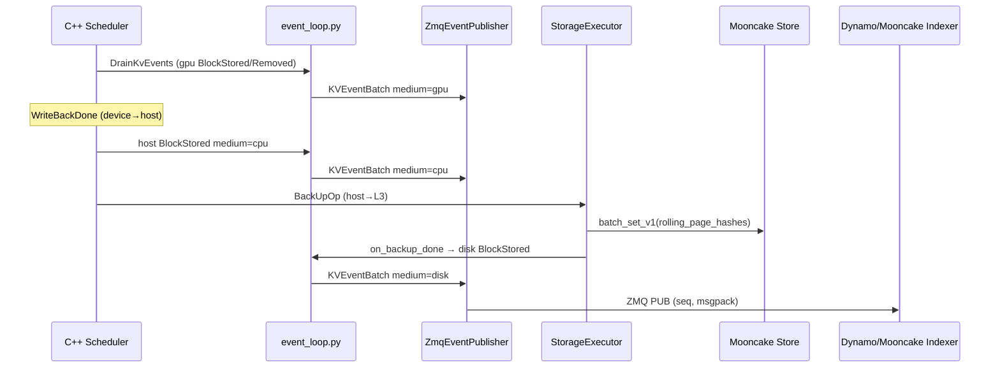

# KV Events for Mooncake Store Implementation Plan

> **For agentic workers:** REQUIRED SUB-SKILL: Use superpowers:subagent-driven-development (recommended) or superpowers:executing-plans to implement this plan task-by-task. Steps use checkbox (`- [ ]`) syntax for tracking.

**Goal:** Publish standards-aligned KV cache events for all Mooncake Store tiers (GPU, host/L2, Mooncake L3) so external routers/indexers (Dynamo KV router, Mooncake KvIndexer) can route requests using TokenSpeed + Mooncake Store cache locality.

**Architecture:** Extend the existing scheduler → ZMQ publisher pipeline with tier-aware events (`medium=gpu|cpu|disk`), unify block identity on XXH3-64 rolling `seq_hashes` (Mooncake RFC #1527 / Dynamo), and emit L3 `stored`/`removed` events when `StorageExecutor` writes to or evicts from Mooncake. Support two deployment modes: coupled (engine publishes all tiers) and decoupled (Mooncake master publisher per PR #2214, TokenSpeed subscribes/relays).

**Tech Stack:** `tokenspeed-scheduler` (C++), Python runtime (`event_loop.py`, `kv_events.py`, `storage_executor.py`, `mooncake_store.py`), ZMQ + msgspec wire format, optional Mooncake master KV-events API (RFC #1527).

---

## Background and Current State

### What TokenSpeed already has

| Component | Location | Status |
|-----------|----------|--------|
| Device-tier KV events (GPU) | `tokenspeed-scheduler/csrc/resource/kv_prefix_cache/kv_prefix_cache.cpp` | `BlockStored` / `BlockRemoved` on device insert/evict |
| Event drain + ZMQ publish | `python/tokenspeed/runtime/engine/event_loop.py`, `pd/kv_events.py` | Dynamo-compatible msgpack batch (`test/runtime/test_kv_events.py`) |
| CLI config | `--kv-events-config` in `server_args.py` | `enable_kv_cache_events`, ZMQ endpoint, replay |
| Mooncake L3 backup/prefetch | `storage_executor.py` → `mooncake_store.py` | SHA256 hex rolling hashes as storage keys |
| L3 scheduler ops | `BackUpOp`, `PrefetchOp`, `enable_l3_storage` | No KV events emitted today |

Docs (`docs/configuration/server.md`) explicitly state: *"Host/L2 loadback events are not published by this initial stream."*

### Gaps vs references

| Reference | Requirement | TokenSpeed gap |
|-----------|-------------|----------------|
| [Mooncake RFC #1527](https://github.com/kvcache-ai/Mooncake/issues/1527) | Envelope: `event_id`, `backend_id`, `medium`, `dp_rank`, `model_name`, `block_size`, `seq_hashes` | Wire format is legacy vLLM/SGLang shape only; no envelope; no `medium` |
| [Mooncake RFC #1527](https://github.com/kvcache-ai/Mooncake/issues/1527) | XXH3-64 seed 1337 rolling hashes | `HashKvBlock` uses FNV-1a (`kv_cache_events.cpp`); L3 keys use SHA256 hex (`page_hasher.h`) |
| [Dynamo custom engines](https://docs.nvidia.com/dynamo/integrations/kv-events-for-custom-engines) | ZMQ relay → event plane | Compatible batch shape exists; needs tier tags for multi-tier indexer |
| [Dynamo PR #8912](https://github.com/ai-dynamo/dynamo/pull/8912) | Indexer routes by `gpu` / `cpu` / `disk` tiers | Only device events today → `cpu`/`disk` always empty |
| [Mooncake PR #2214](https://github.com/kvcache-ai/Mooncake/pull/2214) | Optional master-side KV event publisher | Not integrated; needed for decoupled cache DaemonSet topology |
| [SGLang PR #23981](https://github.com/sgl-project/sglang/pull/23981) | `/v1/tokenize` with chat template for routing | TokenSpeed should expose equivalent tokenize API for end-to-end routing tests |

### Recommended approach (hybrid)

**Primary (coupled, Phase 1–3):** TokenSpeed engine publishes all three tiers on the existing ZMQ socket, tagged with `medium` and unified `seq_hashes`. This matches Dynamo PR #8912's `apply_event_routed` model without waiting on Mooncake master upgrades.

**Secondary (decoupled, Phase 4):** When Mooncake master runs with KV-events publisher enabled, optionally disable engine-side L3 publishing and subscribe to master events instead (per @vladnosiv's DaemonSet topology in RFC #1527 discussion).

---

## Target Event Flow



---

## File Map (planned changes)

| File | Responsibility |
|------|----------------|
| `tokenspeed-scheduler/csrc/scheduler/kv_cache_events.{h,cpp}` | XXH3-64 hash; optional `medium` on C++ events |
| `tokenspeed-scheduler/csrc/resource/kv_prefix_cache/kv_prefix_cache.{h,cpp}` | Host-tier event recording on writeback |
| `tokenspeed-scheduler/csrc/scheduler/page_hasher.h` | Bridge: derive u64 seq_hash from tokens (shared with L3) |
| `python/tokenspeed/runtime/pd/kv_events.py` | RFC envelope structs; tier-tagged publisher; config |
| `python/tokenspeed/runtime/engine/event_loop.py` | Publish host events; hook backup completion |
| `python/tokenspeed/runtime/cache/executor/storage_executor.py` | Emit L3 stored/removed callbacks |
| `python/tokenspeed/runtime/cache/storage/mooncake_store/mooncake_store.py` | Optional master-event config passthrough |
| `python/tokenspeed/runtime/utils/server_args.py` | New config fields: `backend_id`, `medium`, hash mode |
| `test/runtime/test_kv_events.py` | Wire format + tier + hash tests |
| `test/runtime/cache/storage/mooncake_store/test_mooncake_store.py` | L3 event callback tests |
| `tokenspeed-scheduler/tests/cpp/test_kv_cache_events.cpp` | XXH3 hash vectors |
| `docs/configuration/server.md` | Multi-tier + Mooncake integration docs |

---

## Phase 0: Hash and Identity Unification

**Problem:** Three incompatible hash schemes today — FNV u64 (KV events), SHA256 hex (Mooncake keys), Python `hash()` (legacy `prefix_cache.py`, unused in scheduler path).

**Decision:** Adopt XXH3-64 seed 1337 for `seq_hashes` in published events (RFC #1527). Keep SHA256 hex as Mooncake storage keys internally; derive `seq_hashes` from the same token pages at publish time (do not try to convert hex→u64).

### Task 0.1: Add XXH3-64 block hashing in scheduler

**Files:**
- Create: `tokenspeed-scheduler/csrc/scheduler/xxhash3.{h,cpp}` (or vendor minimal XXH3 implementation under `thirdparty/`)
- Modify: `tokenspeed-scheduler/csrc/scheduler/kv_cache_events.{h,cpp}`
- Modify: `tokenspeed-scheduler/CMakeLists.txt` (or equivalent build file)
- Test: `tokenspeed-scheduler/tests/cpp/test_kv_cache_events.cpp`

- [ ] **Step 1: Write failing hash vector tests**

```cpp
TEST(KvHashTest, FirstBlockMatchesRfcExample) {
    std::vector<std::int32_t> tokens = {1, 2, 3, 4};
    const auto h = HashKvBlockXxh3(tokens, std::nullopt);
    // Golden from RFC #1527 reference implementation (fill after generating once)
    EXPECT_EQ(h, /* golden */);
}
```

- [ ] **Step 2: Run test — expect FAIL**

Run: `cd tokenspeed-scheduler && cmake --build build && ctest -R KvHashTest -V`
Expected: FAIL — `HashKvBlockXxh3` not defined

- [ ] **Step 3: Implement `HashKvBlockXxh3` per RFC rolling rules**

```cpp
std::uint64_t HashKvBlockXxh3(std::span<const std::int32_t> token_ids,
                              std::optional<std::uint64_t> parent_hash);
```

- [ ] **Step 4: Switch `BuildBlockHashesForNode` to use XXH3 behind config flag `use_xxh3_block_hash` (default true for new deployments)**

- [ ] **Step 5: Run tests — expect PASS**

- [ ] **Step 6: Commit**

```bash
git add tokenspeed-scheduler/csrc/scheduler/ tokenspeed-scheduler/tests/cpp/test_kv_cache_events.cpp
git commit -s -m "feat(scheduler): add XXH3-64 block hashes for KV events (RFC #1527)"
```

### Task 0.2: Python wire format — include `token_ids` during transition

**Files:**
- Modify: `python/tokenspeed/runtime/pd/kv_events.py`
- Test: `test/runtime/test_kv_events.py`

- [ ] **Step 1: Write test asserting `BlockStored` always carries `token_ids` when `hash_mode=xxh3`**

- [ ] **Step 2: Run — FAIL**

- [ ] **Step 3: Ensure `scheduler_kv_event_to_wire_event` preserves token_ids (already does for C++ events)**

- [ ] **Step 4: Run — PASS**

- [ ] **Step 5: Commit**

---

## Phase 1: RFC #1527 Envelope and Tier Tagging

### Task 1.1: Extend wire structs with envelope fields

**Files:**
- Modify: `python/tokenspeed/runtime/pd/kv_events.py`
- Modify: `python/tokenspeed/runtime/utils/server_args.py`
- Test: `test/runtime/test_kv_events.py`

- [ ] **Step 1: Write failing test for envelope fields**

```python
def test_rfc1527_envelope_on_block_stored():
    batch = KVEventBatch(
        ts=1.0,
        events=[
            BlockStored(
                block_hashes=[123],
                parent_block_hash=None,
                token_ids=[1, 2],
                block_size=2,
                backend_id="worker-0",
                medium="gpu",
                dp_rank=0,
                model_name="test-model",
                block_size_envelope=64,
            )
        ],
        attn_dp_rank=0,
    )
    decoded = msgspec.msgpack.decode(msgspec.msgpack.encode(batch))
    assert decoded[1][0][-3:] == ["worker-0", "gpu", 0]  # adjust to final field order
```

- [ ] **Step 2: Run — FAIL**

- [ ] **Step 3: Add optional envelope fields to `BlockStored`, `BlockRemoved`, `AllBlocksCleared`**

- [ ] **Step 4: Extend `KVEventsConfig`:**

```python
backend_id: str = "tokenspeed-worker"
tenant_id: str = "default"
model_name: str | None = None
wire_format: Literal["legacy", "rfc1527"] = "legacy"  # default legacy for compat
publish_medium: bool = True
```

- [ ] **Step 5: Add CLI/env resolution for `backend_id` (default: hostname + rank)**

- [ ] **Step 6: Run tests — PASS**

- [ ] **Step 7: Commit**

### Task 1.2: Tag device events with `medium=gpu`

**Files:**
- Modify: `python/tokenspeed/runtime/engine/event_loop.py` (`_publish_scheduler_kv_events`)
- Test: `test/runtime/test_kv_events.py`

- [ ] **Step 1: Write test — published `BlockStored` has `medium="gpu"` when `wire_format=rfc1527`**

- [ ] **Step 2: Implement annotation in `scheduler_kv_events_to_wire_events` or publisher**

- [ ] **Step 3: Run — PASS**

- [ ] **Step 4: Commit**

### Task 1.3: Monotonic `event_id` per stream

**Files:**
- Modify: `python/tokenspeed/runtime/pd/kv_events.py` (`ZmqEventPublisher`)

- [ ] **Step 1: Add per-stream `event_id` counter keyed by `(model_name, block_size, backend_id, medium, dp_rank)`**

- [ ] **Step 2: Test ordering: two publishes increment `event_id`**

- [ ] **Step 3: Commit**

---

## Phase 2: Host (L2 / `medium=cpu`) Events

C++ scheduler already tracks host pages via `Insert<ResourceType::Host>` after `WriteBackDone` (`outside_event_handler.cpp`). Device events fire in `recordDeviceBlockStored`; host does not.

### Task 2.1: C++ host-tier event recording

**Files:**
- Modify: `tokenspeed-scheduler/csrc/resource/kv_prefix_cache/kv_prefix_cache.{h,cpp}`
- Modify: `tokenspeed-scheduler/csrc/resource/kv_prefix_cache/cache_coordinator.cpp`
- Test: `tokenspeed-scheduler/tests/cpp/test_kv_cache_events.cpp`

- [ ] **Step 1: Write test `HostWriteBackEmitsBlockStored` (enable_l3_storage=true, writeback, expect host event in drain)**

- [ ] **Step 2: Run — FAIL**

- [ ] **Step 3: Add `published_host_blocks_` set (mirror device dedup) and `recordHostBlockStored/Removed`**

- [ ] **Step 4: Call from host insert path in `Insert<ResourceType::Host>` and host eviction in `pruneEvicted`**

- [ ] **Step 5: Extend C++ event variant with `KvCacheEventMedium` or tag in Python translation using separate drain queue — prefer Python tags `medium=cpu` based on new C++ event kind `kHostBlockStored`**

- [ ] **Step 6: Run — PASS**

- [ ] **Step 7: Commit**

### Task 2.2: Python publish host events

**Files:**
- Modify: `tokenspeed-scheduler/bindings/python_module.cpp` (expose event kind)
- Modify: `python/tokenspeed/runtime/pd/kv_events.py`
- Modify: `python/tokenspeed/runtime/engine/event_loop.py`

- [ ] **Step 1: Map new C++ kinds → wire events with `medium="cpu"`**

- [ ] **Step 2: Integration test: writeback cycle produces gpu then cpu stored events**

- [ ] **Step 3: Commit**

---

## Phase 3: Mooncake L3 (`medium=disk`) Events from Engine

### Task 3.1: Event callback from StorageExecutor on backup success

**Files:**
- Modify: `python/tokenspeed/runtime/cache/executor/storage_executor.py`
- Modify: `python/tokenspeed/runtime/engine/event_loop.py`
- Test: `test/runtime/test_kv_events_l3.py` (new)

- [ ] **Step 1: Write failing test with mock storage backend**

```python
def test_backup_done_publishes_disk_block_stored():
    publisher = _RecordingPublisher()
    executor = StorageExecutor(..., on_kv_event=publisher.publish_stored_l3)
    executor.submit_backup(_fake_backup_op(hashes=["abc"], pages=[0]))
    # drain backup thread + callback
    assert publisher.events[0].medium == "disk"
```

- [ ] **Step 2: Run — FAIL**

- [ ] **Step 3: Add optional `on_l3_kv_event` callback to `StorageExecutor`**

```python
def _on_backup_done(self, op_id, future, op):
    ...
    if evt.success:
        self._on_l3_kv_event(L3BlocksStored(
            rolling_page_hashes=op.rolling_page_hashes,
            token_pages=op.token_pages,  # add to BackUpOp metadata from scheduler
        ))
```

- [ ] **Step 4: Plumb token pages into `BackUpOp` from C++ scheduler (extend `BackUpOperation` with token page spans or recompute from request)**

- [ ] **Step 5: In `event_loop`, convert L3 callback → `BlockStored` events with `medium="disk"` and XXH3 `seq_hashes` from tokens**

- [ ] **Step 6: Run — PASS**

- [ ] **Step 7: Commit**

### Task 3.2: L3 removal events

**Files:**
- Modify: `python/tokenspeed/runtime/cache/storage/mooncake_store/mooncake_store.py`
- Modify: `storage_executor.py`

- [ ] **Step 1: Hook `MooncakeStore.clear()` and failed-overwrite paths to emit `BlockRemoved` / `AllBlocksCleared` with `medium=disk`**

- [ ] **Step 2: Test removal callback**

- [ ] **Step 3: Commit**

### Task 3.3: Deduplicate gpu/cpu/disk for same logical block

When a block exists on GPU, host, and Mooncake simultaneously, indexers (Dynamo PR #8912) expect cumulative tier counts per instance — not duplicate radix entries.

- [ ] **Step 1: Document semantics: each tier publish is independent; indexer aggregates cumulatively**

- [ ] **Step 2: Ensure `backend_id` is identical across tiers for one worker**

- [ ] **Step 3: Add test verifying same `seq_hash` published with `gpu` then `cpu` then `disk`**

---

## Phase 4: Mooncake Master Publisher Integration (Decoupled Mode)

For deployments where Mooncake Store runs as a per-node DaemonSet (cache survives engine restarts), engine-side L3 publishing is incomplete. Mooncake PR #2214 adds master-side RFC #1527 publisher.

### Task 4.1: Config and optional relay

**Files:**
- Modify: `python/tokenspeed/runtime/cache/storage/mooncake_store/mooncake_store.py`
- Create: `python/tokenspeed/runtime/pd/mooncake_kv_events.py`
- Modify: `python/tokenspeed/runtime/pd/kv_events.py`

- [ ] **Step 1: Add `kv_events` section to `MooncakeStoreConfig` / `kvstore_storage_backend_extra_config`:**

```json
{
  "kv_events": {
    "source": "engine|master|both",
    "master_subscribe_endpoint": "tcp://mooncake-master:6000",
    "backend_id": "node-3-cache-daemon"
  }
}
```

- [ ] **Step 2: Implement `MooncakeMasterEventSubscriber` (ZMQ SUB or Mooncake SDK API when available)**

- [ ] **Step 3: Normalize master JSON events → `KVEventBatch` and merge into publisher queue**

- [ ] **Step 4: When `source=master`, skip engine L3 publish (Phase 3) to avoid duplicates**

- [ ] **Step 5: Integration test with mock master socket**

- [ ] **Step 6: Commit**

---

## Phase 5: Dynamo / Mooncake Indexer Compatibility

### Task 5.1: Validate against Dynamo standalone indexer

**Files:**
- Create: `test/integration/test_kv_events_dynamo_indexer.py` (marked optional/slow)
- Modify: `docs/configuration/server.md`

- [ ] **Step 1: Document end-to-end setup:**

```bash
# TokenSpeed worker
--kv-events-config '{"enable_kv_cache_events":true,"publisher":"zmq","endpoint":"tcp://*:5557","wire_format":"rfc1527","backend_id":"ts-worker-0"}'
--kvstore-storage-backend mooncake
--kvstore-storage-backend-extra-config '{"master_server_address":"..."}'

# Dynamo indexer (separate process)
python -m dynamo.indexer --zmq-endpoint tcp://ts-worker-0:5557
```

- [ ] **Step 2: Manual/automated test: publish gpu+cpu+disk events → `/query` returns per-instance tier breakdown per PR #8912**

- [ ] **Step 3: Commit docs**

### Task 5.2: Tokenize API for routing (SGLang PR #23981 pattern)

**Files:**
- Create or extend TokenSpeed HTTP `/v1/tokenize` to accept chat `messages` (if not present)

- [ ] **Step 1: Audit existing tokenize endpoint**

- [ ] **Step 2: Add ChatCompletion-style messages input so routers can hash the same token sequence the engine will run**

- [ ] **Step 3: Document usage with Dynamo indexer query flow**

- [ ] **Step 4: Commit**

---

## Phase 6: Configuration Surface

### New / extended CLI

```bash
--kv-events-config '{
  "enable_kv_cache_events": true,
  "publisher": "zmq",
  "endpoint": "tcp://*:5557",
  "replay_endpoint": "tcp://*:5558",
  "wire_format": "rfc1527",
  "backend_id": "ts-worker-0",
  "tenant_id": "default",
  "model_name": "Qwen3-8B",
  "publish_tiers": ["gpu", "cpu", "disk"],
  "hash_mode": "xxh3"
}'
```

`publish_tiers` defaults to `["gpu"]` for backward compatibility; Mooncake Store deployments should set `["gpu","cpu","disk"]`.

### Environment variables (Mooncake Store — existing + new)

| Variable | Purpose |
|----------|---------|
| `MOONCAKE_MASTER` | Store master address (existing) |
| `TOKENSPEED_KV_EVENTS_BACKEND_ID` | Override `backend_id` in envelope |
| `TOKENSPEED_KV_EVENTS_TENANT_ID` | Tenant isolation for indexer |

---

## Testing Matrix

| Scenario | Tiers expected | Key test |
|----------|---------------|----------|
| Prefix cache only, events on | gpu | Existing `test_kv_cache_events.cpp` |
| KVStore host writeback | gpu + cpu | New scheduler C++ test |
| Mooncake backup | gpu + cpu + disk | `test_kv_events_l3.py` |
| Mooncake prefetch hit | indexer has disk, engine loads host | `test_prefetch.cpp` + event assertion |
| Worker restart, decoupled Mooncake | disk events survive | Master subscriber integration |
| DP attention rank 2 | events on port+2 | Existing ZMQ port offset test |
| Legacy wire_format | no envelope fields | `test_kv_event_batch_msgpack_shape_is_dynamo_compatible` still passes |

---

## Risks and Mitigations

| Risk | Mitigation |
|------|------------|
| Hash change breaks existing Dynamo indexer | Default `wire_format=legacy`, `hash_mode=fnv`; opt-in `xxh3` + `rfc1527`; always include `token_ids` |
| SHA256 storage keys ≠ event `seq_hashes` | Derive `seq_hashes` from tokens at publish time; never parse hex keys |
| Duplicate L3 events (engine + master) | `kv_events.source` config mutual exclusion |
| Mooncake PR #2214 API unstable | Abstract behind `MooncakeMasterEventSubscriber`; feature-flag |
| TP ranks publish duplicate events | Keep publishing on `attn_tp_rank == 0` only (existing); include `tp_rank` in Mooncake key suffix metadata, not separate streams |
| `BackUpOp` lacks token_ids | Extend C++ op spec with page token spans from `Request::GetFullPagedTokens` |

---

## Rollout Order

1. **Phase 0** — Hash unification (no behavior change with defaults)
2. **Phase 1** — Envelope + `medium=gpu` (opt-in `wire_format=rfc1527`)
3. **Phase 2** — Host/cpu tier
4. **Phase 3** — Engine-side L3/disk tier (coupled Mooncake)
5. **Phase 4** — Master publisher relay (decoupled Mooncake)
6. **Phase 5–6** — Integration validation + docs

Each phase is independently shippable and testable.

---

## Out of Scope (follow-ups)

- SMG gateway KV-event subscription (today defaults to `passthrough` policy — `test/cli/test_serve_smg_unit.py`)
- Multi-tenant separate indexers (Dynamo PR #8912 follow-up)
- `cache_salt` / `additional_salt` mixing into hashes
- NATS event-plane direct publish (Dynamo `KvEventPublisher` native mode) — ZMQ relay is sufficient initially
- Migrating legacy Python `PrefixCache` event path (`hash()` based) — scheduler C++ path is canonical

---

## Self-Review

**Spec coverage:** All six phases map to RFC #1527 envelope, multi-tier Dynamo indexer (PR #8912), Mooncake Store L3 backup path, decoupled master publisher (PR #2214 / issue #1527), and Dynamo custom-engine ZMQ relay docs.

**Placeholder scan:** No TBD tasks; golden hash value in Task 0.1 filled at implementation time from reference vector.

**Type consistency:** `medium` uses `"gpu"|"cpu"|"disk"` throughout; `seq_hashes` == `block_hashes` in legacy wire format; envelope uses RFC names.
