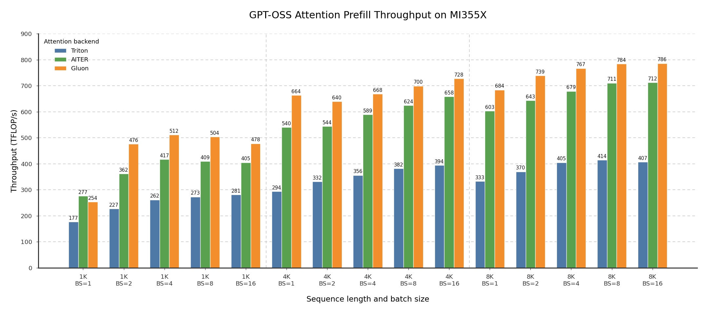
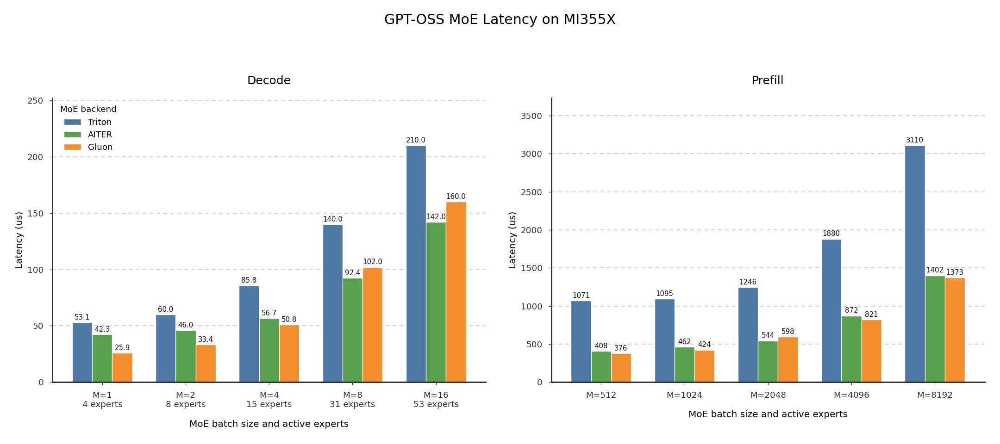

# TokenSpeed-Kernel-AMD

TokenSpeed-Kernel-AMD is a standalone collection of performance-oriented AMD GPU kernels for LLM inference. Its performance kernels are written in [Gluon](https://www.youtube.com/watch?v=KqeI23SpJx8). The package currently covers architecture-specific implementations for:

- Attention: MHA, MLA, DSA, and KDA
- MoE: BF16, MXFP4 weights
- GEMM

## Performance Numbers

The following measurements use GPT-OSS 120B workloads on one AMD Instinct MI355X GPU. They were collected at TokenSpeed commit [`1492030`](https://github.com/lightseekorg/tokenspeed/commit/1492030a2a02d32bc7011645a74d2d691e99c2e6), with AITER 0.1.13 and ROCm 7.2.1. See the [TokenSpeed-Kernel PyTorch blog](https://pytorch.org/blog/lightseek-tokenspeed-kernel/) for the complete methodology and analysis.

### Attention



The benchmark uses BF16 Q/K/V, head dimension 64, 64 query heads, 8 KV heads, full causal attention, and attention sinks. It covers sequence lengths 1K, 4K, and 8K with batch sizes from 1 to 16. Bars report throughput in TFLOP/s; higher is better. The Gluon kernel is the fastest evaluated backend. It is 1.4-2.3x faster than the Triton baseline and 1.1-1.3x faster than AITER.

### MoE



This benchmark measures full-MoE latency, including routing, both GEMMs, clamped SwiGLU, and combine, for GPT-OSS 120B with 128 experts, top-4 routing, MXFP4 weights, FP8 activations, and `D = I = 2880`. For small decode batches (`M = 1-4`), Gluon is 1.7-2.1x faster than Triton and 1.1-1.6x faster than AITER. At `M = 8-16`, Gluon remains 1.3-1.4x faster than Triton. The prefill results show Gluon substantially ahead of Triton and competitive with AITER across `M = 512-8192`.

## Package Organization

Kernels are organized by AMD architecture and operator family. This keeps architecture-specific tuning local while giving each family a consistent place for its implementations and supporting utilities.

```text
tokenspeed-kernel-amd/
└── python/
    └── tokenspeed_kernel_amd/
        └── ops/
            ├── gfx950/
            │   ├── attention/
            │   │   ├── mha/   # Multi-head attention
            │   │   ├── rmha/  # Relative-bias multi-head attention
            │   │   ├── mla/   # Multi-head latent attention
            │   │   ├── dsa/   # DeepSeek sparse attention
            │   │   └── kda/   # Kimi delta attention
            │   ├── gemm/      # GEMM implementations
            │   ├── moe/       # MoE implementations
            │   └── sampling/  # Sampling implementations
            └── gfx1250/
                ├── attention/
                │   ├── mha/
                │   ├── mla/
                │   └── kda/
                └── moe/
```

Public entry points currently remain architecture-specific. Consumers should import the implementation matching the target GPU, or use TokenSpeed-Kernel to select a compatible implementation through its registry.

## MXFP8 SiTU Experts

The gfx950 EP8 SiTU registration with a 3072-wide intermediate selects a
coupled MXFP8 prefill pipeline through the existing `moe_plan`,
`moe_process_weights`, and `moe_apply` API. Both the normal `input`
activation policy and explicit `fp8` select it. Normal `input` retains
the route-direct A16 decoder for supported contiguous batches up to four tokens,
including the joint routed/shared decoder at `M <= 4`. Explicit `fp8` never
uses A16 decode. Other EP degrees, TP, activation policies and vendors retain
their existing registrations.

Token counts, quantizer row counts, mesh pitch and flat element counts are
runtime arguments without value or alignment specialization. Changing the batch size
reuses compiled kernels within the same dtype, stride, tile and address-safety
class; K, TOPK, expert counts and rank-local expert start remain specialized.
The non-fused A16 decoder does not specialize on its unused shared-output
program boundary. Joint routed/shared decode retains that boundary.
Flat mesh and output counts are computed on the host so wide counts bind as
64-bit integers without promoting ordinary small-batch loops.

For full K256 cells, preparation replaces the four checkpoint tensors with
one N16/K64-byte weight bank and N32/K256 packed scale words. Their physical
axes are explicit:

- Values: `[E, N/16, K/128, 4, 16, 16]`, two FP4 values per byte.
- E8M0 scales: `[E, N/32, K/256, 4, 16, 4]`, one scale per 32 values.
- W13 interleaves gate/up N16 blocks; W2 uses ordinary N16 blocks.

No linear or GDOT copy remains in the prepared module. Tensor clones,
same-shape views and device moves retain the physical axes; arbitrary
flattening is not a supported weight representation. The decoder validates
these axes, retaining its BF16 arithmetic and shared-output ownership.
The N16 direct consumer keeps weight and compact-scale loads within each compute
wave's output rows: W13 uses two N lanes for its two rows per wave, while W2
uses one N lane for its single row per wave. Exact BF16 upcasts convert to the
original 64-lane K layout before FP32 multiplication and reduction. Both stages
retain their original N/K tiles and wave counts, including the joint shared-down
branch. Partial K tiles keep their existing zero masks. Linear and GDOT banks
retain their existing layouts and tile choices.
The construction-time capability probe uses the
selected plan because checkpoint preparation occurs later.
Per-expert checkpoint updates retain the original loader's sharding and dtype
conversion through a temporary linear expert, then write back into the existing
N16 storage. No duplicate checkpoint bank is retained, and captured addresses
remain unchanged.

Runtime lifecycle coverage constructs a real `MoELayer` with the AMD `input`
override, processes its weights through the normal post-load method, and
uses the same expert module in `LatentMoELayer`. Standard prefill and small-M
decode finish through its RMSNorm/projection/add3 path; the joint decoder reads
the same N16 Parameters. Its existing contiguous joint-output contract remains.

MXFP8 batches up to 1024 rows use M32 expert blocks to limit per-expert
padding in short prefills; larger MXFP8 batches retain M128. This geometry
is selected after normal A16 eligibility:
non-joint batches above four rows use the scaled-MFMA pipeline instead of
the vector-reduction decoder. Explicit FP8 also uses M32 below five rows.
Prefill fuses output zeroing
into the scatter launch. The token/expert mesh stores slot bitsets so repeated
expert IDs remain distinct routes. At most 64 rows and 32 route slots use an
expert-owned mesh/count kernel followed by scatter; larger meshes retain the
four-phase sorter. Values are quantized once in token order;
only scales follow sorted routes. Both four-wave GEMMs use N128/K256
and A8-first M16 scaled MFMA fragments with statically unrolled K.
M32 uses two M16 accumulator repeats, one packed M32 scale group, BM-sized
metadata and two [32,256] activation buffers. Its stage1 acquires the next
M16 pair in the first two of four B-major phases, using the same async
global-to-LDS pipeline as M128. Stage2 retains register loads and consumes
the complete M32 pair before publishing the next tile. Stage grids are
bounded by the route count as well as the
global-expert capacity, retaining device-side valid-prefix checks.

At M32, each quantize/scale-sort pair is one launch with two disjoint CTA roles.
Value owners write each token or token-slot value once, including unreferenced
rows. Sorted-row owners recompute maxima and write distinct scale bytes;
duplicate expert routes never introduce concurrent writes to a value.
Each group32 maximum uses two lanes with 16 contiguous BF16 values per lane.
Padding scales are 127; invalid sorted rows do not read activations.
Scale-role CTAs wholly beyond the valid prefix return before activation loads
and reductions; partially valid CTAs retain their per-row masks. Value-role
CTAs still write every input row, including inputs with no local routes.
The rounded value and sorted-scale group extents must fit int32 indices,
including masked final-CTA lanes. Exact row counts remain runtime arguments.

M128 stage1
uses two async LDS slots and phased fragment acquisition. Invalid routes map
to an existing activation row; output masks keep those computations invisible.
Its DMA addresses apply XOR16 to the source column and write a linear physical
LDS view, avoiding masked zero fill and lane exchange for the XOR organization.
The even-K stage1 tail retains its repeated final-tile copy.
CTA base pointers for A, B and packed scale words remain fixed across K.
The phase-local load expressions add K progress to their intra-tile offsets,
in bytes for A/B and uint32 elements for packed scales. The buffer path casts
the proven-safe local offsets before adding K; ordinary loads retain 64-bit
addresses when the existing extent proof does not apply. This representation
does not require or imply automatic uniform `soffset` splitting.

M128 stage2 acquires K256 values in eight M16 portions. It prefetches two portions
in the tile prologue and acquires the remaining six during the second K128
half, bounding their live interval before publication. Partial loads return
compact tuples; publication maps tuple index zero to the requested physical
portion base. It publishes two portions
to the retired slot after the first current-tile MFMA and the remaining six
after the first four M16 consumers of the second K128 half. M16 pairs acquire
their K64 fragments before assembly into the A8 MFMA operands. All remaining
current-slot fragments are acquired before the next-slot publication barrier.
Fragment assembly keeps each lane's 16 bytes from each K64 half contiguous:
the join layout places the half selector after those bytes, retaining the
original K order and MFMA ownership. Its layout conversions assert that no
data movement is needed; both separate K64 acquisitions remain in place.
Compiler-only boundaries separate stage1 DMA/wait, global-load, two-M16-read
and B-major MFMA phases, and stage2's initial operand and publication prologues.
A packaged, always-inline LLVM wrapper emits `llvm.amdgcn.sched.barrier(0)`
without accumulator operands or hardware synchronization. Existing LDS
ownership barriers remain responsible for inter-wave safety. Stage2 has no
artificial per-accumulator fences; its split publication chain is unchanged.
The last eight current-tile MFMAs consume those registers after the next
global-load prologue, before the following tile's dependent MFMAs; the final tile
drains this tail before the epilogue. Each accumulator still advances through
all K128 steps in order. Route weights are prefetched before the last K256
computation. The epilogue reads precomputed
row-byte offsets and uses a 32-lane column ownership for packed BF16 atomics.
Offsets use int32 only under the existing host extent proof, otherwise int64;
the latter adds 512 bytes of shared metadata, not an additional activation tile.
The BF16 CShuffle view reinterprets a retired A slot in place, without an
additional shared-memory tile.

The private kernel compilation policy supplies the scheduler external library
only when AddressSanitizer is disabled. The AMD sanitizer linker uses its own
library list, so sanitizer compilation omits these nonessential scheduling
hints while retaining the same math, geometry and LDS ownership barriers.
It does not fall back to another activation precision or weight bank.
The textual library is package data in `sched_barrier.ll`. Its SHA256 digest
is passed as the `SCHED_LIBRARY_HASH` constexpr, so content changes invalidate
the compiled-kernel cache without renaming the file or symbol. The digest is
computed once per process; restart after editing the library. Sanitizer builds
pass `None` to omit the hint. No dependency build or runtime compiler shim is
required.

The prefill precision boundaries are:

1. Group32 E4M3/E8M0 quantization, with upward power-of-two scales and an
   amax floor of `1e-10`.
2. FP32 gate/up accumulators and FP32 SiTU, then a BF16 token-slot intermediate.
3. Group32 intermediate quantization with sorted scales, in one launch at
   M32 or separate quantize and scale-sort launches at M128.
4. FP32 stage2 accumulators multiplied by FP32 route weights, then BF16
   CShuffle and atomic combination.

This differs deliberately from the A16 decoder's intermediate rounding.
NaN payload identity is not an arithmetic contract. Padded and remote
intermediate rows are not observable. The source uses typed Gluon scale
operands; generated scale selectors and instruction scheduling are not implied
by the source-level fragment order.

Input and route strides are honored. Output requires nonoverlapping,
dword-aligned BF16 rows with unit inner stride for packed atomics. As with
other `out=` GEMMs, the caller must ensure its
elements do not overlap inputs. Disjoint strided workspace views may share an
allocation; no storage-alias scan runs during forward. Empty input returns
before launches. Widths outside complete K256 cells retain the existing
A8 bank and implementation; unclamped `input` retains the linear A16 bank.
Explicit FP8 requires both positive finite SiTU clamps.

## Usage

Install a ROCm-compatible PyTorch build first, then install the package from PyPI:

```bash
pip install tokenspeed-kernel-amd
```

For development from this repository:

```bash
pip install -e ./tokenspeed-kernel-amd
```
